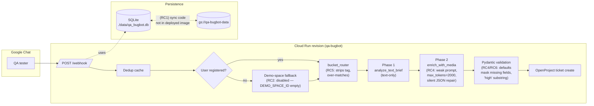

# Design Document: Production Reliability Fixes

## Overview

The QA Bug Logger Bot (`qa-bugbot`, asia-south1) is degraded across deployment, observability, LLM
correctness, and routing. Live diagnostics confirmed eight independent root causes already documented
in the issue brief; this design covers how each is repaired without changing architecture
(FastAPI + SQLAlchemy + OpenAI-compatible LLM gateway, SQLite persisted to GCS, two-phase pipeline).

The eight root causes group into four themes:

| Theme | Root Causes | Symptom |
|---|---|---|
| **Deployment hygiene** | RC1 stale image, RC2 env-var corruption, RC7 leaked secret, RC8 no commit discipline | Code in working tree never reaches the deployed revision; demo-space fallback permanently disabled |
| **Observability** | RC3 silent GCS exceptions | `/logs` cannot tell us why GCS sync fails — every error path collapses into the same generic line |
| **LLM pipeline correctness** | RC4 truncated Phase 2 JSON, RC6 priority substring match | Tickets created with placeholder steps and wrongly classified priorities |
| **Routing robustness** | RC5 bucket router strips/over-matches | `[LMS Webview] flickering` arrives at the LLM as just `flickering`; unrelated `[step 3]` brackets get treated as bucket tags |

Strict execution order: every fix is built and verified locally with synthetic webhook scenarios
before any image rebuild or deploy. The design therefore ends with a Local Verification Strategy
and a Rollout Plan that gates deploy on user sign-off.

---

## Architecture

This is a High-Level Design view of the live system with failure injection points marked, plus
the deployment + persistence flow. Detailed per-component changes live under Low-Level Design.

### Bug-report pipeline with failure injection points

The diagram below shows the live pipeline. Boxes marked `(RCn)` are the points where the
corresponding root cause manifests.



Failure surface visible to the user:

* RC1 → registrations vanish on every cold start; `Database initialized` appears 112 ms after
  `Starting up...`, which is impossible if a real GCS HTTP call ran.
* RC2 → guests routed to demo space are told "you are not registered" because
  `settings.demo_space_id == ""` after the corrupted `--set-env-vars` deploy.
* RC3 → when GCS does fail, the only log is a single-line `GCS DB download FAILED: <type>: <msg>`
  with no actionable distinction between auth, network, or missing-blob.
* RC4 → tickets ship with `steps_to_reproduce = ["See attached media for reproduction steps"]`.
* RC5 → `[LMS Webview] flickering` resolves correctly only by accident; `Login fails [step 3]`
  resolves to whatever `[step 3]` fuzzy-matches.
* RC6 → `Medium-High` and `highlighted bug` both classified `HIGH`.

### Deployment + persistence flow

```mermaid
flowchart TB
    DEV[Developer working tree<br/>(uncommitted GCS sync code,<br/>updated prompts, model fixes)]
    GIT[Local git<br/>(only one commit so far — RC8)]
    BUILD["gcloud builds submit<br/>(RC1: prior builds reused<br/>cached layers, never picked up<br/>uncommitted code)"]
    IMG[Artifact Registry image<br/>qa-bugbot@sha256:2716a2…]
    REV["Cloud Run revision<br/>qa-bugbot-00039-dth<br/>(stale: lacks GCS sync)"]
    GCS[(gs://qa-bugbot-data/qa_bugbot.db)]
    CONT[Running container<br/>./data/qa_bugbot.db]

    DEV -. "checkpoint commit<br/>(Phase C of rollout)" .-> GIT
    GIT --> BUILD
    DEV -- "Docker COPY . ." --> BUILD
    BUILD --> IMG --> REV --> CONT
    CONT -- "_download_db_from_gcs<br/>at startup" --> GCS
    CONT -- "_upload_db_to_gcs<br/>after register +<br/>at shutdown" --> GCS
```

Two structural facts make RC1 hard to spot:

1. `Dockerfile` does `COPY . .`, so anything in the working tree (committed or not) ends up in the
   image — but if the build context is reused without invalidating the layer, stale code stays.
2. `.dockerignore` does not exclude `.git`, so build cache invalidation is keyed on file mtimes;
   touching `database.py` may not be enough on Windows hosts.

The fix is therefore a forced clean rebuild plus a startup log line that proves the new code shipped
(see Theme 1 verification checklist).

## Components and Interfaces

| Component | File | Current responsibility | Changes in this spec |
|---|---|---|---|
| Webhook + lifespan | `main.py` | Accept Chat events, dedupe, route, call clients, register users | Add startup env-var validator; expose last GCS sync status on `/health`; emit a structured "build marker" log line |
| Bucket router | `bucket_router.py` | Extract `[Tag]` from text, resolve via exact → alias → fuzzy, fall back to device detection | Tighten regex, raise fuzzy cutoff, drop `tag_lower in alias`, **stop stripping the tag from the brief sent to the LLM**; add free-text bucket extraction layer (`_extract_bucket_from_freetext`) for `bucket - X`, `bucket: X`, multi-word phrase matches like `LMS Webview`, and weighted single-word alias matches |
| LLM client | `gemini_client.py` | Two-phase analysis: text brief + media enrichment | New mandatory-fields prompt; `max_tokens=6000` for Phase 2 (3× safety headroom — truncation is treated as a bug, not an expected path); fail-loud JSON cleanup that raises `Phase2TruncatedError`; defense-in-depth default-stuffing detector that falls back to Phase 1; Phase 2 timeout reduced from 180s/210s to 45s/50s; on timeout, fall back to Phase 1 with `PHASE2_SLOW outcome=timeout` ERROR log |
| Models | `models.py` | Pydantic schema + validators | Word-boundary priority validator; document which defaults are intentional fallbacks vs which fields fail-fast |
| Database | `database.py` | SQLite + GCS sync; CRUD | Structured exception handling for both download and upload paths; sync-status state exposed for `/health` |
| Config | `config.py` | `pydantic-settings` from env / `.env` | No code change; covered by env-var validator |
| `.env.example` | repo root | Template for local devs | Replace real `LLM_API_KEY` with placeholder |

Detailed function signatures and behavioural contracts for each changed component live in the
Low-Level Design section below (organized by theme).

## Data Models

Two new pydantic types and one extension to an existing one. All other domain models in
`models.py` (`ExtractedBugReport`, `UserRegistrationRequest`, etc.) are unchanged.

### `GcsSyncStatus` (new — Theme 2)

Snapshot of the most recent GCS sync attempt. Held in a module-level `_last_gcs_sync` and surfaced
through `/health`.

```python
class GcsSyncStatus(BaseModel):
    op: Literal["download", "upload"]
    started_at: datetime
    finished_at: datetime
    duration_ms: int
    outcome: Literal[
        "ok", "skipped", "import_error", "auth_error",
        "forbidden", "not_found", "network_error", "unknown_error"
    ]
    bytes: int = 0
    detail: str = ""   # short human-readable explanation
```

**Validation rules**

* `duration_ms ≥ 0`
* `bytes ≥ 0`; `bytes > 0` only when `outcome == "ok"`
* `detail` ≤ 500 chars (truncated when serializing into log lines)

### `JsonCleanResult` (new — Theme 3.3)

Tuple-shaped helper returned by the rewritten `_clean_json_response`.

```python
class JsonCleanResult(NamedTuple):
    cleaned: str            # JSON-parseable text
    was_truncated: bool     # True iff repair was needed
    repair_log: list[str]   # one entry per repair action
```

**Validation rules**

* If `was_truncated` is `False`, then `repair_log` MUST be empty.
* `cleaned` MUST be parseable by `json.loads` after the function returns (or the function would
  have raised — repair is best-effort but the caller is allowed to assume parseability).

### `HealthResponse` (extended — Theme 2.3)

Two optional fields added; existing fields unchanged.

```python
class HealthResponse(BaseModel):
    status: str
    database: str
    gemini: str
    llm_gateway: Optional[str] = None
    llm_model: Optional[str] = None
    openproject: Optional[str] = None
    timestamp: str
    last_gcs_sync: Optional[dict] = None   # serialized GcsSyncStatus
    build_marker: Optional[str] = None     # git sha or build timestamp emitted at startup
```

**Validation rules**

* `status == "healthy"` requires `database == "connected"`, `gemini == "configured"`, and
  `last_gcs_sync` either `None` (never attempted) or `outcome ∈ {ok, skipped}`.
* `status == "degraded"` if any of the above fail.
* `build_marker` is non-empty after a successful startup.

---

## Low-Level Design

### Theme 1 — Deployment & env hygiene

#### 1.1 Corrected redeploy command

The bug was a space separator in `--set-env-vars`. PowerShell + gcloud's parser tolerated it,
producing `value='8cf6d8d6...e08ea593 DEMO_SPACE_ID=AAQAhf6qdAw'` for
`DEFAULT_OPENPROJECT_API_KEY` and never setting `DEMO_SPACE_ID`.

Use a YAML env file to make separators unambiguous and reviewable. Keep the file out of git
(`.gitignore` already covers `*.env*`-style — verify before commit).

```pascal
PROCEDURE deploy_with_env_file()
  INPUT: env_file (path to env.yaml)
  PRECONDITION: env_file exists, has been hand-reviewed, every value is a single string with no
                trailing whitespace and no embedded '=' or newline
  POSTCONDITION: new Cloud Run revision is rolled out with each var set exactly once

  SEQUENCE
    REQUIRE no key starts/ends with whitespace
    REQUIRE no value contains '\n', '\r', or unescaped quotes

    EXECUTE gcloud builds submit --tag <image> --no-cache .
    EXECUTE gcloud run deploy qa-bugbot
              --image <image>
              --region asia-south1
              --env-vars-file env.yaml
              --service-account qaautomation@artful-affinity-634.iam.gserviceaccount.com
  END SEQUENCE
END PROCEDURE
```

`env.yaml` template (values redacted in spec):

```yaml
LLM_API_KEY: "<single-line-token>"
LLM_BASE_URL: "https://imllm.intermesh.net/v1"
LLM_MODEL: "google/gemini-2.5-flash"
OPENPROJECT_BASE_URL: "https://project.intermesh.net"
DEFAULT_OPENPROJECT_API_KEY: "<single-line-token>"
DEMO_SPACE_ID: "<space-id>"
DATABASE_URL: "sqlite+aiosqlite:///./data/qa_bugbot.db"
```

The `--env-vars-file` form does not interpret spaces or `=` inside YAML scalars, so the
RC2 corruption mode is structurally impossible.

#### 1.2 Env-var startup validator

A new function runs once during the FastAPI `lifespan` startup, after `get_settings()` and before
the rest of the bring-up.

```python
def validate_env_vars(settings: Settings) -> list[str]:
    """
    Inspect Settings for shapes known to indicate a corrupted --set-env-vars deploy.
    Returns list of warning messages; never raises (we want the bot to keep running
    with degraded fallbacks rather than crashloop).

    Checks performed:
      1. Each required key is non-empty.
      2. No string value contains literal whitespace, '\n', or '\r'.
      3. No value contains an embedded '=' followed by an UPPER_SNAKE token (the
         classic 'KEY1=valKEY2=val' corruption signature).
      4. LLM_API_KEY starts with the expected gateway prefix (currently 'sk-').
      5. DEMO_SPACE_ID looks like a Google Chat space id (alphanumeric + -_).
    """
```

**Pre/postconditions**

* Pre: `settings` is a fully constructed `Settings` instance.
* Post: returns `list[str]` of human-readable warnings; logs each at WARNING level with the
  prefix `ENV_VALIDATION:` so they are greppable in `/logs`.
* Side effects: only logging. Never mutates settings, never exits.

**Example log output** when RC2 reproduces:

```
ENV_VALIDATION: DEFAULT_OPENPROJECT_API_KEY appears corrupted: contains whitespace and 'KEY=' substring (suggests --set-env-vars used space separator)
ENV_VALIDATION: DEMO_SPACE_ID is empty — demo-space fallback for unregistered users will be disabled
```

The validator emits an explicit log line `ENV_VALIDATION: all checks passed` on the happy path so
QA can confirm the validator is itself wired up.

#### 1.3 Cleaned `.env.example`

Replace the leaked real key with a placeholder. The file is committed; the real `.env` stays
untracked.

```dotenv
# ─────────────────────────────────────────────
# QA Bug Logger Bot — Environment Configuration
# Copy this file to .env and fill in your values.
# Do NOT commit your real .env to git.
# ─────────────────────────────────────────────

# ── LLM (OpenAI-compatible gateway) ──
LLM_API_KEY=sk-REPLACE_WITH_YOUR_GATEWAY_TOKEN
LLM_BASE_URL=https://imllm.intermesh.net/v1
LLM_MODEL=google/gemini-2.5-flash

# ── OpenProject ──
OPENPROJECT_BASE_URL=https://project.intermesh.net
DEFAULT_OPENPROJECT_API_KEY=REPLACE_WITH_DEMO_SPACE_API_KEY
DEMO_SPACE_ID=REPLACE_WITH_GOOGLE_CHAT_SPACE_ID

# ── Google Chat ──
GOOGLE_SERVICE_ACCOUNT_JSON=service-account.json

# ── Database ──
DATABASE_URL=sqlite+aiosqlite:///./data/qa_bugbot.db

# ── Server ──
PORT=8080
```

The previous file leaked `LLM_API_KEY=sk-KNy4qPAxAw0OEvgZuNyOeA`. This was a company-issued
gateway token (issued by IndiaMART for use against `imllm.intermesh.net`), not a customer-facing
or production secret tied to user data. Rotation is therefore **not required**: the same key
remains valid in production, the only fix needed is to ensure the example file no longer carries
a real value. Going forward, `.env.example` MUST never again contain a real token, and `.env`
MUST stay untracked — verified against existing ignore rules:

* `.gitignore` already excludes `.env` and `*.env` (`.env.example` is a deliberate exception).
* `.dockerignore` already excludes `.env` and `.env.example`.
* `.gcloudignore` already excludes `.env`.

As an additional safeguard, a pre-commit hook (added in Phase C of the rollout plan) rejects any
staged `.env*` file that contains a token-like prefix outside an obvious placeholder pattern. The
hook regex is roughly:

```
\b(sk|pk|api|key|token)[-_][A-Za-z0-9]{16,}\b
```

with an allow-list for placeholder forms like `sk-REPLACE_WITH_…`, `REPLACE_WITH_…`, and
`<single-line-token>`. If the hook fires, the commit is aborted and the developer is told which
line tripped it.

#### 1.4 Local verification checklist (before any deploy)

A developer-runnable script `scripts/preflight.sh` (and `.bat` for Windows) executes:

```pascal
SEQUENCE
  STEP "git status --porcelain" — fail if working tree is dirty when about to deploy
  STEP "python -c 'from main import settings; from main_validators import validate_env_vars; warnings = validate_env_vars(settings); print(*warnings, sep=chr(10)); raise SystemExit(0 if not warnings else 0)'"
  STEP "python -m pytest -q" — all tests pass
  STEP "python scripts/synthetic_webhook.py --scenario all" — every scenario in §6 returns expected ticket shape
  STEP "docker build -t qa-bugbot:local --no-cache ." — image builds clean
  STEP "docker run -p 8080:8080 --env-file .env qa-bugbot:local" — startup logs include 'BUILD_MARKER:' line
  STEP "curl localhost:8080/health" — status=='healthy', last_gcs_sync field present
END SEQUENCE
```

A grep against startup logs for `BUILD_MARKER:` proves the new image shipped — this line is emitted
once by `lifespan()` with the value `BUILD_MARKER: <git-sha-or-build-time>`. RC1's symptom of
`Database initialized 112ms after startup` becomes immediately diagnosable: the marker either has
the expected sha or it does not.

---

### Theme 2 — GCS sync observability

#### 2.1 `_download_db_from_gcs()` refactor

The current implementation collapses every failure into one generic log line. The replacement
uses a typed exception ladder so each path produces a different, greppable log signature.

```python
# database.py

class GcsSyncStatus(BaseModel):
    """Snapshot of the most recent GCS sync attempt; exposed via /health."""
    op: Literal["download", "upload"]
    started_at: datetime
    finished_at: datetime
    duration_ms: int
    outcome: Literal["ok", "skipped", "import_error", "auth_error",
                     "forbidden", "not_found", "network_error", "unknown_error"]
    bytes: int = 0
    detail: str = ""  # short human-readable explanation


_last_gcs_sync: GcsSyncStatus | None = None


def _download_db_from_gcs() -> GcsSyncStatus:
    """
    Pull qa_bugbot.db from gs://qa-bugbot-data/.

    Preconditions:
      - LOCAL_DB_PATH parent directory is writable (created by caller if missing).
      - Either ADC is configured (Cloud Run injects this) or GOOGLE_APPLICATION_CREDENTIALS
        points to a valid service-account JSON.

    Postconditions:
      - On 'ok'    : LOCAL_DB_PATH exists and is a valid SQLite file.
      - On 'skipped': blob does not exist in GCS; LOCAL_DB_PATH is left untouched
                      (fresh start is allowed).
      - On any error outcome: LOCAL_DB_PATH may not exist. Caller MUST tolerate this
                              and let SQLAlchemy create a fresh DB.
      - Always returns a GcsSyncStatus and updates module-level _last_gcs_sync.
      - Always emits exactly one structured log line of the form:
          GCS_SYNC op=download outcome=<outcome> duration_ms=<n> bytes=<n> detail="..."
    """
```

Exception ladder:

```pascal
PROCEDURE _download_db_from_gcs()
  OUTPUT: GcsSyncStatus
  
  started ← now()
  status ← GcsSyncStatus(op="download", started_at=started, outcome="unknown_error")

  TRY
    IMPORT google.cloud.storage AS storage         # may raise ImportError
    IMPORT google.api_core.exceptions AS gax       # Forbidden, NotFound
    IMPORT google.auth.exceptions AS gauth         # DefaultCredentialsError
  CATCH ImportError as e
    status.outcome ← "import_error"
    status.detail ← "google-cloud-storage not importable: " + str(e)
    GO TO finalize
  END TRY

  TRY
    client ← storage.Client()
    bucket ← client.bucket("qa-bugbot-data")
    blob ← bucket.blob("qa_bugbot.db")

    IF NOT blob.exists() THEN
      status.outcome ← "skipped"
      status.detail  ← "no existing DB in GCS — starting fresh"
      GO TO finalize
    END IF

    ENSURE_DIR(dirname(LOCAL_DB_PATH))
    blob.download_to_filename(LOCAL_DB_PATH)

    status.outcome ← "ok"
    status.bytes   ← os.path.getsize(LOCAL_DB_PATH)
    status.detail  ← "restored from GCS"
  CATCH gauth.DefaultCredentialsError as e
    status.outcome ← "auth_error"
    status.detail  ← "no ADC available: " + str(e)
  CATCH gax.Forbidden as e
    status.outcome ← "forbidden"
    status.detail  ← "service account lacks objectAdmin: " + str(e)
  CATCH gax.NotFound as e
    status.outcome ← "not_found"
    status.detail  ← "bucket or blob missing: " + str(e)
  CATCH (TimeoutError, ConnectionError, OSError) as e
    status.outcome ← "network_error"
    status.detail  ← type(e).__name__ + ": " + str(e)
  CATCH Exception as e
    status.outcome ← "unknown_error"
    status.detail  ← type(e).__name__ + ": " + str(e)
  FINALLY
finalize:
    status.finished_at ← now()
    status.duration_ms ← (status.finished_at - status.started_at).milliseconds
    LOG_INFO "GCS_SYNC op=download outcome=" + status.outcome
             + " duration_ms=" + str(status.duration_ms)
             + " bytes=" + str(status.bytes)
             + " detail=\"" + status.detail + "\""
    SET _last_gcs_sync ← status
    RETURN status
  END TRY
END PROCEDURE
```

**Loop invariants** — none, no loops.

**Postconditions also satisfied**

* The function never re-raises. The startup path must be resilient: a temporary GCS outage cannot
  prevent the bot from accepting webhooks, it can only cause a one-cold-start blip in
  registrations.
* The structured log line is the **only** observability handle — it is what `/logs` shows and what
  `grep GCS_SYNC` can pivot on.

#### 2.2 `_upload_db_to_gcs()` refactor

Same exception ladder. Distinct outcomes:

| outcome | trigger |
|---|---|
| `ok` | upload completed, blob.size matches local size |
| `skipped` | local DB does not exist (e.g. nothing registered yet) |
| `import_error` | google-cloud-storage missing |
| `auth_error` | no ADC / invalid creds |
| `forbidden` | bucket IAM denies write |
| `network_error` | timeout / connection error |
| `unknown_error` | anything else |

Same log shape: `GCS_SYNC op=upload outcome=… duration_ms=… bytes=… detail="…"`.

Critical change vs. current code: the upload path **must not silently swallow `ImportError`**.
Today, `except ImportError: pass` hides the case where the deployed image lacks the package.
After the refactor it logs and updates `_last_gcs_sync`.

#### 2.3 `/health` endpoint extension

`HealthResponse` gains two optional fields:

```python
class HealthResponse(BaseModel):
    status: str
    database: str
    gemini: str
    llm_gateway: Optional[str] = None
    llm_model: Optional[str] = None
    openproject: Optional[str] = None
    timestamp: str
    last_gcs_sync: Optional[dict] = None        # serialized GcsSyncStatus
    build_marker: Optional[str] = None          # the sha/build-time emitted at startup
```

`status` becomes `"degraded"` if `last_gcs_sync.outcome` is anything other than `ok` or `skipped`.

This lets QA verify the new code shipped (`build_marker` matches expectation) and that GCS is
healthy (`last_gcs_sync.outcome == "ok"`) without GCP console access.

---

### Theme 3 — Phase 2 LLM reliability

The pipeline that produces garbage tickets is:

1. Soft prompt → LLM omits fields (RC4a).
2. `max_tokens=2000` → response truncated mid-output for 20-frame videos (RC4b).
3. `_clean_json_response` → silently rewrites truncation into "valid" JSON (RC4c).
4. Pydantic defaults in `models.py` → fill in placeholders like
   `["See attached media for reproduction steps"]`.
5. Ticket created. Tester sees a useless ticket and doesn't know why.

The fix is to break this chain at every link.

#### 3.1 New Phase 2 prompt — all 11 fields mandatory

Replace the `enrich_with_media` prompt with one that lists every field as MANDATORY and gives the
LLM an explicit fallback string for each (so it never has reason to omit a field). The LLM still
sees the original brief and the Phase 1 JSON for context.

```python
PHASE2_PROMPT_TEMPLATE = """\
CONTENT SCREENING (quick check):
If ALL attached images are natural photographs (people, animals, outdoor, food) with NO software
UI visible → respond exactly:
  {{"is_valid": false, "reason": "Not a software screenshot"}}
Otherwise, proceed with bug analysis below.

You are analyzing screenshots/video frames of a software bug. Respond with valid JSON.

INITIAL TEXT ANALYSIS (from QA tester's brief):
```json
{initial_json}
```

QA TESTER'S ORIGINAL BRIEF (kept verbatim, including any [Tag] prefix):
{original_brief}

YOUR TASK — Produce a JSON object with ALL 11 fields below. No field may be omitted.
If a value is genuinely unknown, output the literal string "Not specified" for string fields,
or the array ["Not specified"] for steps_to_reproduce. NEVER output an empty array, NEVER
output null for a required field, NEVER output the placeholder
"See attached media for reproduction steps".

MANDATORY FIELDS (in this exact order, all required):
  1.  is_valid              — boolean, must be true here (false is only used by the screening branch above)
  2.  title                 — string, 50–120 chars, "[Element] is not [working] on [screen]"
  3.  actual_behavior       — string, what is wrong in the media (read the UI text)
  4.  expected_behavior     — string, what should happen instead
  5.  steps_to_reproduce    — non-empty array of strings, ONE step per visible action in the
                              frames. If only 2–3 frames are visible, output 2–3 steps. Never
                              pad. Never output the placeholder string above.
  6.  device                — exact device model from status bar / settings / brief, else "Not specified"
  7.  operating_system      — exact OS string, else "Not specified"
  8.  environment           — "STAGE" (default) or "LIVE" (only if tester said live/prod)
  9.  app_version           — visible app version, else "Not specified"
  10. bug_type              — one of "UI/UX","Functional/Logical","Network","Content"
  11. priority              — one of "High","Medium","Low" (default Medium — see PRIORITY rules)

PRIORITY RULES (the LLM has the final say within these rules — they are a floor, not an override):
  - Default to "High" when the brief contains any of: "hangs", "hang", "hanging",
    "crashes", "crash", "crashing", "stuck", "stuck on", "freezes", "frozen",
    "blank screen", "white screen", "black screen", "not responsive", "unresponsive",
    "not responding", "broken", "completely failing", "data loss", "fatal", "severe"
    — UNLESS context clearly indicates the issue is rare/recoverable, in which case
    you may downgrade to "Medium".
  - Default to "Low" when the brief contains any of: "intermittent", "intermittently",
    "sometimes", "occasionally", "rarely", "minor", "cosmetic", "trivial", "nit",
    "slight misalignment", "slightly" — UNLESS the underlying symptom is severe (e.g.
    "intermittent crash on payment" can still be "High" if the impact is bad enough).
  - When BOTH a HIGH and a LOW keyword appear in the same brief (e.g. "intermittent
    crash"), USE YOUR JUDGEMENT based on user impact and frequency. The validator
    will tie-break to "Medium" with an audit log if you don't pick.
  - Otherwise → "Medium" (the safe default).
  - "High" is also still warranted for: app crash dialog visible, full login broken,
    payments fully broken, entire feature unavailable, data loss observed.
  - "Low" is also still warranted for: purely cosmetic issues (alignment, font, spacing).
  - When in doubt, "Medium".

OUTPUT — exactly this JSON shape, no markdown, no commentary:
{{
  "is_valid": true,
  "title": "...",
  "actual_behavior": "...",
  "expected_behavior": "...",
  "steps_to_reproduce": ["...", "..."],
  "device": "...",
  "operating_system": "...",
  "environment": "STAGE",
  "app_version": "...",
  "bug_type": "Functional/Logical",
  "priority": "Medium",
  "logs_or_links": null
}}
"""
```

Notes:

* The "Not specified" / "Not specified" array convention removes the LLM's incentive to omit
  fields when uncertain.
* `original_brief` is the **untrimmed** message including any `[Tag]` (see Theme 4).
* The "never pad" instruction is preserved from the existing prompt because we want short videos
  to yield short, accurate step lists.

#### 3.2 `max_tokens` calculation for Phase 2

Worst-case payload: 20 frames, each generating ~30 words of step description, plus the rest of the
JSON skeleton (~200 tokens of overhead) plus other long fields like actual/expected behavior /
narrative (~600 tokens combined). One English word ≈ 1.3 tokens.

```
20 frames × 30 words/step × 1.3 tokens/word        = 780 tokens (steps_to_reproduce)
title + actual + expected + device + os + ... etc. ≈ 600 tokens (narrative)
JSON syntax overhead (braces, keys, quotes)        ≈ 200 tokens
                                                    ───────
realistic ceiling                                    1580 tokens
3× safety multiplier                              ≈  4740 tokens
                                                    ───────
rounded up                                           6000 tokens
```

Set `max_tokens = 6000` for Phase 2.

**Rationale**: this is deliberately conservative headroom we will essentially never use. With
20 video frames and a typical QA brief, Gemini 2.5 Flash via the gateway responds well under
2000 tokens; even pathological cases stay under 3000. The 3× multiplier and round-up to 6000
exists for one reason only: to **eliminate truncation as a possibility** under normal operating
conditions. If `max_tokens` is ever reached, that is a load-bearing alert that something
upstream is wrong (prompt regression, gateway misbehaviour, payload bloat) — see Theme 3.3.

The gateway imposes no per-call cost ceiling that is breached by this change.

#### 3.2.1 Phase 2 latency budget enforcement

Existing client timeout (180s) and overall asyncio timeout (210s) are far too generous. They
allow truly degraded gateway calls to consume background-task quota and delay ticket
finalization beyond user-visible patience.

New limits:

* `client.chat.completions.create(..., timeout=45.0)` — was 180s
* `asyncio.wait_for(..., timeout=50.0)` — was 210s

Target SLOs:

* Text-only bug (no media): 5–10s end-to-end
* Bug with 1–3 photos: 10–20s end-to-end
* Bug with video (up to 20 frames): 15–30s end-to-end
* Hard ceiling: 50s with automatic fall-back to Phase 1

When the 50s ceiling is hit:

* `asyncio.TimeoutError` is caught in `enrich_with_media`.
* A new log line `PHASE2_SLOW outcome=timeout duration_ms=50000 frames=<n>` is emitted at
  ERROR level.
* The function falls back to the Phase 1 result (same contract as `Phase2TruncatedError` and
  default-stuffing).

This adds a third trigger to the "fall back to Phase 1" pathway. Update Theme 3.3 caller code
to handle three exception types:

```python
try:
    clean = self._clean_json_response(response_text)
except Phase2TruncatedError as e:
    logger.error("PHASE2_TRUNCATED falling back to Phase 1: %s", e.repair_log)
    return initial_report
except asyncio.TimeoutError:
    logger.error(
        "PHASE2_SLOW outcome=timeout duration_ms=50000 frames=%d falling back to Phase 1",
        frame_count,
    )
    return initial_report
```

(The `asyncio.TimeoutError` is already caught at the outer `wait_for` level — just route it
through the same fall-back path instead of letting it propagate.)

#### 3.3 Fail-loud `_clean_json_response`

With Phase 2's `max_tokens` raised to 6000 (Theme 3.2), truncation is **no longer an expected
code path** — it is a sign that something upstream has gone wrong (prompt regression, gateway
misbehaviour, payload bloat). The function is therefore reframed as a **safety net** for
unexpected gateway errors rather than a routine repair step. It still detects truncation, but on
detection it logs at ERROR level and **raises** rather than silently rebuilding fake JSON.

```python
class JsonCleanResult(NamedTuple):
    cleaned: str            # the text to pass to json.loads
    was_truncated: bool     # True if we observed unterminated string / open container
    repair_log: list[str]   # one entry per detection (kept for log forensics, not repair)


class Phase2TruncatedError(Exception):
    """
    Raised by _clean_json_response when the LLM response is missing closing
    tokens. Should never fire in normal operation given max_tokens=6000;
    if it does, it indicates a gateway / prompt regression that ops MUST
    investigate.
    """
    def __init__(self, repair_log: list[str], preview: str):
        self.repair_log = repair_log
        self.preview = preview
        super().__init__(f"Phase 2 response truncated: {repair_log}")
```

```pascal
PROCEDURE _clean_json_response(response_text)
  INPUT: response_text from LLM
  OUTPUT: JsonCleanResult on success
  RAISES: Phase2TruncatedError on detected truncation

  PRECONDITION: response_text is a string (may be empty)
  POSTCONDITION:
    - On success (was_truncated == false):
        - cleaned is the JSON-parseable form (markdown fences stripped only)
        - repair_log is empty
    - On detected truncation:
        - LOG_ERROR "PHASE2_TRUNCATED" with detection details
        - RAISE Phase2TruncatedError (no fake repair, no silent close)

  text ← response_text.strip()

  IF text starts with "```" THEN
    text ← strip_markdown_fence(text)
  END IF

  open_braces   ← count('{') - count('}')
  open_brackets ← count('[') - count(']')
  in_string     ← compute_unterminated_string(text)

  was_truncated ← (open_braces > 0) OR (open_brackets > 0) OR in_string
  repair_log    ← []

  IF was_truncated THEN
    IF in_string         THEN repair_log.append("unterminated string")          END IF
    IF open_brackets > 0 THEN repair_log.append("open arrays="+str(open_brackets)) END IF
    IF open_braces > 0   THEN repair_log.append("open objects="+str(open_braces))  END IF
    LOG_ERROR "PHASE2_TRUNCATED detections=" + str(repair_log)
              + " preview=\"" + text[-200:].replace('"', '\\"') + "\""
    RAISE Phase2TruncatedError(repair_log, preview=text[-200:])
  END IF

  RETURN JsonCleanResult(text, false, [])
END PROCEDURE
```

**Why ERROR not WARNING**: with `max_tokens=6000` and 20 frames at Gemini 2.5 Flash quality, this
condition should never fire. If it does, on-call needs to wake up and figure out why — either
the gateway is misbehaving or our prompt has regressed. ERROR level ensures it shows up in
alerting, not just `/logs`.

Caller behaviour change in `enrich_with_media`:

```python
try:
    clean = self._clean_json_response(response_text)
except Phase2TruncatedError as e:
    # Theme 3.3 contract: truncation is unexpected at max_tokens=6000.
    # Do NOT attempt a fake repair. Fall back to the Phase 1 result so the
    # tester still gets a usable ticket; ops gets a loud ERROR log.
    logger.error(
        "PHASE2_TRUNCATED falling back to Phase 1 result: detections=%s preview=%s",
        e.repair_log, e.preview,
    )
    return initial_report  # Phase 1 brief-derived report

result_json = json.loads(clean.cleaned)
report = ExtractedBugReport(**result_json)
```

**Net effect**: the user always gets a ticket (Phase-1 quality at worst). Truncation has stopped
being a silent corruption pathway and become a single greppable, alertable log signature
(`PHASE2_TRUNCATED`) that fires only when the system actually needs investigation.

#### 3.4 Defense-in-depth — `_detect_default_stuffing`

This is **not** the primary line of defense against poor Phase 2 output any more — Themes 3.1
(strict prompt with explicit "Not specified" fallbacks) and 3.2 (`max_tokens=6000`) together
should make default-stuffed responses essentially impossible. `_detect_default_stuffing` is
retained as a **defense-in-depth** check: if Phase 2 ever returns a default-stuffed report
despite the strict prompt and ample max_tokens, we treat it as a sign that the LLM gateway is
degraded (model cold, rate-limit fallback, prompt regression) and behave the same way we behave
on `Phase2TruncatedError` — fall back to Phase 1 and log loud.

```python
DEFAULT_STUFFING_MARKERS = {
    "steps_to_reproduce_placeholders": {
        "See attached media for reproduction steps",
        "Review attached media",
    },
    "actual_behavior_placeholders": {
        "See attached media for details.",
    },
    "expected_behavior_placeholders": {
        "Expected normal behavior.",
    },
}

def _detect_default_stuffing(report: ExtractedBugReport) -> tuple[bool, list[str]]:
    """
    Decide whether the report is so default-laden that it would produce a useless ticket.

    Preconditions:
      - report is a fully validated ExtractedBugReport.

    Postconditions:
      - Returns (is_stuffed, reasons).
      - is_stuffed is True iff at least 2 of the following hold:
          a) steps_to_reproduce equals or is a subset of placeholder set
          b) actual_behavior is in placeholder set
          c) expected_behavior is in placeholder set
          d) device == "Not specified" AND operating_system == "Not specified"
             AND app_version == "Not specified"   (all device fields blank)
      - reasons is the list of (a)..(d) labels that fired.
      - Pure function; no side effects.
    """
```

Caller behaviour:

```pascal
PROCEDURE post_validate_report(phase2_report, phase1_report)
  is_stuffed, reasons ← _detect_default_stuffing(phase2_report)

  IF is_stuffed THEN
    LOG_ERROR "PHASE2_DEFAULT_STUFFED reasons=" + str(reasons)
              + " — falling back to Phase 1 result"
    // Same fall-back contract as Phase2TruncatedError: user still gets a
    // ticket (Phase-1 quality, derived from the QA brief), ops gets a loud
    // alert that something in the LLM gateway is degraded.
    RETURN phase1_report
  END IF

  RETURN phase2_report
END PROCEDURE
```

This guarantees property **P1** in two layers: first by making default-stuffing nearly impossible
(Themes 3.1 + 3.2), and second by treating any breakthrough as a gateway-degradation signal that
falls back to Phase 1 (which has the QA brief content) instead of serving a placeholder-stuffed
ticket. The user always gets *some* ticket; ops always gets a loud, greppable
`PHASE2_DEFAULT_STUFFED` ERROR line when the second layer fires.

---

### Theme 4 — Bucket router robustness

#### 4.1 New regex with structural constraints

Current: `\[([^\]]+)\]` — matches any `[...]` anywhere, including `[step 3]`, `[2024-05-12]`,
or a paste of a stack trace.

Replacement: only accept tags that look like project bucket names — at the start of the message
(after optional whitespace), 1–3 words, alphanumeric plus space, `&`, `/`, and `-`.

```python
# New regex — anchored, structurally constrained
BUCKET_TAG_RE = re.compile(
    r"^\s*\[([A-Za-z][A-Za-z0-9 &/\-]{1,40})\]\s*",
    re.UNICODE,
)
```

Properties of this regex:

* `^\s*` — anchored to the start (prevents `Login fails [step 3]` from matching).
* `[A-Za-z]` first char — `[step 3]` would match `s` so allowed; mitigated by next constraint…
* `[A-Za-z0-9 &/\-]{1,40}` — no digits at start, no underscores, no special punctuation,
  capped length. `[step 3]` passes the regex but `step 3` will fail every step of `_resolve_tag`
  with the tightened settings below — which is the correct outcome (no match → fall through to
  device detection on the original text).
* The match consumes leading/trailing whitespace so the rest of the brief reads naturally.

#### 4.2 Keep the bucket tag in the brief sent to the LLM

The current code returns `cleaned_text = text[:tag_match.start()] + text[tag_match.end():]`. For
sparse briefs like `[LMS Webview] flickering`, the LLM is then handed `flickering`.

Decision: **the LLM gets the original text, including the tag**. The tag adds context, not noise.
`extract_bucket_from_message` returns:

```python
def extract_bucket_from_message(text: str) -> tuple[Optional[int], str]:
    """
    Returns:
      (project_id, text_for_llm)
    
    Postconditions:
      - text_for_llm == text   (verbatim, never strips the tag)
      - project_id is the resolved OpenProject project ID, or None if no resolution
    """
```

Internally, the routing computation still parses the tag — but the parsed tag is used only for the
project-id lookup. The string returned to `main.py` is byte-identical to the input. P3 is testable
because the tag is preserved across the pipeline.

#### 4.3 Tightened `_resolve_tag`

Three changes:

1. Remove the `tag_lower in alias` clause from step 4. Keep only `alias in tag_lower`, and
   require `len(alias) ≥ 3` to prevent `"L"` matching `"lms"`.
2. Raise the fuzzy cutoff from `0.6` → `0.78`.
3. Add a minimum length guard on the tag itself: `if len(tag_lower) < 2: return None`.

```python
def _resolve_tag(tag: str) -> Optional[int]:
    tag_lower = tag.lower().strip()
    if len(tag_lower) < 2:
        return None

    # Step 1: Exact match (case-sensitive)
    if tag in OP_PROJECTS:
        return OP_PROJECTS[tag]

    # Step 2: Case-insensitive exact match
    for key, proj_id in OP_PROJECTS.items():
        if key.lower() == tag_lower:
            return proj_id

    # Step 3: Alias exact match
    if tag_lower in PROJECT_ALIASES:
        proj_name = PROJECT_ALIASES[tag_lower]
        if proj_name in OP_PROJECTS:
            return OP_PROJECTS[proj_name]

    # Step 4: Alias-substring match (alias must appear within tag, alias must be ≥3 chars)
    for alias, proj_name in PROJECT_ALIASES.items():
        if len(alias) >= 3 and alias in tag_lower:
            if proj_name in OP_PROJECTS:
                return OP_PROJECTS[proj_name]

    # Step 5: Fuzzy match, cutoff raised to 0.78
    candidates = [n.lower() for n in
                  list(OP_PROJECTS.keys()) + list(PROJECT_ALIASES.keys())]
    matches = get_close_matches(tag_lower, candidates, n=1, cutoff=0.78)
    if matches:
        matched_lower = matches[0]
        for key in OP_PROJECTS:
            if key.lower() == matched_lower:
                return OP_PROJECTS[key]
        for alias, proj_name in PROJECT_ALIASES.items():
            if alias.lower() == matched_lower and proj_name in OP_PROJECTS:
                return OP_PROJECTS[proj_name]

    return None
```

#### 4.4 Test cases

Each row is one synthetic webhook scenario (see §6). All run locally before any deploy.

| # | Input message | Expected project | Expected `text_for_llm` |
|---|---|---|---|
| T-BR-1 | `[LMS Webview] flickering` | LMS Webview (476) | `[LMS Webview] flickering` |
| T-BR-2 | `[LMS Webveiw] flickering` (typo, edit dist 2) | LMS Webview via fuzzy | original verbatim |
| T-BR-3 | `[lms] login broken` | LMS Webview (alias) | original verbatim |
| T-BR-4 | `Login fails [step 3]` | None → device-detect → Android default | original verbatim |
| T-BR-5 | `[2024-05-12] crash` | None (regex rejects digit-leading tag) → default | original verbatim |
| T-BR-6 | `[L] crash` | None (len<2 OR no alias ≥3 match) → default | original verbatim |
| T-BR-7 | `[home] page broken` | None — fuzzy 0.78 cutoff blocks "home"→"Desktop Homepage" weak match. **Caveat**: `"home"` IS in `PROJECT_ALIASES` exactly under `"homepage"` only, not `"home"`. So step-4 substring `"home" in tag_lower` won't fire because the alias key is `"homepage"`, len≥3 but "homepage" is not in "home". Result: None → default. |
| T-BR-8 | `[Desktop Homepage] hero broken` | Desktop Homepage (50) | original verbatim |
| T-BR-9 | `[Header & Footer] logo cropped` | Desktop Header Footer (44) | original verbatim |
| T-BR-10 | `[Random Garbage Tag] something` | None → default | original verbatim |

Rows T-BR-4..T-BR-7 are the regression cases for RC5 — each currently mis-routes.

#### 4.5 Free-text bucket extraction layer

Add a new resolution layer between Step 1 (explicit `[Tag]` regex) and the device-detection
fallback. The new function `_extract_bucket_from_freetext(text)` runs ONLY if no `[Tag]`
matched, returns `Optional[int]` (project_id or `None`).

QA testers should be able to specify the bucket in any of these ways, all working:

1. **Explicit `[Tag]` at start of message** — existing path (Theme 4.1), highest priority,
   zero ambiguity. Example: `[LMS Webview] flickering on chat screen iPhone 13`.
2. **`bucket - X` / `bucket: X` / `bucket X` shorthand** — new in this layer.
   Examples: `bucket - LMS webview, login button not working`,
   `bucket: Photo Search, image not loading on Samsung`.
3. **Free-text bucket name anywhere in brief** — new in this layer.
   Examples: `Flickering on LMS Webview chat screen, iPhone 13`,
   `Photo Search bug on Android`, `Login broken on Desktop Homepage`.
4. **Device/OS detection** — existing fallback (Theme 4 device-platform path), fires only when
   layers 1, 2, 3 do not match.
5. **Default to Android** — existing last resort.

The free-text extraction layer is **purely Python (regex + string scan + scoring)** — it does
NOT call the LLM. This is critical for keeping latency in budget (Property 7).

Algorithm:

```pascal
PROCEDURE _extract_bucket_from_freetext(text)
  INPUT: text (the full original brief)
  OUTPUT: Optional[int] (project_id or None)

  text_lower ← text.lower()
  scores ← {}                     # project_id → cumulative score

  // ── Step A: bucket-shorthand pattern ──
  // Matches: "bucket - X", "bucket: X", "bucket X" (all case-insensitive)
  match ← regex.search(r"\bbucket\s*[-:]?\s*([A-Za-z][A-Za-z0-9 &/\-]{1,40})", text_lower)
  IF match THEN
    candidate ← match.group(1).strip()
    project_id ← _resolve_tag(candidate)   // reuse tightened resolver from §4.3
    IF project_id THEN
      RETURN project_id                    // explicit shorthand wins immediately
    END IF
  END IF

  // ── Step B: scan for known bucket names and multi-word aliases ──
  // Higher weight = more specific
  FOR each (canonical_name, project_id) IN OP_PROJECTS:
    IF canonical_name.lower() appears as whole-word phrase in text_lower THEN
      scores[project_id] += 10            // multi-word canonical name match
    END IF
  END FOR

  FOR each (alias, canonical_name) IN PROJECT_ALIASES:
    IF len(alias.split()) >= 2:           // multi-word alias
      IF alias appears as whole-word phrase in text_lower THEN
        scores[OP_PROJECTS[canonical_name]] += 8
      END IF
    ELSE:                                 // single-word alias
      IF alias is in CROSS_KEYWORD_SINGLE_WORDS:   // {"login","home",...}
        weight ← 1
      ELSE:
        weight ← 5
      END IF
      IF alias appears as whole-word in text_lower THEN
        scores[OP_PROJECTS[canonical_name]] += weight
      END IF
    END IF
  END FOR

  IF scores is empty THEN
    RETURN None
  END IF

  // ── Step C: tie-breaker ──
  max_score ← max(scores.values())
  winners  ← [pid FOR pid, s IN scores IF s == max_score]
  IF len(winners) > 1 AND max_score < 10:
    // Genuinely ambiguous low-confidence match — let device detection decide
    RETURN None
  END IF
  RETURN winners[0]                       // single winner OR multi-word match always wins ties
END PROCEDURE
```

Define `CROSS_KEYWORD_SINGLE_WORDS` as a constant in `bucket_router.py`:

```python
CROSS_KEYWORD_SINGLE_WORDS = {
    "login", "home", "homepage", "search", "page", "screen",
    "app", "android", "ios", "user", "buyer", "seller",
}
```

These are words that appear in many bucket aliases AND in many bug descriptions, so they
should not single-handedly select a bucket.

#### 4.6 Updated `extract_bucket_from_message` flow

The full updated flow:

```pascal
PROCEDURE extract_bucket_from_message(text)
  // Layer 1: Explicit [Tag] at start (highest priority, zero ambiguity)
  tag_match ← BUCKET_TAG_RE.match(text)              // anchored regex from §4.1
  IF tag_match THEN
    project_id ← _resolve_tag(tag_match.group(1))
    IF project_id THEN
      RETURN (project_id, text)                      // text returned verbatim per §4.2
    END IF
  END IF

  // Layer 2: Free-text bucket extraction (NEW — §4.5)
  project_id ← _extract_bucket_from_freetext(text)
  IF project_id THEN
    LOG_INFO "Bucket routing: free-text match → project " + str(project_id)
    RETURN (project_id, text)                        // text still verbatim
  END IF

  // Layer 3: Device/OS detection (existing fallback)
  project_id ← _detect_device_platform(text)
  LOG_INFO "Bucket routing: no bucket mention, device detection → project " + str(project_id)
  RETURN (project_id, text)
END PROCEDURE
```

#### 4.7 Free-text test cases

Extend §4.4 test table with rows T-BR-11 through T-BR-20:

| # | Input message | Expected project | Notes |
|---|---|---|---|
| T-BR-11 | `bucket - LMS webview, login button not working` | LMS Webview (476) | bucket-shorthand pattern |
| T-BR-12 | `bucket: Photo Search, image not loading on Samsung S23` | Photo Search (461) | bucket-shorthand with colon, despite Samsung device |
| T-BR-13 | `Flickering on LMS Webview chat screen, iPhone 13` | LMS Webview (476) | multi-word phrase wins over iOS device |
| T-BR-14 | `Photo Search bug on Android` | Photo Search (461) | multi-word phrase (weight 10) wins over Android single-word |
| T-BR-15 | `Login broken on Desktop Homepage` | Desktop Homepage (50) | multi-word phrase wins over generic "Login" |
| T-BR-16 | `App hangs on login screen, Samsung S23, Android 14` | Android (3) | no bucket mention, device detection → Android |
| T-BR-17 | `App hangs on login screen, iPhone 13, iOS 17` | iOS (85) | no bucket mention, device detection → iOS |
| T-BR-18 | `Crash on home page` | Android (3) default | "home" is cross-keyword (weight 1), no other signal, falls to device default |
| T-BR-19 | `MERP login broken` | MERP (76) | single-word alias "merp" (weight 5) is specific (not cross-keyword) |
| T-BR-20 | `BL webview crash on Android, Samsung S23` | Android (3) | "BL webview" is webview category, "Android" is device — webview names map to category subfield within Android bucket; bucket = Android |

Rows T-BR-13, T-BR-14, T-BR-15 are the regression cases where "device + bucket name" must NOT
default to the device's platform — the explicit bucket name takes precedence.

---

### Theme 5 — Models robustness

#### 5.1 Tightened priority validator

Replace substring match with a word-boundary regex over a curated keyword set. The set is the
single source of truth for property **P4** and aligns with the PRIORITY RULES the LLM is told
about in Theme 3.1.

The validator is a **floor / fallback**, not an override: the LLM still produces the priority,
the validator only rescues obviously-wrong values from natural-language inputs (e.g. when the
LLM emits free text instead of a canonical enum). When both a HIGH keyword and a LOW keyword
appear in the same string, the validator returns `MEDIUM` and emits a `PRIORITY_AMBIGUOUS` log
warning so we can audit those cases later.

```python
# models.py
import logging
import re

logger = logging.getLogger(__name__)

_HIGH_PRIORITY_RE = re.compile(
    r"\b("
    # Existing whitelist
    r"high|broken|completely failing|data loss|fatal|severe|"
    # Crash family
    r"crash|crashes|crashing|"
    # Hang / freeze / unresponsive family
    r"hang|hangs|hanging|"
    r"stuck|stuck on|"
    r"freezes|frozen|"
    r"not responsive|unresponsive|not responding|"
    # Visible-failure-screen family
    r"blank screen|white screen|black screen"
    r")\b",
    re.IGNORECASE,
)

_LOW_PRIORITY_RE = re.compile(
    r"\b("
    # Existing whitelist
    r"low|minor|cosmetic|trivial|nit|"
    # Frequency qualifiers (rare/recoverable issues default to LOW)
    r"intermittent|intermittently|sometimes|occasionally|rarely|"
    # Severity qualifiers
    r"slight misalignment|slightly"
    r")\b",
    re.IGNORECASE,
)

@field_validator('priority', mode='before')
@classmethod
def validate_priority(cls, v):
    if not v or not isinstance(v, str):
        return PriorityLevel.MEDIUM

    v_clean = v.strip()

    # Whitelist exact match first (fast path — LLM emitted a clean enum value)
    canonical = v_clean.lower()
    if canonical == "high":   return PriorityLevel.HIGH
    if canonical == "medium": return PriorityLevel.MEDIUM
    if canonical == "low":    return PriorityLevel.LOW

    # Word-boundary fallback for natural-language inputs
    high_match = bool(_HIGH_PRIORITY_RE.search(v_clean))
    low_match  = bool(_LOW_PRIORITY_RE.search(v_clean))

    # Tie-breaker: both classes match (e.g. "intermittent crash") — return MEDIUM
    # and log so we can audit these cases.
    if high_match and low_match:
        logger.warning(
            "PRIORITY_AMBIGUOUS: both HIGH and LOW keywords matched in %r — "
            "defaulting to MEDIUM",
            v_clean,
        )
        return PriorityLevel.MEDIUM

    if high_match:
        return PriorityLevel.HIGH
    if low_match:
        return PriorityLevel.LOW
    return PriorityLevel.MEDIUM
```

Behaviour table (extended with the new keywords):

| Input string | Old result | New result |
|---|---|---|
| `"High"` | HIGH | HIGH |
| `"Medium"` | MEDIUM | MEDIUM |
| `"Low"` | LOW | LOW |
| `"Medium-High"` | HIGH (substring) | MEDIUM (no word-boundary `high`) |
| `"High Medium"` | HIGH | HIGH (correct: explicit `high` token) |
| `"highlighted bug"` | HIGH | MEDIUM (no boundary) |
| `"app crashes constantly"` | MEDIUM | HIGH (`crashes` keyword) |
| `"data loss observed"` | MEDIUM | HIGH (`data loss` phrase) |
| `"slight misalignment"` | MEDIUM | LOW (`slight misalignment` phrase) |
| `"minor cosmetic issue"` | MEDIUM | LOW (`minor`/`cosmetic`) |
| `"app hangs on login screen"` | MEDIUM | HIGH (`hangs` keyword) |
| `"stuck on OTP screen"` | MEDIUM | HIGH (`stuck on` phrase) |
| `"blank screen after tap"` | MEDIUM | HIGH (`blank screen` phrase) |
| `"app is not responding"` | MEDIUM | HIGH (`not responding` phrase) |
| `"intermittent crash"` | MEDIUM | MEDIUM + `PRIORITY_AMBIGUOUS` log (HIGH+LOW tie) |
| `"screen freezes intermittently"` | MEDIUM | MEDIUM + `PRIORITY_AMBIGUOUS` log (HIGH+LOW tie) |
| `"sometimes crashes on payment"` | MEDIUM | MEDIUM + `PRIORITY_AMBIGUOUS` log (HIGH+LOW tie) |
| `"rarely happens, cosmetic"` | MEDIUM | LOW (only LOW keywords match) |

#### 5.2 Defaults: intentional fallbacks vs fail-fast fields

| Field | Current default | Status after this fix | Rationale |
|---|---|---|---|
| `title` | `"Bug report"` | Keep as fallback | Always recoverable; tester can still understand from body. |
| `actual_behavior` | `"See attached media for details."` | **Fail-fast** (P1) | Tester needs to know what's wrong; placeholder is useless. |
| `expected_behavior` | `"Expected normal behavior."` | Keep as fallback | Lower-stakes field, often inferable. |
| `steps_to_reproduce` | `["See attached media for reproduction steps"]` | **Fail-fast** (P1) | The point of the ticket. |
| `device` | `"Not specified"` | **Fail-fast** when ALL device-fields blank (P1) | Bugs are not actionable without context. |
| `operating_system` | `"Not specified"` | Same group as `device` | |
| `app_version` | `"Not specified"` | Keep as fallback (optional) | Often unavailable. |
| `environment` | `STAGE` | Keep as fallback | Sensible default. |
| `bug_type` | `FUNCTIONAL` | Keep as fallback | 83% of bugs are functional per audit. |
| `priority` | `MEDIUM` | Keep as fallback (P4) | Default per prompt. |
| `platform` | `ANDROID` | Keep — overridden by bucket_router. | `bucket_router` is the authority. |
| `logs_or_links` | `None` | Keep | Genuinely optional. |
| `category` | `None` | Keep | Genuinely optional. |

`_detect_default_stuffing` enforces "fail-fast" by inspecting the post-validated report and
falling back to the Phase 1 result whenever the Phase 2 output looks default-stuffed (see
Theme 3.4). The user always gets *some* ticket; ops gets a loud `PHASE2_DEFAULT_STUFFED` ERROR
log line when the fallback fires.

---

### Theme 6 — Local verification strategy

Goal: every fix above is testable against the local FastAPI server, with no Cloud Run deploy and
no real LLM gateway calls except in the optional integration tier.

**Tier 1 — pure unit tests (`pytest`, no network)**

Tests live under `tests/unit/`. Each maps to one Theme.

```pascal
SEQUENCE
  test_validate_env_vars_detects_corruption       // Theme 1.2
  test_validate_env_vars_clean_input_passes       // Theme 1.2
  test_download_db_each_outcome                   // Theme 2.1, parametrized over mocked exceptions
  test_upload_db_each_outcome                     // Theme 2.2
  test_clean_json_response_clean_input_unchanged  // Theme 3.3
  test_clean_json_response_raises_on_truncation   // Theme 3.3 — asserts Phase2TruncatedError raised + ERROR log
  test_enrich_with_media_falls_back_to_phase1_on_truncation       // Theme 3.3 caller contract
  test_enrich_with_media_falls_back_to_phase1_on_default_stuffing // Theme 3.4 caller contract
  test_detect_default_stuffing_all_paths          // Theme 3.4
  test_priority_validator_word_boundary           // Theme 5.1, parametrized over the full table inc. new HIGH/LOW keywords + tie-breaker
  test_priority_validator_ambiguous_logs_warning  // Theme 5.1 — asserts PRIORITY_AMBIGUOUS log line for HIGH+LOW
  test_phase2_token_budget_invariance             // Property 6 (hypothesis), parametrized over frames × brief
  test_extract_bucket_regex                       // Theme 4.1, parametrized over T-BR-1..10
  test_resolve_tag_fuzzy_threshold                // Theme 4.3
  test_extract_bucket_preserves_original_text     // Theme 4.2 — the brief is verbatim
  test_extract_bucket_from_freetext_shorthand     // Theme 4.5 — bucket - X / bucket: X / bucket X
  test_extract_bucket_from_freetext_multiword_match  // Theme 4.5 — multi-word phrase wins
  test_extract_bucket_from_freetext_cross_keyword_handling  // Theme 4.5 — home/login/search don't single-handedly route
  test_extract_bucket_from_freetext_device_fallback  // Theme 4.5 — no bucket mention → device detection
  test_extract_bucket_full_layer_priority         // Theme 4.6 — [Tag] > free-text > device, T-BR-11..20
  test_enrich_with_media_falls_back_to_phase1_on_timeout  // Theme 3.2.1 — asyncio.TimeoutError → fall-back
END SEQUENCE
```

**Tier 2 — synthetic webhook scenarios (`scripts/synthetic_webhook.py`)**

A standalone script that boots the FastAPI app via `httpx.ASGITransport` (no real HTTP listener),
posts hand-crafted Chat events, and asserts on the resulting ticket-creation call (mocked at
`OpenProjectClient.create_ticket`). The LLM client is replaced by a deterministic stub that
returns canned `ExtractedBugReport` objects so the test is fully offline.

```pascal
SCENARIOS:
  S1  empty brief + 1 photo    → ticket created with photo-derived steps, device detected
  S2  brief-only "[LMS Webview] flickering"
                                → routed to project 476, brief preserved verbatim to LLM
  S3  brief with "[step 3]"     → routed to default Android, brief preserved verbatim
  S4  20-frame video + brief    → Phase 2 fits within max_tokens=6000, no truncation,
                                  no default stuffing; ticket reflects Phase 2 content
  S5  photo-only bug report     → Phase 1 minimal, Phase 2 fills steps from image
  S6  registration after restart→ register user, kill the in-process DB, re-init (simulating
                                  cold start), GCS download path is exercised against a
                                  mocked storage client; user is still recognized
  S7  RC2 reproduction          → start the app with DEFAULT_OPENPROJECT_API_KEY="x DEMO_SPACE_ID=y"
                                  and DEMO_SPACE_ID="" — env validator MUST log
                                  "ENV_VALIDATION: DEFAULT_OPENPROJECT_API_KEY appears corrupted"
  S8  truncated Phase 2 JSON    → stub returns LLM response cut off mid-array; pipeline emits
                                  PHASE2_TRUNCATED at ERROR level, _clean_json_response RAISES
                                  Phase2TruncatedError, enrich_with_media falls back to the
                                  Phase 1 result and a Phase-1-quality ticket is created
                                  (no user-visible failure)
  S9  Phase 2 timeout fall-back → stub returns after 60s; pipeline emits PHASE2_SLOW
                                  outcome=timeout, falls back to Phase 1, ticket is
                                  created from Phase 1 within the 50s budget.
```

**Tier 3 — integration smoke (manual, opt-in)**

Run only after Tiers 1+2 pass and the user signs off. One real Chat message into a dev space,
observed via `/logs` and `/health`. Not part of CI.

The strict local-first posture is non-negotiable: `scripts/synthetic_webhook.py` exits non-zero on
any scenario failure, and the rollout plan blocks deploy on this exit code.

---

## Correctness Properties

The five properties below define the user-visible correctness guarantees the fix must uphold.
Each is enforced at a specific point in the code and verified by the test tier indicated.

### Property 1: Tickets contain non-default critical fields

For every accepted bug report, the resulting ticket MUST contain non-default values for
`steps_to_reproduce`, `actual_behavior`, and `device` — or the system falls back to the Phase 1
result (which is built from the QA brief, never from placeholders), so the ticket is still
useful and ops gets a loud `PHASE2_DEFAULT_STUFFED` ERROR log line.

* **Enforced at**: `_detect_default_stuffing` (Theme 3.4) — on detection, `enrich_with_media`
  returns the Phase 1 report instead of the default-stuffed Phase 2 report.
* **Verified by**: Tier 1 `test_detect_default_stuffing_all_paths`,
  `test_enrich_with_media_falls_back_to_phase1_on_default_stuffing`; Tier 2 scenarios S5, S8.

### Property 2: Registrations survive container restarts

A registered user MUST remain registered across container restarts (assuming the GCS bucket is
reachable).

* **Enforced at**: `_download_db_from_gcs` exception ladder + structured logging +
  `last_gcs_sync` exposure on `/health` (Theme 2).
* **Verified by**: Tier 2 scenario S6 (mocked GCS); Tier 3 manual smoke after deploy.

### Property 3: Bucket tag routing is robust to typos and preserves the brief

A bucket tag in the brief MUST resolve to the same project id regardless of typos within edit
distance ≤ 2, AND the brief sent to the LLM is byte-identical to the user's input.

* **Enforced at**: `extract_bucket_from_message` returns original text (Theme 4.2);
  `_resolve_tag` fuzzy cutoff 0.78 (Theme 4.3).
* **Verified by**: Tier 1 `test_extract_bucket_regex`,
  `test_resolve_tag_fuzzy_threshold`, `test_extract_bucket_preserves_original_text`;
  Tier 2 scenario S2.

### Property 4: Priority defaults to Medium unless a high-severity keyword fires

The `priority` field MUST be `Medium` unless the brief explicitly contains a HIGH-severity
keyword from the fixed whitelist below, AND no LOW-severity keyword appears in the same string
(if both classes match, the value resolves to `Medium` and emits a `PRIORITY_AMBIGUOUS` audit
log).

* **HIGH whitelist**: `high`, `broken`, `completely failing`, `data loss`, `fatal`, `severe`,
  `crash`/`crashes`/`crashing`, `hang`/`hangs`/`hanging`, `stuck`/`stuck on`, `freezes`/`frozen`,
  `not responsive`/`unresponsive`/`not responding`,
  `blank screen`/`white screen`/`black screen`.
* **LOW whitelist**: `low`, `minor`, `cosmetic`, `trivial`, `nit`,
  `intermittent`/`intermittently`, `sometimes`, `occasionally`, `rarely`,
  `slight misalignment`, `slightly`.
* **Tie-breaker**: HIGH ∧ LOW → `Medium` + `PRIORITY_AMBIGUOUS` warning.

* **Enforced at**: `validate_priority` word-boundary regex (Theme 5.1).
* **Verified by**: Tier 1 `test_priority_validator_word_boundary`, parametrized over the full
  table in §5.1 including the new HIGH and LOW keywords and the tie-breaker rows.

### Property 5: Every external service call emits a structured log line

The system SHALL emit a structured log line for every external service call (GCS, LLM,
OpenProject) including success/failure and duration.

* **Enforced at**: `GCS_SYNC` lines (Theme 2); existing `Phase 1/2 LLM response` logs in
  `gemini_client.py`; new wrapper `OP_CALL outcome=… duration_ms=…` around
  `OpenProjectClient` HTTP calls.
* **Verified by**: grep assertion in Tier 2 — every scenario asserts the relevant log line
  appears in `_log_capture`.

### Property 6: Phase 2 token budget invariance

For any Phase 2 invocation with up to 20 video frames and a reasonably-sized QA brief
(≤ 500 words), the LLM response MUST fit within `max_tokens` (currently 6000) — i.e.
`_clean_json_response` MUST NOT raise `Phase2TruncatedError`. This is a contract on the LLM
gateway's behaviour given our prompt and frame budget; if it breaks, either the prompt has
regressed or the gateway/model is misbehaving and ops needs to investigate.

* **Enforced at**: `max_tokens=6000` constant in `enrich_with_media` (Theme 3.2);
  `_clean_json_response` raises `Phase2TruncatedError` if the contract is violated (Theme 3.3).
* **Verified by**: Tier 1 + Tier 2 — a property-based test (`hypothesis`) parametrized over
  video frame count (1..20) and brief length (1..500 words) asserts that the captured
  Phase 2 raw response, when fed into `_clean_json_response`, never raises
  `Phase2TruncatedError`. Tier 3 (production smoke) re-confirms by grepping
  `PHASE2_TRUNCATED` in `/logs` after deploy — zero hits is the pass criterion.

The first, third, and sixth of these are the strongest of the six and are explicitly tested in
the property-based-testing sense (parametrized inputs, asserted outputs).

### Property 7: Phase 2 latency budget

Phase 2 (`enrich_with_media`) MUST complete or fall back to Phase 1 within 50 seconds. The
user-visible total time from webhook receipt to finalized ticket message MUST stay within 50
seconds for any combination of attachments (text, photos, video up to 20 frames).

* **Enforced at**: 50s `asyncio.wait_for` timeout in `enrich_with_media`; `PHASE2_SLOW` log
  line on breach; same fall-back-to-Phase-1 contract as truncation.
* **Verified by**: Tier 1 `test_enrich_with_media_falls_back_to_phase1_on_timeout`; Tier 2
  scenario S9 (slow LLM stub returns after 60s — assert fall-back fires within 50s and ticket
  is created from Phase 1).

---

## Error Handling

Error handling is per-theme; the entries below are the consolidated view of every error scenario
introduced or modified by this design.

### Scenario E1: GCS download fails on cold start

* **Condition**: `_download_db_from_gcs` raises any exception (auth, forbidden, not found,
  network).
* **Response**: Exception is caught by the typed ladder (Theme 2.1). `_last_gcs_sync` is set
  with the corresponding `outcome`. A single `GCS_SYNC op=download outcome=… …` log line is
  emitted. The function returns normally.
* **Recovery**: SQLAlchemy creates a fresh local DB. The bot keeps serving webhooks; users who
  were registered before the cold start will be told "not registered" until the next successful
  sync. `/health` shows `status=degraded`.

### Scenario E2: GCS upload fails after registration

* **Condition**: `_upload_db_to_gcs` raises any exception after a successful
  `create_or_update_user`.
* **Response**: Same typed ladder as E1. Registration in the local DB has already committed,
  so the user can use the bot in *this* container, but the registration is at risk of loss on
  the next cold start. Log line: `GCS_SYNC op=upload outcome=… …`.
* **Recovery**: Next successful upload (e.g. on shutdown or after another registration) writes
  the file to GCS. `/health` shows degraded until that happens.

### Scenario E3: Env-var corruption detected at startup

* **Condition**: `validate_env_vars` finds whitespace, embedded `=`-prefixed UPPER tokens, or
  empty required values.
* **Response**: Each finding is logged at WARNING level with the prefix `ENV_VALIDATION:`.
  Bot still starts (degraded mode) so it can serve registered users while ops fixes the deploy.
* **Recovery**: Operator redeploys with `--env-vars-file env.yaml` (Theme 1.1). No code change
  required.

### Scenario E4: Phase 2 LLM response is truncated (should never happen at max_tokens=6000)

* **Condition**: `_clean_json_response` detects open braces/brackets or an unterminated string.
  Given `max_tokens=6000` and 20 frames at Gemini 2.5 Flash quality (Theme 3.2), this is treated
  as a structural anomaly — most likely a gateway error, prompt regression, or unexpected
  payload shape — not an expected operating condition.
* **Response**: `_clean_json_response` logs `PHASE2_TRUNCATED` at **ERROR** level (with the
  detection list and last 200 chars of raw output) and **raises `Phase2TruncatedError`** —
  no silent repair. The caller in `enrich_with_media` catches `Phase2TruncatedError` and falls
  back to the Phase 1 result.
* **Recovery**: The user gets a Phase-1-quality ticket created from the QA brief — they do not
  see an error message. Ops sees the loud `PHASE2_TRUNCATED` ERROR line and is expected to
  investigate why `max_tokens` was insufficient (e.g. is the gateway returning unbounded retries,
  has the prompt grown, did the frame extractor regress?). Repeated firings are the cue to bump
  `max_tokens` further or fix the underlying root cause.

### Scenario E5: Phase 2 returns default-stuffed report (defense in depth)

* **Condition**: `_detect_default_stuffing` returns `is_stuffed=True` even though the strict
  prompt (Theme 3.1) and ample `max_tokens` (Theme 3.2) should have prevented it. This is a
  signal that the LLM gateway is degraded (cold model, rate-limit fallback, prompt regression).
* **Response**: `PHASE2_DEFAULT_STUFFED` logged at **ERROR** level with the firing reason labels.
  `enrich_with_media` returns the Phase 1 result instead of the Phase 2 report — same fall-back
  contract as E4.
* **Recovery**: User receives a Phase-1-quality ticket built from the QA brief content (no
  user-visible error, no manual resubmit required). Ops investigates the loud ERROR line; if
  the rate is non-trivial, that escalates into a gateway-side investigation. The webhook is
  **not** retried automatically (avoids duplicate cost / duplicate tickets).

### Scenario E5.1: Phase 2 LLM call exceeds 50s timeout

* **Condition**: `enrich_with_media` has been waiting on the LLM gateway for 50 seconds.
* **Response**: `asyncio.TimeoutError` is caught;
  `PHASE2_SLOW outcome=timeout duration_ms=50000 frames=<n>` is logged at ERROR level.
  `enrich_with_media` returns the Phase 1 result.
* **Recovery**: User receives a Phase-1-quality ticket built from the QA brief. Ops
  investigates the slow gateway / payload bloat. No retry.

### Scenario E6: Bucket tag is structurally invalid

* **Condition**: `BUCKET_TAG_RE` does not match (e.g. `[step 3]`, `[2024-05-12]`, `[L]`).
* **Response**: No log line emitted (this is a *non-event* — most messages have no bucket tag).
  `extract_bucket_from_message` falls through to device detection.
* **Recovery**: The brief is preserved verbatim and the device-detection path picks Android
  (default) or iOS based on text content. The LLM still sees the original bracket text and can
  reason about it.

### Scenario E7: Bucket tag matches regex but resolves to no project

* **Condition**: `_resolve_tag` returns `None` after exact, alias, substring, and fuzzy passes.
* **Response**: `Bucket routing: [<tag>] — no match found, using device detection` log line
  (existing behaviour, preserved).
* **Recovery**: Same fallback as E6.

### Scenario E8: Stale image deployed (RC1 regression)

* **Condition**: `/health` `build_marker` does not match the expected sha after a deploy.
* **Response**: This is detected manually in Phase E of the rollout. Not an in-process error
  handler; it's a deploy-time gate.
* **Recovery**: Re-run `gcloud builds submit --no-cache` and redeploy. If still wrong, fall
  through to Phase G (rollback to `qa-bugbot-00026-btk`).

---

## Testing Strategy

### Unit Testing Approach

Tests live under `tests/unit/` and run with `pytest -q`. No network, no real LLM, no real GCS.

The unit suite follows §6.1 (Tier 1) and covers each theme:

* **Theme 1 (Env hygiene)**: `test_validate_env_vars_detects_corruption`,
  `test_validate_env_vars_clean_input_passes` — cover the canonical RC2 corruption shape and a
  clean baseline.
* **Theme 2 (GCS observability)**: `test_download_db_each_outcome` parametrized over mocked
  `ImportError`, `DefaultCredentialsError`, `Forbidden`, `NotFound`, `TimeoutError`, generic
  `Exception`. Same shape for `test_upload_db_each_outcome`. Both assert the structured log line
  is emitted exactly once per call and `_last_gcs_sync` is updated.
* **Theme 3 (LLM reliability)**: `test_clean_json_response_clean_input_unchanged`,
  `test_clean_json_response_raises_on_truncation` (parametrized over the four firing conditions —
  open braces, open brackets, unterminated string, combined — asserts
  `Phase2TruncatedError` is raised and that the log line is at ERROR level),
  `test_enrich_with_media_falls_back_to_phase1_on_truncation` (mocks the gateway to return a
  truncated payload and asserts the function returns the Phase 1 report instead),
  `test_detect_default_stuffing_all_paths` parametrized over the four firing conditions (a–d),
  `test_enrich_with_media_falls_back_to_phase1_on_default_stuffing`.
* **Theme 4 (Bucket routing)**: `test_extract_bucket_regex` parametrized over T-BR-1..10
  (§4.4); `test_resolve_tag_fuzzy_threshold` for cutoff edges; the critical
  `test_extract_bucket_preserves_original_text` asserts byte-identity of the returned brief.
* **Theme 5 (Models)**: `test_priority_validator_word_boundary` parametrized over the full
  behaviour table in §5.1, including the new HIGH keywords (`hangs`, `stuck on`, `blank screen`,
  `unresponsive`, `not responding`, etc.), the new LOW keywords (`intermittent`, `sometimes`,
  `rarely`, `slightly`), and the tie-breaker rows (HIGH ∧ LOW → MEDIUM with `PRIORITY_AMBIGUOUS`
  log assertion via `caplog`).

Coverage goal: 100% line coverage on the changed functions; ≥ 90% on each touched module.

### Property-Based Testing Approach

Three properties are amenable to property-based testing.

**Property Test Library**: `hypothesis` (Python). Already a transitive dev dep in many Python
projects; adding it here means an entry in `requirements-dev.txt` (no production runtime impact,
which the constraint "no new external dependencies in `requirements.txt`" allows).

* **Property 4 (priority parsing)** — generate random strings drawn from the union of the
  HIGH-severity whitelist, the LOW-severity whitelist, and arbitrary noise; assert the
  validator's output matches the deterministic reference function `_reference_priority(s)`
  defined in the test file. The reference function encodes the tie-breaker rule
  (HIGH ∧ LOW → MEDIUM + `PRIORITY_AMBIGUOUS` log).
* **Property 3 (bucket routing typo tolerance)** — for each canonical project name, generate
  edits within Levenshtein distance 1 or 2; assert that `_resolve_tag(typo)` either returns the
  same project id or `None` (it MUST NOT silently return a *different* project's id). This
  catches future regressions of the over-aggressive substring match (RC5).
* **Property 6 (Phase 2 token budget invariance)** — parametrize over `frame_count ∈ [1, 20]`
  and `brief_word_count ∈ [1, 500]`. For each draw, build a synthetic Phase 2 raw response of
  realistic shape (full 11-field JSON, steps_to_reproduce sized to the frame count, narrative
  sized to the brief). Assert that `_clean_json_response` does NOT raise
  `Phase2TruncatedError` for any draw — i.e. the realistic worst case still fits within the
  6000-token cap. This is a contract test on our own size assumptions; it does **not** call
  the real gateway. The integration tier (Tier 3) re-confirms by grepping `PHASE2_TRUNCATED` in
  `/logs` after deploy — zero hits is the pass criterion.

Properties 1, 2, 5 are example-based rather than property-based and are covered by the unit and
scenario tiers.

### Integration Testing Approach

Tier 2 — synthetic webhook scenarios — is the integration tier. Lives in
`scripts/synthetic_webhook.py` per §6 Tier 2. Key points:

* The full FastAPI app is exercised via `httpx.ASGITransport`, so the webhook handler, dedup
  cache, bucket router, two-phase pipeline, and ticket-creation call are all real code paths.
* Only `OpenProjectClient.create_ticket`, `GeminiClient.client.chat.completions.create`, and
  `google.cloud.storage.Client` are mocked.
* Each scenario S1–S8 has explicit assertions on:
  * Returned ticket payload (project id, title, steps, priority).
  * Log lines emitted (at least one `GCS_SYNC`, at least one `Phase 1 LLM response` etc.).
  * Side effects (e.g. did the bucket router preserve the original brief?).
* The script exits non-zero on any scenario failure, gating the rollout plan's Phase A.

Tier 3 — production smoke (Phase F of rollout) — is manual: one real bug into a dev space, with
the operator inspecting `/health` and `/logs`. Not part of CI by design; the constraint
"verifiable locally before any deployment" means CI cannot reach prod.

---

---

## Open Questions

### Resolved

* **Q1 (RESOLVED) — Priority keyword set.** The HIGH/LOW keyword sets are now finalized and
  reflected in Theme 5.1 (`_HIGH_PRIORITY_RE`, `_LOW_PRIORITY_RE`), the Theme 3.1 prompt's
  `PRIORITY RULES` block, the §5.1 behaviour table, and Property 4.

  - **HIGH whitelist**: `high`, `broken`, `completely failing`, `data loss`, `fatal`, `severe`,
    `crash`/`crashes`/`crashing`, `hang`/`hangs`/`hanging`, `stuck`/`stuck on`,
    `freezes`/`frozen`, `not responsive`/`unresponsive`/`not responding`,
    `blank screen`/`white screen`/`black screen`.
  - **LOW whitelist**: `low`, `minor`, `cosmetic`, `trivial`, `nit`,
    `intermittent`/`intermittently`, `sometimes`, `occasionally`, `rarely`,
    `slight misalignment`, `slightly`.
  - **Tie-breaker**: when both classes match (e.g. `intermittent crash`), the validator returns
    `MEDIUM` and emits a `PRIORITY_AMBIGUOUS` log warning. The LLM still has the final say on
    priority within these rules — the keyword whitelist is a floor / fallback, not a hard
    override. The LLM is free to upgrade an "intermittent crash on payment" to HIGH or
    downgrade a "rarely happens" hang to LOW based on full context.

  *Rationale*: matches real bug-brief vocabulary observed in production (especially the
  "hang"/"freeze"/"blank screen"/"unresponsive" cluster, which currently slips through as
  MEDIUM despite being user-blocking). The tie-breaker keeps ambiguous cases auditable instead
  of swinging arbitrarily.

* **Q2 (RESOLVED) — Phase 2 truncation handling.** Truncation is now treated as **a bug to fix
  at the root, not a condition to handle**. With `max_tokens` raised to 6000 (Theme 3.2 — 3×
  safety multiplier over the 1580-token realistic worst case), 20 frames of Gemini 2.5 Flash
  output cannot legitimately overflow. Truncation detection therefore becomes a **safety net /
  loud alert** rather than a routine code path:

  - Theme 3.3: `_clean_json_response` no longer silently rebuilds JSON. On detected
    truncation it logs `PHASE2_TRUNCATED` at **ERROR** level (so it shows up in alerting) and
    raises `Phase2TruncatedError`.
  - `enrich_with_media` catches `Phase2TruncatedError` and falls back to the Phase 1 result
    (built from the QA brief). The user gets a Phase-1-quality ticket; ops gets a loud
    ERROR line to investigate.
  - Same fall-back contract for `PHASE2_DEFAULT_STUFFED` (Theme 3.4) — defense in depth for
    the rare case where the gateway returns coherent-looking but content-empty output.

  No retries: a retry loop would just hide the upstream regression. If truncation ever fires,
  on-call investigates the gateway / prompt / payload, not the fall-back.

  *Rationale (per user decision)*: Gemini 2.5 Flash with 20 frames is well within capability
  for ≤500-word briefs; the only realistic causes of truncation are an under-set `max_tokens`
  cap or a prompt regression, both of which deserve an alert rather than a silent repair.

* **Q3 (RESOLVED) — Leaked `.env.example` key.** The `LLM_API_KEY` in the previous
  `.env.example` was a **company-issued gateway token** (issued by IndiaMART for use against
  `imllm.intermesh.net`), not a customer-facing or production-data secret. **Rotation is not
  required.** The same key remains valid in production. The fix is purely about the example
  file:

  - Theme 1.3: `.env.example` ships with placeholders only
    (`sk-REPLACE_WITH_YOUR_GATEWAY_TOKEN`, `REPLACE_WITH_DEMO_SPACE_API_KEY`,
    `REPLACE_WITH_GOOGLE_CHAT_SPACE_ID`).
  - Verified that `.env` stays untracked: `.gitignore` excludes `.env`/`*.env`,
    `.dockerignore` excludes `.env` and `.env.example`, `.gcloudignore` excludes `.env`.
  - As an additional safeguard, a **pre-commit hook** (added in rollout Phase C) rejects any
    staged `.env*` file containing a token-like prefix (`sk-`, `pk-`, `api-`, etc.) outside
    of an obvious placeholder pattern.

  *Rationale (per user decision)*: the leaked value is the legitimately-issued gateway key
  shared with the rest of the company's tooling; rotating it would break unrelated services.
  The example file MUST never again carry a real value, but the existing key stays.

### Still open

* **Q4.** RC8 commit discipline — are we OK with a single feature branch
  (`fix/production-reliability`) that rebases on `main`, or do we want one branch per Theme?

* **Q5.** Is the chosen rollback target `qa-bugbot-00026-btk` still considered a known-good
  revision at the time we deploy? Should we re-verify it boots cleanly before relying on it?

---

## Rollout Plan

Strict local-first. No deploy happens until Phase B is signed off.

**Phase A — Local development + automated tests pass**

* All Theme 1–5 changes implemented on branch `fix/production-reliability`.
* `pytest -q` green for Tier 1.
* `python scripts/synthetic_webhook.py --scenario all` green for Tier 2.
* `docker build --no-cache -t qa-bugbot:local .` builds clean.
* `docker run` locally — `/health` returns `last_gcs_sync.outcome ∈ {ok, skipped}` against a
  mocked GCS, and `build_marker` is non-null.

**Phase B — User runs the test scenarios manually and signs off**

* User clones the branch, runs `scripts/preflight.sh`, eyeballs the output of
  `synthetic_webhook.py --scenario all --verbose`.
* User runs the local container against the real GCS bucket (read-only IAM is enough for the
  download path) to confirm RC1/RC2 fixes behave correctly without affecting production.
* **Sign-off gate**: user explicitly says "deploy". No exceptions.

**Phase C — git commit checkpoint**

* Install the `.env*` secret-prefix pre-commit hook (Theme 1.3) under
  `.git/hooks/pre-commit` (or via `pre-commit` framework in `.pre-commit-config.yaml` if
  available). The hook scans staged `.env*` files for token-like prefixes
  (`sk-`, `pk-`, `api-`, `key-`, `token-` followed by ≥16 alphanumeric chars) and rejects
  the commit unless the value matches the placeholder allow-list (`REPLACE_WITH_*`,
  `<single-line-token>`, etc.). Verify with a dry-run: stage a fake key and confirm the
  commit is rejected.
* `git add -A && git commit -m "fix: production reliability — RC1..RC8"` on the branch.
* `git tag pre-deploy-prod-reliability` so we can roll the source tree back instantly.
* Push branch to origin so the build context includes a clean tree.

**Phase D — Deploy with `--no-cache`**

* `gcloud builds submit --tag <image> --no-cache .`
* `gcloud run deploy qa-bugbot --image <image> --region asia-south1 --env-vars-file env.yaml --service-account qaautomation@artful-affinity-634.iam.gserviceaccount.com`

**Phase E — Verify the new code shipped**

* `curl https://<service-url>/health` — `build_marker` matches the sha from Phase C, `status` is
  `healthy`, `last_gcs_sync.outcome` is `ok` (not `skipped` if a DB existed pre-deploy).
* `curl https://<service-url>/logs | grep BUILD_MARKER` — sha matches.
* `curl https://<service-url>/logs | grep GCS_SYNC` — at least one structured line appears.
* `curl https://<service-url>/logs | grep ENV_VALIDATION` — `all checks passed` or known warnings
  only.
* The log line `Database initialized` MUST appear ≥ 200ms after `Starting up...` (the GCS HTTP
  call is real). RC1 verification.

**Phase F — Production smoke test**

* User posts ONE known-good bug to the dev space. Confirm:
  * Ticket is created in the correct project.
  * `steps_to_reproduce` is non-default.
  * `priority` matches the brief's keywords.
  * `/logs` shows `GCS_SYNC op=upload outcome=ok` immediately after registration if any was
    triggered.

**Phase G — Rollback plan**

If any check in Phase E or F fails:

* `gcloud run services update-traffic qa-bugbot --region asia-south1 --to-revisions qa-bugbot-00026-btk=100`
  — instant rollback to the last known-good revision.
* `git checkout main && git reset --hard pre-deploy-prod-reliability~1` — if we need to revert
  the source tree (we won't, the branch is unmerged).
* Post-mortem note added under `.kiro/specs/production-reliability-fixes/postmortem.md`
  explaining which check failed and which Theme regressed; iterate from Phase A.
