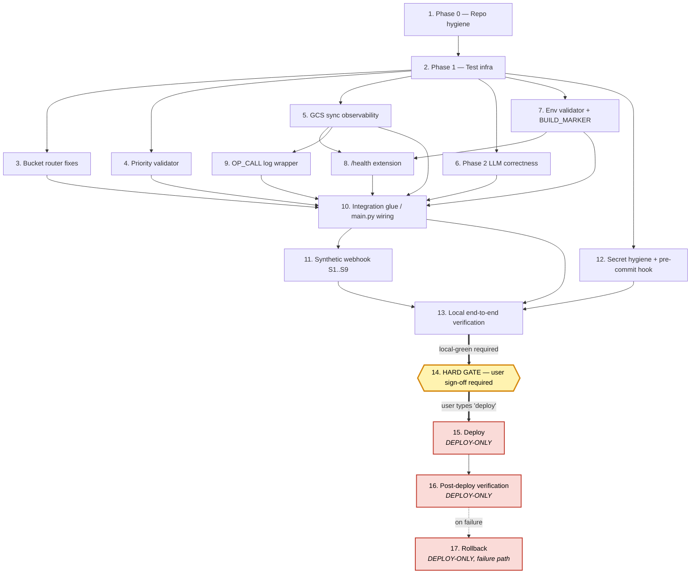

# Implementation Plan: Production Reliability Fixes

## Overview

Convert the production reliability design into a series of prompts for a code-generation
LLM that will implement each step with incremental progress. Make sure that each prompt
builds on the previous prompts, and ends with wiring things together. There should be no
hanging or orphaned code that isn't integrated into a previous step. Focus ONLY on tasks
that involve writing, modifying, or testing code.

The plan is **local-first**: phases 1–13 are fully executable on a developer laptop with no
deploy. Phase 14 is a **hard sign-off gate** — no `gcloud builds submit`, no
`gcloud run deploy`, and no env.yaml creation happens before the user explicitly says
"deploy". Phases 15–17 are deploy-only and clearly marked.

Implementation language: **Python 3.11** (matches `Dockerfile` and current codebase).

Files touched: `bucket_router.py`, `models.py`, `database.py`, `gemini_client.py`,
`openproject_client.py`, `main.py`, `config.py`, `.env.example`, `Dockerfile`,
`requirements-dev.txt` (new), `tests/unit/**` (new), `scripts/preflight.sh` /
`scripts/preflight.bat` (new), `scripts/synthetic_webhook.py` (new), `.git/hooks/pre-commit`
(new).

## Tasks

- [ ] 1. Repository hygiene (Phase 0)

  - [x] 1.1 Create feature branch `fix/production-reliability` from `main` and verify clean working tree
    - Run `git checkout -b fix/production-reliability` from repo root
    - Run `git status --porcelain` and confirm empty output
    - _Requirements: 7.1, 7.2_

  - [x] 1.2 Verify `.env`, `.dockerignore`, `.gcloudignore` exclusion rules
    - `grep -n '\.env' .gitignore .dockerignore .gcloudignore` and confirm `.env` is excluded in all three
    - Confirm `.env.example` is allowed by `.gitignore` but excluded by `.dockerignore`
    - _Requirements: 6.3, 6.4, 6.5_

  - [x] 1.3 Tag the pre-fix state for fast rollback comparison
    - Run `git tag pre-reliability-fix-$(date +%Y%m%d) && git tag -l` to confirm
    - _Requirements: 5.16_

- [x] 2. Test infrastructure setup (Phase 1)

  - [x] 2.1 Create `tests/unit/` directory with `__init__.py` and shared `conftest.py`
    - Add `conftest.py` with fixtures for a `caplog` helper that asserts on `_log_capture`
    - Add empty `__init__.py` so pytest discovers the package
    - _Requirements: 7.3_

  - [x] 2.2 Create `requirements-dev.txt` pinning `hypothesis`, `pytest`, `pytest-asyncio`
    - Pin exact versions: `hypothesis==6.108.5`, `pytest==8.3.3`, `pytest-asyncio==0.24.0`, `httpx==0.27.2`
    - Document in a comment that these are dev-only and SHALL NOT enter `requirements.txt`
    - _Requirements: 7.3, OutOfScope §"No new external runtime dependencies"_

  - [x] 2.3 Create `scripts/preflight.sh` skeleton (POSIX shell)
    - Add steps in order from design Theme 1.4: `git status --porcelain`, env validator invocation, `pytest -q`, synthetic webhook, `docker build --no-cache`, `docker run`, `curl /health`
    - `set -euo pipefail` at top; non-zero exit on any step failure
    - Leave each step as a placeholder that prints `[preflight] step X: …` until the underlying capability lands in later phases
    - _Requirements: 7.1, 7.2_

  - [x] 2.4 Create `scripts/preflight.bat` skeleton (Windows cmd)
    - Mirror `preflight.sh` step-for-step using `if errorlevel 1 exit /b 1` between steps
    - _Requirements: 7.1, 7.2_

  - [x] 2.5 Create `scripts/synthetic_webhook.py` skeleton with `--scenario` CLI arg
    - Use `argparse` to accept `--scenario {S1,S2,S3,S4,S5,S6,S7,S8,S9,all}`
    - Stub each scenario as `def scenario_S1(): raise NotImplementedError("filled in task 11.x")`
    - Wire up `httpx.ASGITransport` boot of `main:app` so later scenarios just plug in
    - Exit non-zero on any scenario raising `AssertionError` or `NotImplementedError`
    - _Requirements: 7.4, 7.5, 7.6_

- [ ] 3. Bucket router fixes (Theme 4 → Requirement 1)

  - [x] 3.1 Add anchored `BUCKET_TAG_RE` constant in `bucket_router.py`
    - Add `BUCKET_TAG_RE = re.compile(r'^\s*\[([A-Za-z][A-Za-z0-9 &/\-]{1,40})\]\s*')`
    - Replace the existing free-floating `re.search(r'\[([^\]]+)\]', text)` with `BUCKET_TAG_RE.match(text)`
    - _Requirements: 1.1, 1.2, 1.15_

  - [x] 3.2 Stop stripping the bucket tag from the text returned to the caller
    - In `extract_bucket_from_message`, return the **original** `text` byte-identically as `text_for_llm` regardless of whether a tag matched
    - Remove the `text[:tag_match.start()] + text[tag_match.end():]` slice and the subsequent `.strip()`
    - _Requirements: 1.9, 1.11..1.20_

  - [x] 3.3 Tighten `_resolve_tag` — drop inverse substring match, raise fuzzy cutoff to 0.78, enforce 3-char alias minimum, 2-char tag minimum
    - Remove the `tag_lower in alias` branch (keep only `alias in tag_lower` AND `len(alias) >= 3`)
    - Change `get_close_matches(... cutoff=0.6)` to `cutoff=0.78`
    - Add early-return `if len(tag_lower) < 2: return None`
    - _Requirements: 1.5, 1.6, 1.7, 1.8_

  - [-] 3.4 Add `CROSS_KEYWORD_SINGLE_WORDS` set constant in `bucket_router.py`
    - `CROSS_KEYWORD_SINGLE_WORDS = {"login", "home", "homepage", "search", "page", "screen", "app", "android", "ios", "user", "buyer", "seller"}`
    - Place near the top with `PROJECT_ALIASES`
    - _Requirements: 1.25, 1.26_

  - [~] 3.5 Implement `_extract_bucket_from_freetext(text)` helper
    - Step A: regex-extract `bucket\s*[-:]?\s*<name>` → `_resolve_tag(<name>)` short-circuit
    - Step B: multi-word project-name whole-word phrase scoring (score 10) over `OP_PROJECTS` keys
    - Step C: multi-word alias whole-word phrase scoring (score 8) over `PROJECT_ALIASES`
    - Step D: single-word alias scoring — score 5 if alias ∉ `CROSS_KEYWORD_SINGLE_WORDS`, else score 1
    - Return single-winner project id; return `None` on tied low-confidence (max score < 10)
    - This helper is pure Python — no LLM calls (Property 7)
    - _Requirements: 1.21, 1.22, 1.23, 1.24, 1.25, 1.26, 1.27, 1.28_

  - [~] 3.6 Update `extract_bucket_from_message` flow to integrate freetext layer
    - New order: `BUCKET_TAG_RE.match` → `_resolve_tag(tag)` → if `None`, `_extract_bucket_from_freetext(text)` → if `None`, `_detect_device_platform(text)`
    - Always return the original `text` as the second tuple element (depends on 3.2)
    - _Requirements: 1.10, 1.21_

  - [ ]* 3.7 Write parametrized unit test `test_extract_bucket_regex` for T-BR-1..T-BR-20
    - File: `tests/unit/test_bucket_router.py`
    - Parametrize over the 20 cases in design §4 + requirements §1 (LMS Webview, Webveiw typo, lms alias, [step 3] negative, [2024-05-12] reject, [L] short-tag reject, [home] cutoff, [Desktop Homepage] exact, [Header & Footer] alias, [Random Garbage Tag] no-match, bucket - LMS webview, Flickering on LMS Webview chat screen iPhone 13, Photo Search bug on Android, Samsung S23 device-only, BL webview crash on Android)
    - Assert both `project_id` and that `text_for_llm == input_text` byte-identically
    - _Requirements: 1.11..1.20, 1.29..1.33_

  - [ ]* 3.8 Write Property 3 hypothesis test `test_resolve_tag_typo_tolerance`
    - File: `tests/unit/test_bucket_router_property.py`
    - For each canonical name in `OP_PROJECTS`, generate edits within Levenshtein distance 1–2 via a hypothesis strategy
    - Assert `_resolve_tag(typo)` returns either the original project id or `None` — never a different project's id
    - **Property 3: Bucket tag routing is robust to typos and preserves the brief**
    - **Validates: Requirements 1.5, 1.7, 1.9, 1.12**
    - _Requirements: 1.5, 1.7, 1.9, 1.12_

- [x] 4. Models — priority validator + defaults (Theme 5 → Requirement 4)

  - [x] 4.1 Replace substring priority validator with word-boundary regex in `models.py`
    - Add module-level `_HIGH_PRIORITY_RE` with the exact whitelist from Requirement 4.3 wrapped in `\b…\b`
    - Add module-level `_LOW_PRIORITY_RE` with the exact whitelist from Requirement 4.4 wrapped in `\b…\b`
    - Compile with `re.IGNORECASE`
    - _Requirements: 4.3, 4.4, 4.9_

  - [x] 4.2 Rewrite `validate_priority` field validator with fast path + tie-breaker + audit log
    - Empty/non-string → `MEDIUM`
    - Lowercased trimmed equals `high|medium|low` → fast-path return
    - Both regexes match → `MEDIUM` and `logger.warning("PRIORITY_AMBIGUOUS: both HIGH and LOW keywords matched in %r — defaulting to MEDIUM", v)`
    - Only HIGH → `HIGH`; only LOW → `LOW`; neither → `MEDIUM`
    - _Requirements: 4.1, 4.2, 4.5, 4.6, 4.7, 4.8_

  - [x] 4.3 Document fail-fast vs fallback fields in `ExtractedBugReport` docstring
    - In the class docstring, list which fields use intentional defaults (`bug_type=Functional/Logical`, `priority=Medium`, `environment=STAGE`, `platform=Android`) vs which ones must come from the LLM (`steps_to_reproduce`, `actual_behavior`, `device`, `operating_system`)
    - Reference design Theme 5.2
    - _Requirements: 3.1, 3.2_

  - [ ]* 4.4 Write `test_priority_validator_word_boundary` parametrized over the §5.1 behaviour table
    - File: `tests/unit/test_priority_validator.py`
    - 17 rows from Requirement 4.10 — assert each input maps to the expected `PriorityLevel`
    - _Requirements: 4.10_

  - [ ]* 4.5 Write `test_priority_validator_ambiguous_logs_warning` with `caplog`
    - For `"intermittent crash"`, `"screen freezes intermittently"`, `"sometimes crashes on payment"` — assert result is `MEDIUM` AND `caplog.records` contains a WARNING message starting with `PRIORITY_AMBIGUOUS:`
    - _Requirements: 4.5, 4.10_

  - [ ]* 4.6 Write Property 4 hypothesis test `test_priority_validator_property`
    - File: `tests/unit/test_priority_validator_property.py`
    - Strategy: union of HIGH whitelist ∪ LOW whitelist ∪ `text()` noise; assemble random strings
    - Assert validator output matches deterministic reference function `_reference_priority(s)` defined in the same test file
    - **Property 4: Priority defaults to Medium unless a high-severity keyword fires**
    - **Validates: Requirements 4.1..4.10**
    - _Requirements: 4.1, 4.2, 4.3, 4.4, 4.5, 4.6, 4.7, 4.8, 4.9_

- [ ] 5. GCS sync observability (Theme 2 → Requirement 2 + Requirement 8 GCS portion)

  - [x] 5.1 Define `GcsSyncStatus` Pydantic model in `database.py`
    - Fields per design Data Models §`GcsSyncStatus`: `op`, `started_at`, `finished_at`, `duration_ms`, `outcome` (8-value Literal), `bytes`, `detail`
    - Add validators: `duration_ms >= 0`, `bytes >= 0`, `bytes > 0` only when `outcome == "ok"`, `detail` truncated to 500 chars
    - _Requirements: 2.2, 2.11_

  - [x] 5.2 Add module-level `_last_gcs_sync: Optional[GcsSyncStatus] = None` plus accessor `get_last_gcs_sync()`
    - Accessor returns the snapshot or `None`
    - _Requirements: 2.11, 2.12_

  - [x] 5.3 Refactor `_download_db_from_gcs()` with typed exception ladder
    - Implement the 8-outcome ladder per Requirement 2.4..2.9 and design §2.1 pseudocode
    - Always set `_last_gcs_sync` and emit exactly one `GCS_SYNC op=download outcome=… duration_ms=… bytes=… detail="…"` line via `logger.info`
    - Never re-raise
    - Return the `GcsSyncStatus` (callers may ignore)
    - _Requirements: 2.1, 2.2, 2.4, 2.5, 2.6, 2.7, 2.8, 2.9, 2.10, 8.1_

  - [-] 5.4 Refactor `_upload_db_to_gcs()` with same exception ladder
    - Same 8 outcomes; `outcome=skipped` when `LOCAL_DB_PATH` does not exist locally
    - Critical change vs. current code: must NOT silently `pass` on `ImportError` — it must log and update `_last_gcs_sync` (Requirement 2.4)
    - Same `GCS_SYNC op=upload …` log line shape
    - _Requirements: 2.3, 2.4, 2.5, 2.6, 2.7, 2.8, 2.9, 2.10, 8.1_

  - [~] 5.5 Wire upload calls in `create_or_update_user` and `close_database` (preserve existing call sites)
    - Verify `_upload_db_to_gcs()` is still called after each successful registration commit (existing) and once during `close_database` (existing)
    - _Requirements: 2.14, 2.15_

  - [ ]* 5.6 Write `test_download_db_each_outcome` parametrized over all 8 outcomes
    - File: `tests/unit/test_database_gcs_sync.py`
    - Use `unittest.mock.patch` on `google.cloud.storage.Client` to inject each exception type
    - For each outcome, assert: function returns a `GcsSyncStatus` with the expected `outcome`, never raises, and emits exactly one matching `GCS_SYNC op=download` log line via `caplog`
    - _Requirements: 2.2, 2.4..2.10, 8.1_

  - [ ]* 5.7 Write `test_upload_db_each_outcome` parametrized over all 8 outcomes
    - Same harness as 5.6, with `op=upload` and the no-local-file → `skipped` case
    - Critical assertion: `ImportError` must produce a `GCS_SYNC op=upload outcome=import_error` line — not silence
    - _Requirements: 2.3, 2.4, 2.10, 8.1_

- [ ] 6. Phase 2 LLM correctness (Theme 3 → Requirement 3)

  - [x] 6.1 Define `PHASE2_PROMPT_TEMPLATE` constant in `gemini_client.py` with all 11 mandatory fields
    - Use the exact template from design Theme 3.1, with `{initial_json}` and `{original_brief}` substitution slots
    - The 11 mandatory fields, in order: `is_valid`, `title`, `actual_behavior`, `expected_behavior`, `steps_to_reproduce`, `device`, `operating_system`, `environment`, `app_version`, `bug_type`, `priority`
    - Forbid `null`, empty arrays, and the literal `"See attached media for reproduction steps"`
    - _Requirements: 3.1, 3.2, 3.3_

  - [x] 6.2 Define `Phase2TruncatedError` exception and `JsonCleanResult` NamedTuple
    - Place both in `gemini_client.py` near the top
    - `JsonCleanResult` matches design Data Models §`JsonCleanResult`: `cleaned: str`, `was_truncated: bool`, `repair_log: list[str]`
    - _Requirements: 3.6, 3.7_

  - [x] 6.3 Rewrite `_clean_json_response` to detect truncation and raise (no silent repair)
    - Strip surrounding markdown fences (preserve existing behaviour)
    - Detect: `count('{') > count('}')`, `count('[') > count(']')`, unterminated string scan
    - On any detection: `logger.error("PHASE2_TRUNCATED detections=%s preview=%r", detections, cleaned[-200:])` and `raise Phase2TruncatedError(...)`
    - On clean input: return the cleaned string unchanged
    - **DO NOT** append closing braces, brackets, or quotes — that path is removed
    - _Requirements: 3.5, 3.6, 3.7_

  - [-] 6.4 Define `DEFAULT_STUFFING_MARKERS` constant and implement `_detect_default_stuffing(report)`
    - Constant exposes the 4 placeholder rules from Requirement 3.10 (a..d) for greppability
    - Function is pure (no I/O, no logging) — caller logs `PHASE2_DEFAULT_STUFFED reasons=<labels>`
    - Returns `(is_stuffed: bool, reasons: list[str])` so caller can log the reasons
    - Trigger threshold: ≥ 2 of 4 conditions hold
    - _Requirements: 3.10, 3.13_

  - [~] 6.5 Update `enrich_with_media` to use new prompt + `max_tokens=6000` + `client_timeout=45s` + `asyncio.wait_for(50s)`
    - Build prompt via `PHASE2_PROMPT_TEMPLATE.format(initial_json=..., original_brief=text)` — `text` includes any `[Tag]` from Phase 1 of the bucket router
    - Set `max_tokens=6000`
    - Set inner `client.chat.completions.create(..., timeout=45.0)` and outer `asyncio.wait_for(..., timeout=50.0)`
    - Keep the system prompt slot but remove the inline mega-prompt that currently lives in the function body
    - Depends on 6.1, 6.3
    - _Requirements: 3.1, 3.4, 3.14_

  - [~] 6.6 Wire fall-back-to-Phase-1 paths in `enrich_with_media` for truncation, timeout, default-stuffing
    - Catch `Phase2TruncatedError` → `logger.error("PHASE2 fall-back: truncation detected, returning Phase 1 result")` → `return initial_report`
    - Catch `asyncio.TimeoutError` (outer wait_for) → `logger.error("PHASE2_SLOW outcome=timeout duration_ms=50000 frames=%d", frame_count)` → `return initial_report`
    - After successful parse, run `is_stuffed, reasons = _detect_default_stuffing(parsed)`; if `is_stuffed`: `logger.error("PHASE2_DEFAULT_STUFFED reasons=%s", reasons)` → `return initial_report`
    - **MUST NOT** retry the LLM call on any of these three branches
    - Depends on 6.2, 6.3, 6.4, 6.5
    - _Requirements: 3.8, 3.9, 3.11, 3.15, 3.16_

  - [ ]* 6.7 Write `test_clean_json_response_clean_input_unchanged` and `test_clean_json_response_raises_on_truncation`
    - File: `tests/unit/test_clean_json_response.py`
    - Clean input cases: balanced braces, no markdown — string returned unchanged
    - Truncation cases: missing `}`, missing `]`, unterminated string — assert `Phase2TruncatedError` raised AND ERROR-level log line starts with `PHASE2_TRUNCATED`
    - _Requirements: 3.5, 3.6, 3.7_

  - [ ]* 6.8 Write `test_detect_default_stuffing_all_paths` covering the 2-of-4 threshold
    - File: `tests/unit/test_detect_default_stuffing.py`
    - Parametrize over (a) only, (b) only, (c) only, (d) only — all → `is_stuffed=False`
    - Parametrize over each pair (a∧b, a∧c, a∧d, b∧c, b∧d, c∧d) — all → `is_stuffed=True`
    - _Requirements: 3.10, 3.13_

  - [ ]* 6.9 Write `test_enrich_with_media_falls_back_to_phase1_on_truncation` and `…_on_default_stuffing` and `…_on_timeout`
    - File: `tests/unit/test_enrich_with_media_fallbacks.py`
    - Mock `client.chat.completions.create` to return a truncated string, a default-stuffed JSON, and a hanging coroutine respectively
    - Assert in all three: returned object **is** `initial_report` (identity check) AND no retry occurred (mock called exactly once) AND the appropriate ERROR log line was emitted
    - _Requirements: 3.8, 3.9, 3.11, 3.12, 3.15, 3.16_

  - [ ]* 6.10 Write Property 6 hypothesis test `test_phase2_token_budget_invariance`
    - File: `tests/unit/test_phase2_token_budget_property.py`
    - Strategy: `frame_count ∈ st.integers(1, 20)`, `brief_word_count ∈ st.integers(1, 500)`
    - For each draw, assemble a synthetic Phase 2 raw response of realistic shape (full 11-field JSON, `steps_to_reproduce` sized to frame_count, narrative sized proportional to brief_word_count)
    - Assert the response token count, when rounded to the nearest 1000, never exceeds 6000 (the `max_tokens` ceiling)
    - **Property 6: Phase 2 token budget invariance**
    - **Validates: Requirement 3.4**
    - _Requirements: 3.4_

- [x] 7. Env-var validator + BUILD_MARKER (Theme 1.2 → Requirement 5)

  - [x] 7.1 Implement `validate_env_vars(settings)` in a new module `env_validator.py`
    - 5 checks per Requirements 5.6..5.10: empty-required, whitespace/`\n`/`\r`, `=UPPER_SNAKE` corruption signature, `LLM_API_KEY` `sk-` prefix, `DEMO_SPACE_ID` shape (`^[A-Za-z0-9_-]+$`)
    - Return `list[str]` — never raise, never mutate `settings`
    - Log each warning at WARNING level prefixed `ENV_VALIDATION:`
    - On empty list, log `ENV_VALIDATION: all checks passed` at INFO
    - _Requirements: 5.2, 5.3, 5.4, 5.5, 5.6, 5.7, 5.8, 5.9, 5.10_

  - [x] 7.2 Generate a `BUILD_MARKER` value at build time
    - Add `Dockerfile` step: `ARG BUILD_MARKER` followed by `RUN echo "$BUILD_MARKER" > /app/BUILD_MARKER`
    - Add Python helper `read_build_marker()` in `env_validator.py` that reads `/app/BUILD_MARKER` if present, else falls back to `os.environ.get("BUILD_MARKER")`, else returns `dev-<unix-timestamp>`
    - _Requirements: 5.11_

  - [x] 7.3 Update `Dockerfile` to accept and bake the `BUILD_MARKER` build-arg
    - Place `ARG BUILD_MARKER` after the base image line, before `COPY . .`
    - Document in a `Dockerfile` comment that `gcloud builds submit` must pass `--substitutions=_BUILD_MARKER=<sha>` (wired in Phase 15)
    - _Requirements: 5.11_

  - [x] 7.4 Wire `validate_env_vars` and `BUILD_MARKER` emission into `main.py` lifespan
    - In `lifespan()`, immediately after `settings = get_settings()` and before `init_database`, call `validate_env_vars(settings)` exactly once
    - Emit exactly one `logger.info("BUILD_MARKER: %s", read_build_marker())` line
    - Store the marker in a module-level `_build_marker` for `/health` to read
    - _Requirements: 5.1, 5.11, 5.12_

  - [ ]* 7.5 Write `test_validate_env_vars_detects_corruption` and `test_validate_env_vars_clean_input_passes`
    - File: `tests/unit/test_env_validator.py`
    - Corruption cases: empty `LLM_API_KEY`, value with embedded space, RC2-style `KEY1=valKEY2=val` shape, missing `sk-` prefix, `DEMO_SPACE_ID="bad value"`
    - Clean case: every value valid → returns `[]` AND `caplog` contains `ENV_VALIDATION: all checks passed`
    - _Requirements: 5.2, 5.3, 5.4, 5.5, 5.6, 5.7, 5.8, 5.9, 5.10_

- [ ] 8. /health endpoint extension (Theme 2.3 → Requirement 5 + 2)

  - [-] 8.1 Extend `HealthResponse` in `models.py` with `last_gcs_sync` and `build_marker`
    - Add `last_gcs_sync: Optional[dict] = None` and `build_marker: Optional[str] = None`
    - Match the design Data Models §`HealthResponse` shape exactly
    - _Requirements: 2.12, 5.12_

  - [~] 8.2 Update `/health` handler in `main.py` to populate the new fields and apply the `degraded` rule
    - Read `last_gcs_sync` via `database.get_last_gcs_sync()` (added in 5.2) and `model_dump()` it if non-`None`
    - Read `build_marker` from the module-level `_build_marker` set in 7.4
    - Apply `status="degraded"` rule from Requirement 2.13: if `last_gcs_sync` is set AND `outcome ∉ {ok, skipped}`, force `degraded`
    - Depends on 5.2, 7.4, 8.1
    - _Requirements: 2.12, 2.13, 5.12_

  - [ ]* 8.3 Write `test_health_endpoint_reports_gcs_status_and_build_marker`
    - File: `tests/unit/test_health_endpoint.py`
    - Use `httpx.AsyncClient` against `httpx.ASGITransport(app=main.app)`
    - Cases: no sync attempted → `last_gcs_sync=None` and `status` driven only by db+gemini; sync `ok` → `status=healthy`; sync `auth_error` → `status=degraded`
    - Assert `build_marker` is non-empty
    - _Requirements: 2.12, 2.13, 5.12_

- [x] 9. OP_CALL log wrapper (Requirement 8 OpenProject portion)

  - [x] 9.1 Wrap each HTTP call in `OpenProjectClient` with an `OP_CALL` log emitter
    - Create an internal `_log_op_call(start, response_or_exc)` helper that emits `OP_CALL outcome=<…> duration_ms=<n>`
    - 5 outcomes: `ok` (2xx), `client_error` (4xx), `server_error` (5xx), `network_error` (`httpx.RequestError` / `TimeoutError`), `unknown_error` (anything else)
    - Apply to `verify_api_key`, `create_work_package`, `add_attachment`, and any other public HTTP-touching method in `openproject_client.py`
    - _Requirements: 8.4, 8.5_

  - [ ]* 9.2 Write `test_op_call_log_outcomes` parametrized over 5 outcomes
    - File: `tests/unit/test_openproject_client_logging.py`
    - Use `httpx.MockTransport` to inject each response shape; assert exactly one `OP_CALL outcome=… duration_ms=…` line per call
    - _Requirements: 8.4, 8.5_

- [ ] 10. Integration glue + main.py wiring (Phase 3)

  - [~] 10.1 Wire bucket router output through `_handle_bug_report` so the LLM receives the original brief
    - Verify the `text` passed to `gemini_client.analyze_text_brief` and forwarded into `enrich_with_media` is the original `text_for_llm` from `extract_bucket_from_message` (byte-identical, with `[Tag]` preserved)
    - Update both call sites in `main.py`
    - Depends on 3.2, 3.6
    - _Requirements: 1.9, 3.3_

  - [~] 10.2 Verify Phase 2 fall-back paths each produce exactly one OpenProject ticket
    - Trace `_process_media_and_create_ticket` and confirm: on `Phase2TruncatedError` fall-back, on `PHASE2_SLOW` fall-back, and on `PHASE2_DEFAULT_STUFFED` fall-back, the code path proceeds to `op_client.create_work_package(initial_report, …)` exactly once
    - Add an explicit comment block referencing Requirement 3.12
    - Depends on 6.6
    - _Requirements: 3.12_

  - [~] 10.3 Confirm env-validator warnings + `BUILD_MARKER` are emitted before any other startup line
    - Reorder `lifespan()` so the sequence is: `settings`, `validate_env_vars`, `BUILD_MARKER` log, `init_database`, clients init
    - Depends on 7.4
    - _Requirements: 5.1, 5.11_

- [ ] 11. Synthetic webhook scenarios (Phase 4 → Theme 6 Tier 2)

  - [~] 11.1 Build common test harness in `scripts/synthetic_webhook.py`
    - Boot `main:app` via `httpx.ASGITransport`
    - Provide `mock_op_client.create_ticket`, `mock_gemini.client.chat.completions.create`, and `mock_storage_client` fixtures shared across scenarios
    - Capture log lines from `_log_capture` for assertion
    - _Requirements: 7.6_

  - [~] 11.2 Implement scenario S1 — empty brief + photo
    - POST `/webhook` with attachment but `text=""`; assert webhook returns the "please provide a brief description" message; mock `create_ticket` was NOT called
    - _Requirements: 7.4, 7.5_

  - [~] 11.3 Implement scenario S2 — `[LMS Webview] flickering` brief
    - Assert ticket created with `project_id=476`; assert prompt sent to LLM contains the `[LMS Webview]` prefix verbatim (Property 3 brief-preservation)
    - _Requirements: 1.9, 1.11, 7.4, 7.5_

  - [~] 11.4 Implement scenario S3 — `Login fails [step 3]` brief (negative test for over-matching)
    - Assert no `[step 3]` resolution; ticket falls back to Android (3); LLM receives the original `Login fails [step 3]` text
    - _Requirements: 1.2, 1.14, 1.32, 7.4, 7.5_

  - [~] 11.5 Implement scenario S4 — 20-frame video bug
    - Mock `_extract_video_frames` to return 20 frames; mock `chat.completions.create` to return a complete 11-field JSON; assert ticket created and `Phase 2 LLM response` log line is present
    - _Requirements: 3.1, 3.4, 7.4, 7.5, 8.3_

  - [~] 11.6 Implement scenario S5 — photo-only with default-stuffed Phase 2 response
    - Mock Phase 2 to return JSON satisfying ≥ 2 default-stuffing conditions; assert ticket is created from Phase 1 result; assert `PHASE2_DEFAULT_STUFFED` log line present
    - _Requirements: 3.10, 3.11, 3.12, 7.4, 7.5_

  - [~] 11.7 Implement scenario S6 — registration survives mocked GCS round-trip
    - Mock `storage.Client` to act like a real bucket (in-memory); register user → restart app instance → assert user is still registered after `_download_db_from_gcs` runs
    - Asserts `GCS_SYNC op=download outcome=ok` and `GCS_SYNC op=upload outcome=ok` log lines
    - _Requirements: 2.1, 2.14, 2.15, 7.4, 7.5, 8.1_

  - [~] 11.8 Implement scenario S7 — RC2 env-var corruption reproduction
    - Boot app with `DEFAULT_OPENPROJECT_API_KEY="<token> DEMO_SPACE_ID=AAQAhf6qdAw"` and `DEMO_SPACE_ID=""`
    - Assert validator emits two `ENV_VALIDATION:` warnings; assert `/health` is reachable; assert demo-space fallback is disabled
    - _Requirements: 5.6, 5.7, 5.8, 7.4, 7.5_

  - [~] 11.9 Implement scenario S8 — truncated Phase 2 response triggers fall-back
    - Mock `chat.completions.create` to return a JSON string missing the closing `}`
    - Assert: `Phase2TruncatedError` raised internally, `PHASE2_TRUNCATED` log line emitted, ticket still created using Phase 1 result, `create_ticket` called exactly once
    - _Requirements: 3.6, 3.8, 3.12, 7.4, 7.5_

  - [~] 11.10 Implement scenario S9 — Phase 2 timeout triggers fall-back (depends on 6.6)
    - Mock `chat.completions.create` to sleep > 50s; assert `PHASE2_SLOW outcome=timeout duration_ms=50000 frames=<n>` log line and ticket still created
    - _Requirements: 3.15, 3.16, 7.4, 7.5_

  - [~] 11.11 Wire `--scenario all` to run S1..S9 sequentially with non-zero exit on any failure
    - Aggregate per-scenario pass/fail; print a one-line summary; exit with `1` on any failure (Requirement 7.5)
    - _Requirements: 7.5_

- [x] 12. Secret hygiene (Phase 5 → Requirement 6)

  - [x] 12.1 Replace real values in `.env.example` with placeholders
    - Set `LLM_API_KEY=sk-REPLACE_WITH_YOUR_GATEWAY_TOKEN`, `DEFAULT_OPENPROJECT_API_KEY=REPLACE_WITH_DEMO_SPACE_API_KEY`, `DEMO_SPACE_ID=REPLACE_WITH_GOOGLE_CHAT_SPACE_ID`
    - Verify no real token remains via `grep -E '\b(sk|pk|api|key|token)[-_][A-Za-z0-9]{16,}\b' .env.example` returns no real-looking match
    - _Requirements: 6.1, 6.2_

  - [x] 12.2 Add pre-commit hook script `.git/hooks/pre-commit` (and a committed copy at `scripts/hooks/pre-commit` for reproducibility)
    - Bash script that scans staged `.env*` files; matches `\b(sk|pk|api|key|token)[-_][A-Za-z0-9]{16,}\b`; allow-lists `REPLACE_WITH_…` and `<single-line-token>`
    - On match: print offending line + file + abort with exit code 1
    - On clean: exit 0
    - _Requirements: 6.6, 6.7, 6.8, 6.9_

  - [x] 12.3 Document hook installation step in `README.md` or new `scripts/install-hooks.sh`
    - One-liner: `ln -sf ../../scripts/hooks/pre-commit .git/hooks/pre-commit && chmod +x .git/hooks/pre-commit`
    - _Requirements: 6.6_

  - [x] 12.4 Verify `.gitignore`, `.dockerignore`, `.gcloudignore` enforce the exclusion contract
    - Confirm `.gitignore` excludes `.env` and `*.env` while keeping `.env.example` whitelisted
    - Confirm `.dockerignore` excludes both `.env` and `.env.example`
    - Confirm `.gcloudignore` excludes `.env`
    - _Requirements: 6.3, 6.4, 6.5_

  - [ ]* 12.5 Test the pre-commit hook with a fake key (must reject) and a placeholder (must allow)
    - File: `tests/unit/test_precommit_hook.py`
    - Use `subprocess.run` to invoke `scripts/hooks/pre-commit` with a tempdir staged file containing `LLM_API_KEY=sk-fakefakefakefakefakefakeFAKE` → expect exit 1
    - Same hook with `LLM_API_KEY=sk-REPLACE_WITH_YOUR_GATEWAY_TOKEN` → expect exit 0
    - _Requirements: 6.7, 6.8, 6.9_

- [ ] 13. Local end-to-end verification (Phase 6)

  - [~] 13.1 Run full unit test suite green: `python -m pytest -q`
    - Run from repo root; all tests in `tests/unit/` pass
    - Depends on 3.7, 3.8, 4.4, 4.5, 4.6, 5.6, 5.7, 6.7, 6.8, 6.9, 6.10, 7.5, 8.3, 9.2, 12.5
    - _Requirements: 7.3_

  - [~] 13.2 Run synthetic webhook scenarios green: `python scripts/synthetic_webhook.py --scenario all`
    - All of S1–S9 pass; script exits 0
    - Depends on 11.2..11.11
    - _Requirements: 7.4, 7.5_

  - [~] 13.3 Build local Docker image clean: `docker build -t qa-bugbot:local --no-cache --build-arg BUILD_MARKER=local-$(git rev-parse --short HEAD) .`
    - No layer cache reuse; build succeeds
    - Depends on 7.3
    - _Requirements: 5.11_

  - [~] 13.4 Run container locally and verify `/health` shape
    - `docker run -p 8080:8080 --env-file .env qa-bugbot:local`
    - `curl localhost:8080/health` returns `status=healthy`, `build_marker` non-null and matching the build-arg, `last_gcs_sync.outcome ∈ {ok, skipped}` (or `null` if no creds locally — acceptable for local)
    - _Requirements: 2.12, 5.12_

  - [~] 13.5 Grep startup logs for the three required markers
    - `docker logs <container> | grep -E 'BUILD_MARKER|ENV_VALIDATION|GCS_SYNC'` returns at least one line for each marker
    - `BUILD_MARKER` line matches the build-arg value byte-identically
    - _Requirements: 2.2, 5.4, 5.5, 5.11_

  - [~] 13.6 Run `scripts/preflight.sh` end-to-end (POSIX) or `scripts/preflight.bat` (Windows) — green
    - Every step in 2.3 / 2.4 returns 0
    - Depends on 13.1, 13.2, 13.3, 13.4, 13.5
    - _Requirements: 7.1, 7.2_

- [ ] 14. **HARD GATE** — Wait for explicit user sign-off before any deploy

  > **DEPLOY-ONLY: Requires explicit user approval — do not proceed past this gate without the user typing "deploy".**

  - [~] 14.1 Present a summary of local-test results and STOP
    - Summarise: pytest pass count, synthetic-webhook S1..S9 pass list, `/health` snapshot from 13.4, BUILD_MARKER value, `last_gcs_sync` outcome
    - Explicitly ask the user: "Local verification complete. Reply with 'deploy' to proceed to Phase 8 (build + push), or 'rollback' to abort."
    - Do **NOT** run any `gcloud` command, do **NOT** create `env.yaml`, do **NOT** push the branch until the user confirms
    - _Requirements: 5.15, 7.8, 7.9, 7.10_

- [ ] 15. Deploy (Phase 8 — DEPLOY-ONLY, only after Phase 14 sign-off)

  > **DEPLOY-ONLY: Requires explicit user approval — only execute these tasks after the user has typed "deploy" in Phase 14.**

  - [~] 15.1 Create `env.yaml` from `.env` (NOT committed — covered by `.gitignore`)
    - One YAML scalar per env var, single-line, no embedded `=` or whitespace
    - Verify with `grep -E '^[A-Z_]+: ".*"$' env.yaml` that every line matches the expected shape
    - _Requirements: 5.13, 5.14_

  - [~] 15.2 Commit + tag + push the branch
    - `git add -A && git commit -m "fix: production reliability (RC1..RC8)"`
    - `git tag reliability-fix-$(date +%Y%m%d)`
    - `git push -u origin fix/production-reliability && git push --tags`
    - Pre-commit hook (from 12.2) MUST pass
    - _Requirements: 6.6, 6.7, 6.8, 6.9_

  - [~] 15.3 Build the image with `--no-cache` and pass `BUILD_MARKER` substitution
    - `gcloud builds submit --no-cache --substitutions=_BUILD_MARKER=$(git rev-parse --short HEAD) --tag <image> .`
    - Depends on 7.3, 15.2
    - _Requirements: 5.11_

  - [~] 15.4 Deploy with `--env-vars-file env.yaml` (NEVER `--set-env-vars` with spaces)
    - `gcloud run deploy qa-bugbot --image <image> --region asia-south1 --env-vars-file env.yaml --service-account qaautomation@artful-affinity-634.iam.gserviceaccount.com`
    - _Requirements: 5.13, 5.14_

- [ ] 16. Post-deploy verification (Phase 9 — DEPLOY-ONLY)

  > **DEPLOY-ONLY: Only run after Phase 15 has placed a new revision into traffic.**

  - [~] 16.1 `curl https://qa-bugbot-…/health` and assert the four key invariants
    - `status == "healthy"`, `build_marker == <git short sha>` (matches 15.3 substitution), `last_gcs_sync.outcome == "ok"`, `database == "connected"`
    - _Requirements: 2.12, 2.13, 5.12, 5.16_

  - [~] 16.2 Grep Cloud Run logs for the three required markers
    - `gcloud run services logs read qa-bugbot --region asia-south1 --limit 200 | grep -E 'BUILD_MARKER|ENV_VALIDATION|GCS_SYNC'`
    - Each marker present at least once in the most recent revision's startup window
    - _Requirements: 2.2, 5.4, 5.5, 5.11_

  - [~] 16.3 Confirm `Database initialized` log timestamp ≥ 200 ms after `Starting up...`
    - This proves the GCS download actually executed (the RC1 symptom was 112 ms, which is impossible with a real HTTP round-trip)
    - Capture the two timestamps from the same log query as 16.2 and assert delta ≥ 200 ms
    - _Requirements: 2.1, 5.16_

  - [~] 16.4 Send one known-good bug to the dev space and verify the resulting OpenProject ticket payload
    - Send `[LMS Webview] login button broken on iPhone 13` with no media
    - Assert: ticket created in project 476 (LMS Webview), `priority=High` (broken keyword), title contains the original brief, `steps_to_reproduce` is not the placeholder string
    - _Requirements: 1.11, 3.1, 3.2, 4.3, 4.6_

- [ ] 17. Rollback safety net (Phase 10 — only on failure)

  > **DEPLOY-ONLY, FAILURE-PATH: Run only if Phase 16 fails. Operator must execute the rollback explicitly.**

  - [~] 17.1 Roll back traffic to the last known-good revision
    - `gcloud run services update-traffic qa-bugbot --to-revisions qa-bugbot-00026-btk=100 --region asia-south1`
    - Confirm with `gcloud run services describe qa-bugbot --region asia-south1` that 100% traffic is on `qa-bugbot-00026-btk`
    - _Requirements: 5.16, 7.11_

  - [~] 17.2 Add `postmortem.md` documenting the regression
    - Sections: timeline, observed symptom, `BUILD_MARKER` mismatch (if any), `last_gcs_sync.outcome` at the time, top 5 log lines, root cause, prevention follow-up
    - Commit on the same branch but do NOT push until the team has reviewed
    - _Requirements: 5.16, 7.11_

## Notes

- Tasks marked with `*` are **optional** test sub-tasks — they can be skipped for a faster
  MVP, but the property tests (3.8, 4.6, 6.10) are highly recommended because they encode
  the most fragile invariants (typo tolerance, priority tie-breaker, token budget).
- Tasks 14, 15.x, 16.x, 17.x are **deploy-only** and are explicitly gated on user sign-off
  in Phase 14. The agent MUST NOT execute any task numbered ≥ 15 until the user types
  "deploy" in response to the Phase 14 prompt.
- Each task references one or more granular acceptance criteria from `requirements.md` for
  traceability.
- Property tests live in `tests/unit/test_*_property.py` to keep them visually distinct
  from example-based unit tests.
- The pre-commit hook (12.2) runs before every `git commit`, including 15.2 — a real
  leaked key would block the deploy commit, structurally enforcing Requirement 6.

## Task Dependency Graph



The Phase 7 sign-off gate (node `P7`) is a hard bottleneck: every node downstream of it
(`P8`, `P9`, `P10`) is deploy-only and requires explicit user approval. No `gcloud`
command runs until the user types "deploy".

### Execution Waves (for parallel task scheduling)

Same-file tasks are placed in different waves to prevent edit conflicts. Wave 27 onwards is
gated on the Phase 14 user sign-off — schedulers MUST stop at wave 27 and wait for explicit
user approval before advancing to wave 28+.

```json
{
  "waves": [
    { "id": 0, "tasks": ["1.1", "1.2", "1.3"] },
    { "id": 1, "tasks": ["2.1", "2.2", "2.3", "2.4", "2.5"] },
    { "id": 2, "tasks": ["3.1", "4.1", "5.1", "6.1", "7.1", "7.3", "9.1", "12.1", "12.2", "12.4"] },
    { "id": 3, "tasks": ["3.2", "4.2", "5.2", "6.2", "7.2", "12.3"] },
    { "id": 4, "tasks": ["3.3", "4.3", "5.3", "6.3", "7.4"] },
    { "id": 5, "tasks": ["3.4", "5.4", "6.4", "8.1"] },
    { "id": 6, "tasks": ["3.5", "5.5", "6.5", "8.2"] },
    { "id": 7, "tasks": ["3.6", "6.6"] },
    { "id": 8, "tasks": ["10.1"] },
    { "id": 9, "tasks": ["10.2"] },
    { "id": 10, "tasks": ["10.3"] },
    { "id": 11, "tasks": ["11.1"] },
    { "id": 12, "tasks": ["11.2"] },
    { "id": 13, "tasks": ["11.3"] },
    { "id": 14, "tasks": ["11.4"] },
    { "id": 15, "tasks": ["11.5"] },
    { "id": 16, "tasks": ["11.6"] },
    { "id": 17, "tasks": ["11.7"] },
    { "id": 18, "tasks": ["11.8"] },
    { "id": 19, "tasks": ["11.9"] },
    { "id": 20, "tasks": ["11.10"] },
    { "id": 21, "tasks": ["11.11"] },
    { "id": 22, "tasks": ["3.7", "3.8", "4.4", "4.5", "4.6", "5.6", "5.7", "6.7", "6.8", "6.9", "6.10", "7.5", "8.3", "9.2", "12.5"] },
    { "id": 23, "tasks": ["13.1", "13.2", "13.3"] },
    { "id": 24, "tasks": ["13.4"] },
    { "id": 25, "tasks": ["13.5"] },
    { "id": 26, "tasks": ["13.6"] },
    { "id": 27, "tasks": ["14.1"] },
    { "id": 28, "tasks": ["15.1"] },
    { "id": 29, "tasks": ["15.2"] },
    { "id": 30, "tasks": ["15.3"] },
    { "id": 31, "tasks": ["15.4"] },
    { "id": 32, "tasks": ["16.1", "16.2", "16.3", "16.4"] },
    { "id": 33, "tasks": ["17.1", "17.2"] }
  ]
}
```
