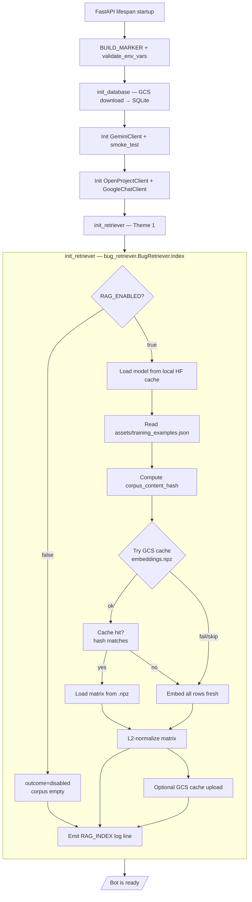
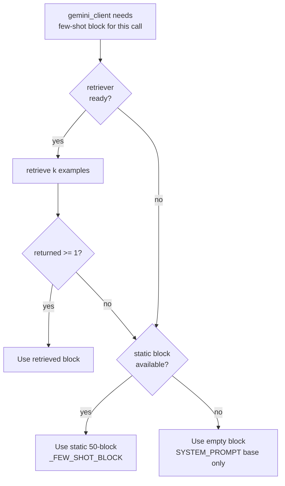

# Design Document: Retrieval-Augmented Few-Shot Selection

> **STATUS:** This document is the design contract for the new feature
> `rag-few-shot-retrieval`. The bot is currently live at revision
> `qa-bugbot-00042-8zj` (commit `5002f50`, tag `checkpoint-stable-20260530`).
> Every section of this design is constrained by what is already deployed —
> 190 unit tests, 9 synthetic webhook scenarios, the deterministic-Python-first
> bucket router, and the existing 22s/50s `asyncio.wait_for` deadlines.
>
> **HARD DEPLOY GATE:** No `gcloud run` command runs until the user explicitly
> types `deploy` after reviewing the readiness summary. See §10 and Requirement 9.

---

## Overview

Today, every Phase 1 (`analyze_text_brief`) and Phase 2 (`enrich_with_media`) prompt
includes the same static block of 50 few-shot examples produced once at module
import by `gemini_client._load_few_shot_block(max_examples=50)`. The block costs
~14,700 prompt tokens and ~4.4 s of Phase 1 latency, regardless of whether the
brief is about LMS Webview, Photo Search, Desktop PDP, or WebERP. More than 100
examples hits a gateway timeout cliff.

This feature replaces *only the few-shot block* on a per-call basis with the
top-K most semantically similar past tickets to the current brief. A new module
`bug_retriever.py` builds an in-memory `numpy.ndarray(N, 384)` corpus matrix at
cold start using a locally-cached `sentence-transformers/all-MiniLM-L6-v2`
model, optionally restored from `gs://qa-bugbot-data/embeddings.npz` for fast
cold start. On every webhook, `gemini_client` embeds `text_for_llm`, retrieves
top-K (default 5) by cosine similarity with a `+0.05` soft boost for entries
matching the bucket-routed `project_id`, and substitutes those examples into
the prompt for that one call. The static 50-example fallback path stays in the
codebase, reachable on every error and degraded-state path.

**What changes.** Where the few-shot examples in the LLM prompt come from on
each call: they are now retrieval-selected instead of static-50.

**What does not change.**

- `bucket_router.py` stays the sole authority for OpenProject `project_id`.
  The retriever consumes `project_id` as a soft signal; it never overrides it.
- The OpenProject API surface, `LLM_CALL` / `OP_CALL` / `GCS_SYNC` /
  `ENV_VALIDATION` / `BUILD_MARKER` log markers, and the `/health` shape
  (other than the new `rag` sub-object).
- The 22 s Phase 1 and 50 s Phase 2 `asyncio.wait_for` ceilings.
- The 30 s Google Chat webhook deadline.
- The two-phase pipeline; Phase 2 fall-back paths (`Phase2TruncatedError`,
  `PHASE2_DEFAULT_STUFFED`, `PHASE2_SLOW`).
- The 190 unit tests under `tests/unit/` and the 9 synthetic webhook scenarios
  in `scripts/synthetic_webhook.py`.

### Theme → Requirements map

| Theme | Requirements satisfied |
|---|---|
| Theme 1 — Index lifecycle | Req 1, Req 7 |
| Theme 2 — Per-call retrieval | Req 2, Req 3 |
| Theme 3 — Fallback safety | Req 4, Req 8 (parts) |
| Theme 4 — Observability | Req 6 |
| Theme 5 — Latency budget enforcement | Req 5, Req 8 (parts) |
| Theme 6 — Cache and persistence | Req 7 |
| Theme 7 — Hard deploy gate | Req 9 |

---

## Architecture

### 2.1 Cold-start flow (lifespan → ready)



The retriever's `index()` is **synchronous and blocking** within the lifespan
hook so that the first served webhook has a deterministic state. If anything
inside `index()` raises, the exception is caught at the boundary, the corpus
matrix is left empty, an `RAG_INDEX outcome=*_failed` line is emitted, and
the bot continues to start. This is the same never-raise pattern as
`_download_db_from_gcs`.

### 2.2 Per-request flow (webhook → bucket_router → retriever → LLM)

```mermaid
flowchart LR
    WH[/POST /webhook/]
    BR[bucket_router.<br/>extract_bucket_with_provenance]
    P1[gemini_client.<br/>analyze_text_brief<br/>text_for_llm, project_id]
    RET1[BugRetriever.<br/>retrieve query=text_for_llm<br/>k=K, project_filter=project_id]
    REND[_render_examples_block<br/>retrieved → prompt block]
    LLM1[LLM call<br/>SYSTEM_PROMPT base + retrieved block]
    P2{Has media?}
    BG[Phase 2 background task]
    RET2[BugRetriever.retrieve same query]
    LLM2[Phase 2 LLM call<br/>retrieved block]
    OP[create_work_package<br/>project_id]

    WH --> BR --> P1 --> RET1 --> REND --> LLM1 --> P2
    P2 -- no --> OP
    P2 -- yes --> BG --> RET2 --> LLM2 --> OP
```



Two key invariants visible in this diagram:

- `project_id` flows **from bucket_router into the retriever**, never the other
  way. The retriever is a pure function of `(corpus, query, k, project_id)`.
- The same `text_for_llm` (`[Tag]` preserved, brief byte-identical) is the
  query for both Phase 1 and Phase 2 retrieval. Phase 2 does not re-query with
  the enriched media-aware text — that would change what semantically similar
  means and we want stable behavior across phases for a single brief.

### 2.3 Fallback chain (retrieved → static → empty)



`retriever ready?` collapses the cases `RAG_ENABLED=false`,
`get_retriever() is None`, and `retriever.is_ready() is False` into one branch.
The static-50 path is always reachable as long as
`assets/training_examples.json` is present in the image; the empty branch is
reached only when both retrieval AND the static loader fail.

### 2.4 Module boundaries

| Owns | `bug_retriever.py` | `gemini_client.py` |
|---|---|---|
| Embedding model lifecycle (load, warm) | yes | no |
| Corpus matrix in memory | yes | no |
| Cosine similarity + top-K + soft boost | yes | no |
| GCS cache I/O for `embeddings.npz` | yes | no |
| `RAG_INDEX` and `RAG_RETRIEVE` log lines | yes | no |
| Few-shot examples → prompt block string rendering | no | yes |
| Static `_FEW_SHOT_BLOCK` and `_load_few_shot_block` | no | yes (existing) |
| Decision to use retrieved vs. static vs. empty | no | yes |
| `LLM_CALL` log emission with `rag_examples` extra | no | yes |
| Calling `BugRetriever.retrieve()` per request | no | yes |

Tests for `bug_retriever.py` exercise it as a self-contained unit;
`gemini_client` tests stub the retriever via the module-level singleton.

---

## Themes

### Theme 1 — Index lifecycle

**Goal.** Build the corpus matrix exactly once per container instance, in the
lifespan startup hook, with three possible source paths (cache hit, fresh
recompute, disabled), and emit exactly one `RAG_INDEX` log line that operators
can grep for.

**Data structures.**

```python
# bug_retriever.py
import numpy as np
from typing import Optional, Literal, TypedDict

# Per-row metadata aligned 1:1 with corpus matrix rows
class CorpusEntry(TypedDict):
    id: str                # ticket id from training_examples.json
    subject: str
    description_raw: str
    project: str           # human-readable name from training_examples.json
    project_id: Optional[int]   # resolved via OP_PROJECTS, None if unknown
    priority: str          # "High" | "Medium" | "Low"
    bug_type: str          # "UI/UX" | "Functional/Logical" | ...
    environment: str       # "LIVE" | "STAGE"
    category: Optional[str]

IndexOutcome = Literal[
    "ok",
    "cache_hit",
    "cache_stale",
    "cache_miss",
    "model_load_failed",
    "corpus_load_failed",
    "disabled",
]

CacheSource = Literal["gcs", "recompute", "static_fallback", "none"]
```

**Critical-path pseudocode (BugRetriever.index).**

```python
def index(self) -> None:
    """Build the in-memory corpus. Never raises. Emits one RAG_INDEX line."""
    started_at = time.monotonic()
    outcome: IndexOutcome = "disabled"
    source: CacheSource = "none"

    if not self._enabled:                                 # RAG_ENABLED=false
        self._emit_index_log(started_at, "disabled", "none", 0)
        return

    # 1) Load corpus rows from JSON. Failure → corpus_load_failed.
    try:
        rows = self._load_corpus_rows()                   # list[CorpusEntry]
    except Exception as e:
        self._matrix = None
        self._entries = []
        self._emit_index_log(started_at, "corpus_load_failed", "none", 0,
                             detail=f"{type(e).__name__}: {e}")
        return
    if not rows:
        self._matrix = None
        self._entries = []
        self._emit_index_log(started_at, "corpus_load_failed", "none", 0,
                             detail="no valid entries in training_examples.json")
        return

    # 2) Load model. Failure → model_load_failed.
    try:
        self._model = self._load_model()                  # may download weights
    except Exception as e:
        self._matrix = None
        self._entries = []
        self._emit_index_log(started_at, "model_load_failed", "none", 0,
                             detail=f"{type(e).__name__}: {e}")
        return

    self._content_hash = self._compute_corpus_hash(rows)  # sha256

    # 3) Try GCS cache.
    matrix = self._try_load_cache(self._content_hash)
    if matrix is not None:
        outcome, source = "cache_hit", "gcs"
    else:
        # 4) Fresh embed.
        try:
            matrix = self._embed_rows_l2_normalized(rows)
        except Exception as e:
            self._matrix = None
            self._entries = []
            self._emit_index_log(started_at, "model_load_failed", "none", 0,
                                 detail=f"embed failed: {type(e).__name__}: {e}")
            return
        outcome = "cache_stale" if self._cache_existed_but_mismatched else "cache_miss"
        source = "recompute"
        self._try_upload_cache(matrix, self._content_hash)  # never raises

    self._matrix = matrix       # shape (N, 384), float32, L2-normalized
    self._entries = rows
    self._emit_index_log(started_at, outcome, source, len(rows))
```

**Failure modes and which fallback they trigger.**

| Failure inside `index()` | `RAG_INDEX outcome` | Resulting state | Fallback when retrieve() is called |
|---|---|---|---|
| `RAG_ENABLED=false` | `disabled` | `_matrix=None`, `_entries=[]` | static-50 |
| `training_examples.json` missing/empty/malformed | `corpus_load_failed` | `_matrix=None`, `_entries=[]` | static-50 |
| Model download/load raises | `model_load_failed` | `_matrix=None`, `_entries=[]` | static-50 |
| GCS cache fetch errors | logged as `cache_miss` (not failure) | falls through to fresh embed | n/a |
| Fresh embed raises | `model_load_failed` (with "embed failed" detail) | `_matrix=None`, `_entries=[]` | static-50 |
| Cache upload fails | `outcome` unchanged; `GCS_SYNC op=upload outcome=… detail="rag_embeddings"` line | in-memory matrix authoritative | n/a |

The `is_ready()` predicate is `self._matrix is not None and len(self._entries) > 0`.

**Satisfies:** 1.1, 1.2, 1.3, 1.4, 1.5, 1.6, 1.7, 1.8, 7.1, 7.2, 7.3, 7.4, 7.5, 7.6.

---

### Theme 2 — Per-call retrieval

**Goal.** On every Phase 1 and Phase 2 invocation, embed `text_for_llm`,
score against the corpus matrix, optionally apply the `+0.05` soft project
boost, and return the top-K rows in descending score order. Pure, deterministic,
no I/O.

**Data structures.**

```python
class RetrievedExample(TypedDict):
    # Same fields _format_example consumes today:
    id: str
    subject: str
    description_raw: str
    project: str
    project_id: Optional[int]
    priority: str
    bug_type: str
    environment: str
    category: Optional[str]
    # Diagnostics:
    score: float           # cosine + soft boost; in [-1.0, 1.05]
    matched_project: bool  # True iff project_id == project_filter

class RetrieveOutcome(TypedDict):
    examples: list[RetrievedExample]
    log_outcome: Literal[
        "ok",
        "index_unavailable",
        "embed_error",
        "empty_corpus",
        "short_brief",
    ]
    duration_ms: int
    matched_in_project: int
```

**Critical-path pseudocode (BugRetriever.retrieve).**

```python
def retrieve(
    self,
    query: str,
    k: int = 5,
    project_filter: Optional[int] = None,
    *,
    phase: Literal["phase1", "phase2"] = "phase1",
) -> list[RetrievedExample]:
    """
    Pure: no I/O, no randomness. Time bounded by single embed + matvec + sort.
    Never raises for any input that gemini_client could pass.
    """
    t0 = time.monotonic()
    k = max(1, min(int(k), 20))                 # hard bound 1..20

    # Guard 0: not enabled / not ready
    if not self.is_ready():
        return self._finish(t0, [], "index_unavailable", k, project_filter, 0, phase)

    # Guard 1: short brief — still attempt; caller decides what to do
    short = (query is None) or (len(query.strip()) < 20)
    if short:
        # we still continue; outcome reported as short_brief on the success path
        pass

    # Embed query. Any exception → empty list + embed_error.
    try:
        q = self._embed_query_l2_normalized(query or "")  # shape (384,)
    except Exception as e:
        logger.exception("RAG_RETRIEVE embed_error: %s", e)
        return self._finish(t0, [], "embed_error", k, project_filter, 0, phase)

    if self._matrix is None or len(self._entries) == 0:
        return self._finish(t0, [], "empty_corpus", k, project_filter, 0, phase)

    # Cosine similarity = matrix · q  (matrix and q are L2-normalized)
    scores = self._matrix @ q                      # shape (N,), in [-1, 1]

    # Soft project boost (Theme 2.3 / Req 3.2)
    if project_filter is not None:
        same_project_mask = self._project_id_array == project_filter
        scores = scores + (same_project_mask * 0.05)

    # Top-K
    if len(scores) <= k:
        idx = np.argsort(-scores)
    else:
        # argpartition + argsort over the K-sized slice — avoids full sort
        partition = np.argpartition(-scores, k)[:k]
        idx = partition[np.argsort(-scores[partition])]

    examples: list[RetrievedExample] = []
    matched_in_project = 0
    for i in idx:
        e = self._entries[i]
        matched = (project_filter is not None
                   and e["project_id"] == project_filter)
        if matched:
            matched_in_project += 1
        examples.append({**e, "score": float(scores[i]), "matched_project": matched})

    outcome = "short_brief" if short else "ok"
    return self._finish(t0, examples, outcome, k, project_filter,
                        matched_in_project, phase)
```

**Soft project boost arithmetic.** With L2-normalized vectors, raw cosine is in
`[-1.0, 1.0]`. Adding a constant `0.05` to entries whose `project_id` matches
the routed `project_id` gives a final score in `[-1.0, 1.05]`. The boost
amount (`0.05`) is calibrated to be larger than typical noise between
near-duplicate cross-project entries (~0.02) and smaller than typical
distance between semantically distinct briefs (~0.10), so it acts as a
tie-breaker rather than a project hard-filter. Codified in Property 2.

**Block rendering (gemini_client._render_examples_block).** Each
`RetrievedExample` flows through the **same** `_format_example` helper that
`_load_few_shot_block` already uses, so retrieved blocks and static blocks are
byte-equivalent for an identical example sequence — see Property 7.

**Failure modes and which fallback they trigger.**

| Failure | `RAG_RETRIEVE outcome` | Returned to caller | Caller's fallback |
|---|---|---|---|
| `is_ready() == False` | `index_unavailable` | `[]` | static-50 block |
| `_embed_query` raises | `embed_error` | `[]` | static-50 block |
| `len(_entries) == 0` (defensive) | `empty_corpus` | `[]` | static-50 block |
| Brief length < 20 chars | `short_brief` | examples (success path) | retrieved block |
| Happy path | `ok` | examples | retrieved block |

**Satisfies:** 2.1, 2.2, 2.3, 2.4, 2.5, 2.6, 2.7, 3.1, 3.2, 3.3, 3.4, 3.5, 3.6.

---

### Theme 3 — Fallback safety

**Goal.** No retrieval failure mode causes a Google Chat error message that
would not have been sent under the pre-feature behavior. Every error path
collapses into one of: retrieved → static-50 → empty.

**Wiring in `gemini_client.analyze_text_brief` (Phase 1).**

```python
async def analyze_text_brief(
    self,
    text: str,
    project_id: Optional[int] = None,    # NEW: forwarded from main.py
) -> ExtractedBugReport:
    # 1. Build the few-shot block — never raises.
    fewshot_block, rag_meta = self._build_fewshot_block(
        query=text, project_id=project_id, phase="phase1",
    )

    # 2. Compose system prompt with the chosen block.
    system_prompt = SYSTEM_PROMPT + fewshot_block

    # ... rest of method unchanged: messages, asyncio.wait_for(22), max_tokens=1000 ...
    # _log_llm_call(..., extra={"rag_examples": rag_meta["count"],
    #                          "rag_outcome":  rag_meta["outcome"]})
```

**`_build_fewshot_block` (new helper in gemini_client.py).**

```python
def _build_fewshot_block(
    self,
    *,
    query: str,
    project_id: Optional[int],
    phase: Literal["phase1", "phase2"],
) -> tuple[str, dict]:
    """
    Returns (block_string, meta). Never raises.
    Fallback chain: retriever → static-50 → empty.
    """
    retriever = get_retriever()        # bug_retriever.get_retriever()
    examples: list[RetrievedExample] = []
    outcome = "index_unavailable"
    if retriever is not None:
        try:
            examples = retriever.retrieve(
                query=query, k=settings_top_k(),
                project_filter=project_id, phase=phase,
            )
            outcome = retriever.last_outcome()  # mirrors RAG_RETRIEVE outcome
        except Exception as e:
            # retrieve() promises not to raise; this is defense-in-depth.
            logger.warning("RAG_RETRIEVE unexpected raise: %s", e)
            examples = []
            outcome = "embed_error"
    if examples:
        block = _render_examples_block(examples)
        return block, {"count": len(examples), "outcome": outcome,
                       "source": "retrieved"}
    # First fallback: static-50.
    if _FEW_SHOT_BLOCK:
        return _FEW_SHOT_BLOCK, {"count": 50, "outcome": outcome,
                                 "source": "static"}
    # Final fallback: empty.
    return "", {"count": 0, "outcome": outcome, "source": "empty"}
```

`_render_examples_block` reuses `_format_example` (see Theme 4 of the existing
codebase) and joins with the same `\n\n---\n\n` separator and the same
`## REFERENCE EXAMPLES …` header. This matters for Property 7.

**Wiring in `gemini_client.enrich_with_media` (Phase 2).**

The Phase 2 prompt template is currently `PHASE2_PROMPT_TEMPLATE` plus the
implicit `_FEW_SHOT_BLOCK` carried inside `SYSTEM_PROMPT`. After this change,
Phase 2 calls `_build_fewshot_block(..., phase="phase2")` and substitutes the
returned block into the position currently occupied by the static block. No
change to `max_tokens=6000`, `client_timeout=45`, or `asyncio.wait_for(50)`.

**Module-level singleton (in `bug_retriever.py`).**

```python
_retriever: Optional["BugRetriever"] = None

def init_retriever() -> "BugRetriever":
    """Idempotent. Called from main.py:lifespan(). Never raises."""
    global _retriever
    if _retriever is None:
        _retriever = BugRetriever.from_env()
        _retriever.index()           # builds matrix or no-ops if disabled
    return _retriever

def get_retriever() -> Optional["BugRetriever"]:
    """Returns None until init_retriever() has run, never raises."""
    return _retriever
```

**Lifespan integration (main.py).**

```python
# Inside lifespan(), AFTER smoke_test step:
try:
    from bug_retriever import init_retriever
    init_retriever()                # emits RAG_INDEX line
except ImportError:
    logger.warning("bug_retriever module not importable — RAG disabled")
except Exception as e:
    # Defensive: init_retriever promises not to raise, but we don't want a
    # bug here to take down the lifespan.
    logger.error("RAG init unexpected failure: %s", e, exc_info=True)
```

If the import itself fails (e.g. sentence-transformers package missing in a
half-built local environment), `gemini_client._build_fewshot_block` finds
`get_retriever() is None` and falls back to the static-50 block. Requirement
4.3 is then trivially satisfied because no code path reads or writes
retriever state.

**Failure modes and which fallback they trigger.**

| Failure | Detected by | Fallback used |
|---|---|---|
| `bug_retriever` import fails | lifespan try/except | static-50 |
| `init_retriever` raises (defensive) | lifespan try/except | static-50 |
| `RAG_ENABLED=false` | retriever's `_enabled` flag | static-50 (per Req 1.8) |
| `retrieve()` returns `[]` | `_build_fewshot_block` | static-50 |
| `retrieve()` raises (defensive) | `_build_fewshot_block` try/except | static-50 |
| `_FEW_SHOT_BLOCK == ""` | `_build_fewshot_block` | empty |

**Satisfies:** 4.1, 4.2, 4.3, 4.4, 4.5, 4.6, 4.7, 8.5, 8.6.

---

### Theme 4 — Observability

**Goal.** Two new greppable structured log markers (`RAG_INDEX`,
`RAG_RETRIEVE`), a new `/health.rag` sub-object, and an extension of the
existing `LLM_CALL` line — without renaming or removing any existing marker.

**`RAG_INDEX` log line format.**

```
RAG_INDEX outcome=<ok|cache_hit|cache_stale|cache_miss|model_load_failed|corpus_load_failed|disabled> duration_ms=<n> corpus_size=<n> source=<gcs|recompute|static_fallback|none> embedding_dim=<n>
```

Emitted exactly once per container instance, at INFO level on every outcome
except `model_load_failed` and `corpus_load_failed`, which emit at WARNING.

**`RAG_RETRIEVE` log line format.**

```
RAG_RETRIEVE phase=<phase1|phase2> outcome=<ok|index_unavailable|embed_error|empty_corpus|short_brief> duration_ms=<n> k=<n> corpus_size=<n> project_filter=<project_id_or_none> matched_in_project=<n>
```

Emitted exactly once per `retrieve()` call. INFO level normally; WARNING when
`duration_ms > 250` (Req 5.2) — same outcome string, same field set.

**`/health.rag` sub-object (Req 6.3).**

```python
{
  "rag": {
    "enabled":        true,
    "index_outcome":  "cache_hit",
    "corpus_size":    606,
    "embedding_dim":  384,
    "model_name":     "sentence-transformers/all-MiniLM-L6-v2",
    "top_k":          5,
    "cache_source":   "gcs"
  }
}
```

When `RAG_ENABLED=false`, the object is `{"enabled": false, "corpus_size": 0,
"index_outcome": "disabled", "cache_source": "none", "model_name": "...",
"top_k": <K from env>, "embedding_dim": 384}`.

`/health.status == "healthy"` is unaffected by RAG state — RAG is best-effort
and degrading to static-50 is not a degraded health state. This is explicit
because we do not want a stale GCS cache to flip /health for an unrelated reason.

**`LLM_CALL` extension (Req 6.6).**

Today's call sites pass `extra=None` to `_log_llm_call`. After this change:

```python
extra = {
    "rag_examples": rag_meta["count"],     # 0 | 1..20 | 50
    "rag_outcome":  rag_meta["outcome"],   # one of the RAG_RETRIEVE outcomes,
                                           # or "index_unavailable" when retriever was None
    "rag_source":   rag_meta["source"],    # "retrieved" | "static" | "empty"
}
```

This produces a single grep that pivots `LLM_CALL` lines by RAG state, e.g.
`grep 'LLM_CALL .* rag_examples=5 rag_source=retrieved'`.

**Satisfies:** 6.1, 6.2, 6.3, 6.4, 6.5, 6.6, 6.7.

---

### Theme 5 — Latency budget enforcement

**Goal.** Retrieval is fast enough that adding it never causes a Phase 1
timeout that would not have happened with static-50. Concretely, p99
`retrieve()` < 100 ms on `corpus_size <= 1000`; > 250 ms emits a WARNING.

**Where the time goes (single retrieve call, on Cloud Run standard CPU).**

| Step | Expected | Notes |
|---|---|---|
| Tokenize query | < 1 ms | bounded; tokenizer is local |
| Forward pass through MiniLM-L6-v2 | ~5 ms | 6 transformer layers, 384 hidden, 256-token cap |
| L2-normalize query | < 0.1 ms | one numpy norm |
| Matvec `M @ q` (N=606, dim=384) | ~0.5 ms | float32, contiguous, single thread |
| Soft-boost addition | < 0.1 ms | broadcast |
| `argpartition(-scores, k)` + `argsort` over K | < 0.5 ms | K=5, k≪N |
| Build result list (5 dict lookups) | < 0.5 ms | trivial |
| **Total budget (p99)** | **< 100 ms** | with margin |

**No blocking I/O in retrieve().** This is enforced by code review and by
Property 1. Specifically: no `requests.*`, no `httpx.*`, no `open()`, no
`storage.Client`, no `boto3.*` references inside `retrieve()` or any function
it transitively calls. The model is loaded once at startup and the matrix is
in RAM.

**Composing with the 22 s Phase 1 ceiling.**

```
Phase 1 wall time = retrieve_time + LLM_call_time + serialization
                  ≤   100 ms       +  asyncio.wait_for(22.0) + ~5 ms
```

The `asyncio.wait_for(22)` covers the OpenAI SDK call only. The retrieval
runs synchronously *before* the timeout starts, in a thread executor (so we
do not block the asyncio loop on the model forward pass). This is identical
to how the existing code calls `client.chat.completions.create` via
`loop.run_in_executor(None, ...)`. The retrieval call therefore consumes from
the 30 s Google Chat webhook deadline, *not* from the 22 s LLM deadline. With
< 100 ms p99 retrieval, that consumption is negligible.

**Why retrieval reduces LLM call latency overall.** The retrieved block is
~5 examples × ~120 lines vs. the static-50 block's ~3,000 lines, dropping
prompt tokens from ~14,700 to ~1,500–3,500. Empirically (per Req 5.5) this
yields a Phase 1 LLM-call median latency drop of ≥ 1500 ms. The 100 ms
retrieval cost is dwarfed by the LLM-call savings. This is verified at the
end of Phase B in §10.

**Slow-call WARNING.** The implementation uses `time.monotonic()` to measure
`duration_ms`; if the value exceeds 250 ms, `_emit_retrieve_log` selects
WARNING level instead of INFO. This is the same convention as
`PHASE2_SLOW outcome=timeout`.

**Satisfies:** 5.1, 5.2, 5.3, 5.4, 5.5, 5.6, 8.1, 8.2.

---

### Theme 6 — Cache and persistence

**Goal.** A new container instance with a current corpus completes the index
build in ≤ 3 s by downloading and validating `gs://qa-bugbot-data/embeddings.npz`,
instead of paying the ~30 s fresh-embed cost.

**Corpus content hash algorithm (specified to the byte).**

```python
def _compute_corpus_hash(rows: list[CorpusEntry]) -> str:
    """
    sha256 of the canonical JSON of the corpus content.

    Steps (all deterministic):
      1. For each row, build {"id": str, "subject": str, "description_raw": str}.
         Only these three fields participate — they are the only fields that
         affect the embedding.
      2. Sort rows by id (string comparison, ascending) to make order
         independent of file order.
      3. json.dumps with sort_keys=True, ensure_ascii=False,
         separators=(",", ":") — no whitespace.
      4. Encode as UTF-8.
      5. hashlib.sha256().hexdigest().
    """
    minimal = [
        {"id":               r["id"],
         "subject":          r["subject"],
         "description_raw":  r["description_raw"]}
        for r in rows
    ]
    minimal.sort(key=lambda r: r["id"])
    payload = json.dumps(minimal, sort_keys=True, ensure_ascii=False,
                         separators=(",", ":")).encode("utf-8")
    return hashlib.sha256(payload).hexdigest()
```

This hash is stable across container instances given the same
`assets/training_examples.json`. Adding/removing/editing any of the three
participating fields invalidates the cache; changing other fields (e.g.
`category`) does not — they are not part of the embedded text and would
produce identical embeddings anyway.

**`embeddings.npz` schema.**

| Key | dtype | Shape | Notes |
|---|---|---|---|
| `vectors` | `float32` | `(N, 384)` | L2-normalized; matches in-memory matrix |
| `corpus_content_hash` | `<U64` (string array, len 1) | `(1,)` | hex sha256 |
| `model_name` | `<U128` | `(1,)` | `"sentence-transformers/all-MiniLM-L6-v2"` |
| `embedding_dim` | `int32` | `(1,)` | `384` |
| `built_at` | `<U32` | `(1,)` | ISO 8601 UTC, e.g. `"2026-06-15T10:42:00Z"` |

Saved with `np.savez_compressed`. Approximate size for N=606: ~0.9 MB raw,
~0.7 MB compressed.

**GCS download/upload paths.**

```
GCS object: gs://qa-bugbot-data/embeddings.npz
```

Same bucket and same service account ADC as `qa_bugbot.db`, so no IAM
changes. Reuses `database._download_db_from_gcs`'s exception-classification
ladder via a small helper:

```python
def _gcs_get_blob(bucket_name: str, blob_name: str) -> Optional[bytes]:
    """Returns blob bytes or None on any error. Logs RAG_GCS outcome=… for diagnostics.
    Does NOT update _last_gcs_sync — that struct is reserved for the SQLite DB."""
```

For uploads, on `cache_stale` and `cache_miss` we attempt to write the new
matrix back. Failures emit a single `GCS_SYNC op=upload outcome=<error>
detail="rag_embeddings"` line per Req 7.5 — using the *existing* GCS_SYNC
marker because that is the operator-known channel, but with a `detail` value
that disambiguates from DB syncs.

**Local-dev skip path (Req 7.6).**

```python
def _gcs_credentials_available() -> bool:
    """True iff either GOOGLE_APPLICATION_CREDENTIALS is set and the file
    exists, OR ADC is available via google.auth.default()."""
```

If False, the cache download/upload steps are skipped and `index()` proceeds
to fresh embed with `outcome=cache_miss source=recompute`. No exception, no
warning beyond the index-log line. Matches the behavior of the current
`_download_db_from_gcs` on a developer laptop.

**Satisfies:** 7.1, 7.2, 7.3, 7.4, 7.5, 7.6, 7.7.

---

### Theme 7 — Hard deploy gate

**Goal.** No `gcloud run` command runs until the user has reviewed a complete
readiness summary and explicitly typed `deploy`. This is a process constraint
expressed as testable artifacts.

**Local-only verification approach.**

| Verification | Tool | What it proves |
|---|---|---|
| Unit tests | `pytest tests/unit -q` | The 190 existing tests still pass; new tests cover index/retrieve/fallback. |
| Synthetic webhooks | `python scripts/synthetic_webhook.py --scenario all` | The 9 existing scenarios still pass; new S10 scenario (retrieval-backed Phase 1) passes. |
| Local FastAPI run | `uvicorn main:app --host 0.0.0.0 --port 8080` + `curl localhost:8080/health` | `/health.rag` is populated; lifespan logs include `RAG_INDEX outcome=…`. |
| Local Docker build | `docker build -t qa-bugbot:local .` | Image builds clean; image-size delta ≤ 80 MB measured by `docker image ls --format '{{.Size}}'`. |
| Local Docker run | `docker run -p 8080:8080 --env-file .env qa-bugbot:local` | Container starts; `RAG_INDEX` line emits within 30 s on first run, ≤ 3 s on second run with cache. |

No step in the readiness sequence makes any HTTP call to
`*.run.app/qa-bugbot*` or any `gcloud run` invocation.

**Definition of "done" for the gate.**

The implementation is "done" when:

1. Every checkbox in `tasks.md` is checked.
2. `pytest tests/unit -q` reports the new total of unit tests with zero
   failures (the existing 190 plus all new tests).
3. `python scripts/synthetic_webhook.py --scenario all` reports 10/10 passed.
4. The local Docker image builds and starts; `/health.rag` is present;
   `RAG_INDEX outcome=ok` (or `cache_hit`) is in `/logs`.
5. The readiness summary defined in §10 has been posted in chat.

The user then types literally `deploy` to unlock Phase D. Anything else is
treated as `not approved` and the team continues working locally (per
Requirement 9.6).

**Readiness summary structure.** See §10 Phase C for the templated form. It
includes test counts, latency measurements (static vs. retrieved), p99
retrieval latency over ≥ 50 calls, `embeddings.npz` size, image-size delta,
sample log lines for every fallback, and the rollback command targeting
`qa-bugbot-00042-8zj`.

**Satisfies:** 9.1, 9.2, 9.3, 9.4, 9.5, 9.6, 9.7, 9.8.

---

## Components and Interfaces

### 4.1 `bug_retriever.py` (NEW)

**File path:** `bug_retriever.py` (workspace root, alongside `gemini_client.py`).

**Logger name:** `qa_bugbot.bug_retriever` (consistent with the
`qa_bugbot.database` convention).

**Public class.**

```python
# bug_retriever.py
from __future__ import annotations
import hashlib
import io
import json
import logging
import os
import time
from datetime import datetime, timezone
from pathlib import Path
from typing import Optional, Literal, TypedDict

import numpy as np

logger = logging.getLogger("qa_bugbot.bug_retriever")

# ────────────── Public type aliases ──────────────

class CorpusEntry(TypedDict):
    id: str
    subject: str
    description_raw: str
    project: str
    project_id: Optional[int]
    priority: str
    bug_type: str
    environment: str
    category: Optional[str]

class RetrievedExample(CorpusEntry, total=False):
    score: float
    matched_project: bool

IndexOutcome = Literal[
    "ok", "cache_hit", "cache_stale", "cache_miss",
    "model_load_failed", "corpus_load_failed", "disabled",
]
RetrieveOutcome = Literal[
    "ok", "index_unavailable", "embed_error",
    "empty_corpus", "short_brief",
]
CacheSource = Literal["gcs", "recompute", "static_fallback", "none"]

EMBEDDING_MODEL_NAME = "sentence-transformers/all-MiniLM-L6-v2"
EMBEDDING_DIM = 384
GCS_CACHE_BUCKET = "qa-bugbot-data"
GCS_CACHE_BLOB = "embeddings.npz"


class BugRetriever:
    def __init__(
        self,
        *,
        enabled: bool,
        top_k: int,
        corpus_path: Path,
        model_name: str = EMBEDDING_MODEL_NAME,
        cache_to_gcs: bool = True,
    ) -> None: ...

    @classmethod
    def from_env(cls) -> "BugRetriever":
        """Construct from environment variables.
        RAG_ENABLED, RAG_TOPK, RAG_CACHE_GCS."""

    def index(self) -> None:
        """Build the in-memory corpus matrix. Never raises. Idempotent — a
        second call is a no-op once `_matrix is not None`. Emits one
        RAG_INDEX line."""

    def retrieve(
        self,
        query: str,
        k: Optional[int] = None,
        project_filter: Optional[int] = None,
        *,
        phase: Literal["phase1", "phase2"] = "phase1",
    ) -> list[RetrievedExample]:
        """Pure: no network, no disk. Never raises for any input. Emits one
        RAG_RETRIEVE line. k=None means use self._top_k."""

    def is_ready(self) -> bool:
        """True iff the in-memory matrix and entries are loaded."""

    def to_health_dict(self) -> dict:
        """Snapshot of state for /health.rag — never raises."""

    def last_outcome(self) -> RetrieveOutcome:
        """Outcome of the most recent retrieve() call (defaults to
        'index_unavailable' before any call). Used by gemini_client to
        populate the LLM_CALL extra fields."""
```

**Internal helpers.**

```python
    # bug_retriever.py — internal helpers
    def _load_corpus_rows(self) -> list[CorpusEntry]: ...
    def _resolve_project_id(self, project_name: str) -> Optional[int]: ...
    def _compute_corpus_hash(self, rows: list[CorpusEntry]) -> str: ...
    def _load_model(self) -> "SentenceTransformer": ...
    def _embed_rows_l2_normalized(self, rows: list[CorpusEntry]) -> np.ndarray: ...
    def _embed_query_l2_normalized(self, query: str) -> np.ndarray: ...
    def _try_load_cache(self, expected_hash: str) -> Optional[np.ndarray]: ...
    def _try_upload_cache(self, matrix: np.ndarray, content_hash: str) -> None: ...
    def _gcs_credentials_available(self) -> bool: ...
    def _emit_index_log(self, started_at_monotonic: float,
                        outcome: IndexOutcome, source: CacheSource,
                        corpus_size: int, *, detail: str = "") -> None: ...
    def _emit_retrieve_log(self, started_at_monotonic: float,
                           outcome: RetrieveOutcome, k: int,
                           project_filter: Optional[int],
                           matched_in_project: int, phase: str) -> None: ...
    def _finish(self, t0: float, examples: list[RetrievedExample],
                outcome: RetrieveOutcome, k: int,
                project_filter: Optional[int], matched_in_project: int,
                phase: str) -> list[RetrievedExample]: ...
```

**Module-level state.**

```python
_retriever: Optional[BugRetriever] = None

def init_retriever() -> BugRetriever:
    """Idempotent. Called from main.py:lifespan(). Never raises."""

def get_retriever() -> Optional[BugRetriever]:
    """Returns None until init_retriever() has run."""
```

**Rationale for module-level state.** The retriever holds a ~22 MB
SentenceTransformer model and a ~0.9 MB float32 matrix. Both are designed
to be loaded once per process and shared across all requests. A module-level
singleton mirrors the convention already used in `gemini_client.py` for
`gemini_client` and in `database.py` for `_last_gcs_sync` — explicit globals
with named accessors, easy to monkey-patch in tests.

**Per-instance state (held by `BugRetriever`).**

| Attribute | Type | Set by | Mutated after init? |
|---|---|---|---|
| `_enabled` | `bool` | `__init__` | no |
| `_top_k` | `int` | `__init__` | no |
| `_corpus_path` | `Path` | `__init__` | no |
| `_model_name` | `str` | `__init__` | no |
| `_cache_to_gcs` | `bool` | `__init__` | no |
| `_model` | `Optional[SentenceTransformer]` | `index()` | no after `index()` returns |
| `_matrix` | `Optional[np.ndarray]` | `index()` | no after `index()` returns |
| `_entries` | `list[CorpusEntry]` | `index()` | no after `index()` returns |
| `_project_id_array` | `np.ndarray (int32)` | `index()` | no after `index()` returns |
| `_content_hash` | `Optional[str]` | `index()` | no after `index()` returns |
| `_cache_existed_but_mismatched` | `bool` | `_try_load_cache()` | only inside `index()` |
| `_last_index_outcome` | `IndexOutcome` | `index()` | no after `index()` returns |
| `_last_index_source` | `CacheSource` | `index()` | no after `index()` returns |
| `_last_retrieve_outcome` | `RetrieveOutcome` | `retrieve()` | yes (read by `last_outcome()`) |

After `index()` returns, the matrix and entries are immutable for the
lifetime of the process. This is what enables Property 1 (purity).

---

### 4.2 `gemini_client.py` (MODIFIED)

**File path:** `gemini_client.py` (existing).

**Logger name:** `gemini_client` (existing, unchanged).

**New helper.**

```python
def _render_examples_block(examples: list["RetrievedExample"]) -> str:
    """
    Render retrieved examples into the same prompt-block format used by
    _load_few_shot_block. Reuses _format_example.

    Property invariant: for any sequence of examples whose underlying dicts
    have the same fields _format_example reads, the returned block is
    byte-identical to what _load_few_shot_block would produce given those
    same examples in the same order.
    """
    if not examples:
        return ""
    rendered = [_format_example(e) for e in examples]
    return (
        "\n\n## REFERENCE EXAMPLES (real tickets — match this style and discipline)\n\n"
        + "\n\n---\n\n".join(rendered)
    )
```

**Modified call sites.**

```python
async def analyze_text_brief(
    self,
    text: str,
    project_id: Optional[int] = None,    # NEW
) -> ExtractedBugReport:
    fewshot_block, rag_meta = self._build_fewshot_block(
        query=text, project_id=project_id, phase="phase1",
    )
    system_prompt = SYSTEM_PROMPT_BASE + fewshot_block
    # ...messages, asyncio.wait_for(22), max_tokens=1000, response_format json_object...
    _log_llm_call("phase1", start_ts, response_chars=len(response_text or ""),
                  extra={"rag_examples": rag_meta["count"],
                         "rag_outcome":  rag_meta["outcome"],
                         "rag_source":   rag_meta["source"]})

async def enrich_with_media(
    self,
    text: str,
    initial_report: ExtractedBugReport,
    media_items: list[dict],
    project_id: Optional[int] = None,    # NEW
) -> ExtractedBugReport:
    fewshot_block, rag_meta = self._build_fewshot_block(
        query=text, project_id=project_id, phase="phase2",
    )
    system_prompt = SYSTEM_PROMPT_BASE + fewshot_block
    # ...rest unchanged: PHASE2_PROMPT_TEMPLATE, max_tokens=6000, wait_for(50)...
    _log_llm_call("phase2", start_ts, ..., extra={"rag_examples": rag_meta["count"],
                                                  "rag_outcome": rag_meta["outcome"],
                                                  "rag_source":  rag_meta["source"]})
```

**The `SYSTEM_PROMPT` rename.**

Today, `SYSTEM_PROMPT` is the string of base rules ONLY (no few-shot block —
`_FEW_SHOT_BLOCK` is appended at the call site). After this change, the same
string is renamed `SYSTEM_PROMPT_BASE` and the call sites switch from
`SYSTEM_PROMPT + _FEW_SHOT_BLOCK` to `SYSTEM_PROMPT_BASE + fewshot_block`.

To avoid breaking imports of `SYSTEM_PROMPT` from tests, we keep
`SYSTEM_PROMPT = SYSTEM_PROMPT_BASE` as a backwards-compat alias and add a
TODO note for tests to migrate to `SYSTEM_PROMPT_BASE`.

**Static fallback retained.** `_FEW_SHOT_BLOCK = _load_few_shot_block(max_examples=50)`
remains exactly as-is at module import time. It is used as the first fallback
when retrieval returns `[]`.

---

### 4.3 `main.py` (MODIFIED)

**File path:** `main.py` (existing).

**Logger name:** `main` (existing, unchanged).

**Changes.**

1. Lifespan startup hook calls `init_retriever()` after the smoke-test step:

   ```python
   try:
       from bug_retriever import init_retriever
       init_retriever()
   except ImportError:
       logger.warning("bug_retriever module not importable — RAG disabled")
   except Exception as e:
       logger.error("RAG init unexpected failure: %s", e, exc_info=True)
   ```

2. `/health` reads from `bug_retriever.get_retriever()` and includes a
   `rag` sub-object in the response:

   ```python
   from bug_retriever import get_retriever
   retriever = get_retriever()
   rag_dict = retriever.to_health_dict() if retriever is not None else None
   return HealthResponse(..., rag=rag_dict)
   ```

3. `_handle_bug_report` passes `target_project_id` to both phases:

   ```python
   initial_report = await asyncio.wait_for(
       gemini_client.analyze_text_brief(text_for_llm, project_id=target_project_id),
       timeout=25.0,
   )
   # ...
   enrichment_result = await asyncio.wait_for(
       gemini_client.enrich_with_media(text, initial_report, media_items,
                                       project_id=target_project_id),
       timeout=180.0,
   )
   ```

4. `webhook` flow is otherwise unchanged. `bucket_router.extract_bucket_with_provenance`
   stays the sole authority for `target_project_id`.

---

### 4.4 `models.py` (MODIFIED)

**File path:** `models.py` (existing).

**Change.** Extend `HealthResponse` with one optional field:

```python
class HealthResponse(BaseModel):
    status: str
    database: str
    gemini: str
    llm_gateway: Optional[str] = None
    llm_model: Optional[str] = None
    openproject: Optional[str] = None
    timestamp: str
    last_gcs_sync: Optional[dict] = None
    build_marker: Optional[str] = None
    rag: Optional[dict] = Field(           # NEW
        default=None,
        description="Retriever state snapshot — see bug_retriever.to_health_dict.",
    )
```

No new validators, no other changes. A `dict` field (rather than a typed
sub-model) keeps the contract loose for diagnostic serialization, mirroring
the `last_gcs_sync: Optional[dict]` shape that already exists.

---

### 4.5 `Dockerfile` (MODIFIED)

**Change.** Pre-fetch the sentence-transformers model into the image so that
cold start does not hit the network. Add this between the
`pip install -r requirements.txt` step and the `COPY . .` step:

```dockerfile
# Pre-fetch sentence-transformers model into the image.
# Cold start cannot rely on a network reach to huggingface.co.
ARG ST_MODEL=sentence-transformers/all-MiniLM-L6-v2
ENV HF_HUB_DISABLE_TELEMETRY=1 \
    SENTENCE_TRANSFORMERS_HOME=/app/.cache/sentence-transformers
RUN python -c "from sentence_transformers import SentenceTransformer; \
               SentenceTransformer('${ST_MODEL}')"
```

**Effect on image size.** Adds ~22 MB for model weights + ~25 MB for
sentence-transformers package + ~30 MB for the (already-present?) torch CPU
slice if not pre-installed. Image-size delta budget is +80 MB per Req 8.7.

**Effect on layer caching.** Placing the model fetch *after*
`pip install -r requirements.txt` means a `requirements.txt` change
invalidates this layer too. Acceptable — model fetch is ~10 s on a warm
build host.

---

### 4.6 `requirements.txt` (MODIFIED)

**Change.** Add two pinned dependencies:

```
sentence-transformers==2.7.0
numpy==1.26.4
```

**Pinning rationale.**

- `sentence-transformers==2.7.0` is the most recent release that supports
  Python 3.11 and ships `all-MiniLM-L6-v2` weights compatible with the local
  HF cache layout. Newer versions (3.x) introduce import-time pyTorch >= 2.1
  requirements that may change the CPU-only image size.
- `numpy==1.26.4` is the most recent 1.x release; numpy 2.x changes
  `np.float_` and several array-API entry points and is incompatible with
  some sentence-transformers 2.x internals. Pinning to 1.26.x is conservative
  and matches the existing pin discipline used elsewhere in the file.
  *Open question — see §9: this pin must be cross-validated against any
  transitive numpy requirement from `pydantic` or `aiosqlite`.*

`torch` is not added explicitly because `sentence-transformers==2.7.0`
declares it as a dependency. Its CPU-only wheel will be selected because no
CUDA index is configured in the build.

---

## Data Models

### 5.1 `RagIndexStatus` (NEW Pydantic model — diagnostics)

Optional addition mirroring the `GcsSyncStatus` pattern from
`production-reliability-fixes`. Held in module-level state on
`BugRetriever._last_index_status` and surfaced via `to_health_dict()`.

```python
# bug_retriever.py
from pydantic import BaseModel, field_validator
from typing import Literal, Optional
from datetime import datetime

class RagIndexStatus(BaseModel):
    """Snapshot of the most recent index() build."""
    started_at: datetime
    finished_at: datetime
    duration_ms: int
    outcome: Literal[
        "ok", "cache_hit", "cache_stale", "cache_miss",
        "model_load_failed", "corpus_load_failed", "disabled",
    ]
    source: Literal["gcs", "recompute", "static_fallback", "none"]
    corpus_size: int
    embedding_dim: int
    model_name: str
    detail: str = ""

    @field_validator("duration_ms")
    @classmethod
    def _ms_nonneg(cls, v: int) -> int:
        return max(0, v)

    @field_validator("corpus_size")
    @classmethod
    def _size_nonneg(cls, v: int) -> int:
        return max(0, v)

    @field_validator("embedding_dim")
    @classmethod
    def _dim_nonneg(cls, v: int) -> int:
        return max(0, v)

    @field_validator("detail")
    @classmethod
    def _truncate_detail(cls, v: str) -> str:
        if v and len(v) > 500:
            return v[:497] + "..."
        return v

    def to_log_string(self) -> str:
        return (
            f"RAG_INDEX outcome={self.outcome} duration_ms={self.duration_ms} "
            f"corpus_size={self.corpus_size} source={self.source} "
            f"embedding_dim={self.embedding_dim}"
        )
```

**Validation rules.**

- `duration_ms ≥ 0`, `corpus_size ≥ 0`, `embedding_dim ≥ 0`.
- `corpus_size > 0` requires `outcome ∈ {ok, cache_hit, cache_stale, cache_miss}`
  (enforced at write site, not in the model — the model is best-effort
  diagnostic).
- `source == "none"` requires `outcome == "disabled"` OR
  `outcome == "model_load_failed"` OR `outcome == "corpus_load_failed"`.
- `detail` truncated to 500 chars at field validation time, matching
  `GcsSyncStatus`.

### 5.2 `RetrievedExample` (TypedDict)

Already defined under §3 Theme 2 and §4.1. Repeated here for the data-model
inventory:

```python
class RetrievedExample(TypedDict, total=False):
    # Mirrors fields _format_example reads:
    id: str
    subject: str
    description_raw: str
    project: str
    project_id: Optional[int]
    priority: str           # "High" | "Medium" | "Low"
    bug_type: str           # "UI/UX" | "Functional/Logical" | "Network" | "Content"
    environment: str        # "LIVE" | "STAGE"
    category: Optional[str]
    # Diagnostics:
    score: float            # cosine + soft boost; in [-1.0, 1.05]
    matched_project: bool   # True iff project_id == project_filter
```

`TypedDict` (not Pydantic) is chosen because the value flows directly into
`_format_example`, which already accepts `dict` and reads keys lazily. A
Pydantic model would require a `.model_dump()` step at every call site for
no validation benefit (the source data is already curated).

### 5.3 `embeddings.npz` schema

Saved with `np.savez_compressed(path, **fields)` where `fields` is:

| Field name | dtype | Shape | Allowed values | Notes |
|---|---|---|---|---|
| `vectors` | `float32` | `(N, 384)` | finite values; rows L2-norm == 1.0 ± 1e-6 | The corpus matrix. |
| `corpus_content_hash` | string array | `(1,)` | 64-char lowercase hex | sha256 of canonical corpus JSON. |
| `model_name` | string array | `(1,)` | exactly `"sentence-transformers/all-MiniLM-L6-v2"` for the current pin | If a future commit bumps the model, the load-time check rejects an old cache. |
| `embedding_dim` | `int32` | `(1,)` | exactly `384` | Must match `vectors.shape[1]`. |
| `built_at` | string array | `(1,)` | ISO 8601 UTC, e.g. `"2026-06-15T10:42:00Z"` | Diagnostic only. |

**Cache load validation.** `_try_load_cache` accepts the cache only if all of:

1. The file exists and is loadable with `np.load(allow_pickle=False)`.
2. `vectors.dtype == np.float32`.
3. `vectors.shape == (len(rows), 384)`.
4. `embedding_dim == 384` and `model_name` matches the configured model.
5. `corpus_content_hash` equals the freshly-computed hash.

Any failure marks `_cache_existed_but_mismatched=True` so `index()` can
distinguish `cache_stale` from `cache_miss`.

### 5.4 `corpus_content_hash` algorithm — specified to the byte

```python
def _compute_corpus_hash(rows: list[CorpusEntry]) -> str:
    minimal = [
        {"id":               r["id"],
         "subject":          r["subject"],
         "description_raw":  r["description_raw"]}
        for r in rows
    ]
    minimal.sort(key=lambda r: r["id"])
    payload = json.dumps(
        minimal,
        sort_keys=True,           # stable order of dict keys per row
        ensure_ascii=False,       # full Unicode passthrough
        separators=(",", ":"),    # no spaces — minimal canonical form
    ).encode("utf-8")
    return hashlib.sha256(payload).hexdigest()
```

**Properties.**

- Order-independent over input rows (the explicit sort by `id`).
- Stable across Python releases (uses `json.dumps` and `hashlib.sha256` —
  both standard library, both spec-stable).
- Insensitive to non-embedded fields (`project`, `priority`, `bug_type`,
  `environment`, `category`). Operators can hand-edit a curation field
  without invalidating the cache.
- Sensitive to any change in `id`, `subject`, or `description_raw` —
  exactly the fields fed to the embedder.

The hash is verified at the byte by the unit test
`test_corpus_content_hash_matches_canonical_form` which constructs a
hand-built JSON payload and compares against `_compute_corpus_hash` on the
same data.

---

## Correctness Properties

*A property is a characteristic or behavior that should hold true across all
valid executions of a system — essentially, a formal statement about what the
system should do. Properties serve as the bridge between human-readable
specifications and machine-verifiable correctness guarantees.*

The eight properties below capture the user-visible correctness guarantees the
implementation must uphold. Each is enforced at a specific point in the code
and verified by the test tier indicated in §7.

### Property 1: Retrieval purity

For all valid corpora `C`, queries `q`, top-K values `k ∈ [1, 20]`, and
project filters `p ∈ ℤ ∪ {None}`, the call `retrieve(q, k, p)` is a
deterministic, side-effect-free function of `(C, q, k, p)`. Two calls with
the same arguments return results whose `(id, score)` sequence is identical
byte-for-byte; no global mutable state outside `_last_retrieve_outcome` is
modified; no socket, file, or subprocess call is made.

**Validates: Requirements 5.6, 8.3.**

### Property 2: Cosine and soft-boost bounds

For all rows `r` in the corpus matrix `M` and any query vector `q` produced
by the embedder, with both `M` and `q` L2-normalized, the raw cosine
similarity `s_raw = M[r] · q` lies in `[-1.0, 1.0]`. After the soft project
boost is applied, the final score `s_final` for row `r` is exactly
`s_raw + 0.05` if `r.project_id == project_filter` and `project_filter is
not None`, and exactly `s_raw` otherwise; therefore `s_final ∈ [-1.0, 1.05]`
in the boosted case and `s_final ∈ [-1.0, 1.0]` otherwise.

**Validates: Requirements 3.2, 3.3, 3.6.**

### Property 3: K boundedness and ordering

For all valid corpora `C` of size `N` and all `k ∈ [1, 20]`, the call
`retrieve(q, k, p)` returns a list `R` such that:

- `len(R) ∈ [0, min(k, N)]`,
- For all consecutive pairs `(R[i], R[i+1])`, `R[i].score >= R[i+1].score`,
- `R` is a subset of `C` (no fabricated rows; every row in `R` matches a
  row in `C` by `id`).

When `k >= N`, `R` is a permutation of `C` ordered by descending score.

**Validates: Requirements 2.1, 2.4, 3.3.**

### Property 4: Brief preservation (non-mutation of caller variables)

For all queries `q` (including those containing `[Tag]` prefixes,
non-ASCII characters, or whitespace-only content), the call
`retrieve(q, k, p)` does not modify `q` or any object reachable from `q`
by Python identity. After `retrieve` returns, every Python object the
caller passed in compares `==` to its pre-call value (and `is` for
immutables). The retriever embeds against `q` verbatim; bracket tags are
preserved into the embedding pass, satisfying the existing brief
preservation contract from `bucket_router`.

**Validates: Requirements 2.3, 8.3.**

### Property 5: Cache fidelity

For all valid corpora `C`, let `H = _compute_corpus_hash(C)` and let `M_fresh`
be the matrix produced by a fresh `_embed_rows_l2_normalized(C)` call. If a
GCS cache object whose `corpus_content_hash` field equals `H` is successfully
loaded by `_try_load_cache(H)`, then the loaded matrix `M_cached` satisfies
`np.allclose(M_cached, M_fresh, atol=1e-6)` and has identical `dtype`,
`shape`, and per-row L2-norm. Round-trip:
`load(save(M_fresh, H)).vectors == M_fresh` byte-equivalent within float32
precision.

**Validates: Requirements 7.1, 7.2, 7.3, 7.7.**

### Property 6: Latency bound and no-blocking-I/O

For all `corpus_size <= 1000` and all `k <= 20`, the wall-clock time of one
`retrieve()` call is bounded above by `T_embed(q) + C` where `T_embed(q)` is
the time of one embedder forward pass on `q` and `C` is a small constant
covering matvec, argpartition, and result assembly. In particular, `retrieve()`
performs no `socket.*`, no `open()`, no `httpx.*`, no `requests.*`, and no
`google.cloud.storage.*` calls; consequently `retrieve()` cannot be slowed
down by any I/O state outside the embedder. Verified by both timing and by
monkey-patching `socket.socket` and `builtins.open` to raise — `retrieve()`
must still succeed.

**Validates: Requirements 5.1, 5.2, 5.6, 2.7.**

### Property 7: Fallback non-amplification

For all queries `q` and project filters `p`, let `B_static` be the byte
string produced by `_load_few_shot_block(max_examples=50)` at module import
time, and let `B_empty == ""`. The system prompt assembled for an LLM call
satisfies exactly one of:

- `prompt = SYSTEM_PROMPT_BASE + _render_examples_block(retrieved)` when
  `retrieved != []` (retrieved-block path).
- `prompt = SYSTEM_PROMPT_BASE + B_static` when `retrieved == []` and
  `B_static != ""` (static-50 fallback). This output is byte-identical to
  the prompt the pre-feature code emitted.
- `prompt = SYSTEM_PROMPT_BASE + B_empty` when `retrieved == []` and
  `B_static == ""` (empty fallback).

The prompt always contains exactly one occurrence of the substring
`## REFERENCE EXAMPLES` (or zero, in the empty branch). The retriever is
non-amplifying: a fallback never produces a prompt strictly larger than what
the pre-feature code produced.

**Validates: Requirements 2.5, 4.5, 4.6, 8.6.**

### Property 8: Never-raise contract

For all inputs the orchestrator can reach `BugRetriever` with — including
empty strings, strings up to 8000 characters, all-whitespace strings, all
non-ASCII strings, missing `assets/training_examples.json`, malformed JSON,
zero-row corpora, embedder exceptions of any class, GCS auth/forbidden/
not-found/network exceptions of any class, and arbitrary `project_filter`
integers — the methods `BugRetriever.index()` and `BugRetriever.retrieve()`
return without raising. Failure modes are reported through `RAG_INDEX` and
`RAG_RETRIEVE` outcome strings; the in-memory state degrades to an empty
corpus on any `index()` failure and `retrieve()` returns `[]` from any
degraded state.

**Validates: Requirements 1.6, 1.7, 4.1, 4.2, 4.3, 4.4, 4.7, 7.4, 7.5.**

---

## Error Handling

This section consolidates the error-handling story already developed under
Themes 1, 3, 5, and 6. The summary view here is what an on-call engineer
needs at a glance; the per-Theme tables hold the per-failure detail.

### Index-time errors (during `BugRetriever.index()`)

| Origin | Outcome string | In-memory state | Operator log signal |
|---|---|---|---|
| `RAG_ENABLED=false` | `disabled` | corpus empty, model not loaded | `RAG_INDEX outcome=disabled source=none` |
| `assets/training_examples.json` missing/malformed/empty | `corpus_load_failed` | corpus empty | `RAG_INDEX outcome=corpus_load_failed` (WARNING) |
| sentence-transformers import or download fails | `model_load_failed` | corpus empty | `RAG_INDEX outcome=model_load_failed` (WARNING) |
| Embedder forward pass raises mid-corpus | `model_load_failed` (with detail `embed failed: …`) | corpus empty | same |
| GCS cache download raises | proceed to fresh embed; outcome becomes `cache_miss source=recompute` | corpus loaded fresh | `RAG_INDEX outcome=cache_miss` |
| GCS cache hash mismatch | `cache_stale source=recompute` | corpus loaded fresh | `RAG_INDEX outcome=cache_stale` |
| GCS cache upload raises | unaffected; outcome already determined | corpus stays loaded | extra line `GCS_SYNC op=upload outcome=<err> detail="rag_embeddings"` |

`index()` is wrapped in a top-level try/except to guarantee Property 8 even
against bugs introduced in our own code. The catch is broad on purpose; the
log line and `_last_index_outcome` field are how operators know.

### Retrieve-time errors (during `BugRetriever.retrieve()`)

| Origin | Outcome string | Returned to caller | Caller fallback |
|---|---|---|---|
| Retriever not yet `is_ready()` (e.g., index disabled or failed) | `index_unavailable` | `[]` | static-50 |
| Embedder forward pass raises | `embed_error` | `[]` | static-50 |
| Empty corpus (defensive — should be caught by `is_ready`) | `empty_corpus` | `[]` | static-50 |
| Brief shorter than 20 chars | `short_brief` | retrieved examples (success) | retrieved block |
| Happy path | `ok` | retrieved examples | retrieved block |
| Slow path (> 250 ms wall-clock) | `ok` (still success) | retrieved examples | retrieved block; **WARNING-level log** |

`retrieve()` is wrapped in a defensive try/except inside `_build_fewshot_block`
on the call site, even though `retrieve()` itself promises not to raise. This
is belt-and-braces protection — see Property 8.

### Caller-side fallback (`gemini_client._build_fewshot_block`)

Three-stage chain, from highest preference to lowest:

```
1. Retrieved block (when retrieval returned ≥ 1 example).
2. Static 50-example block (`_FEW_SHOT_BLOCK`).
3. Empty block (`""`).
```

Each transition emits no extra log line — the corresponding `RAG_RETRIEVE`
outcome plus the `LLM_CALL`'s `rag_source` extra (`retrieved` | `static`
| `empty`) is enough to reconstruct which path was taken from the logs.

### Behaviors NOT introduced by error paths

- No HTTP 500 from the webhook path that was not present before this feature
  (Req 4.7).
- No new error message rendered into a Google Chat reply.
- No mutation of `target_project_id` from `bucket_router`.
- No retry of any LLM call. Retries are out of scope per the existing pipeline
  contract.

---

## Testing Strategy

### 7.1 Unit tests (target: ≥30 new tests)

New tests live under `tests/unit/test_bug_retriever.py` (the bulk),
`tests/unit/test_gemini_client_rag.py` (wiring), and
`tests/unit/test_models_health_rag.py` (`HealthResponse` extension).

| # | Test | What it pins |
|---|---|---|
| U1 | `test_index_cache_hit_emits_ok_outcome` | Cache present + hash matches → `cache_hit` |
| U2 | `test_index_cache_stale_recomputes_and_uploads` | Hash mismatch → `cache_stale source=recompute`, upload attempted |
| U3 | `test_index_cache_miss_due_to_gcs_download_error` | GCS download raises → `cache_miss`, build fresh, no raise |
| U4 | `test_index_cache_miss_due_to_no_credentials` | Local-dev path → `cache_miss source=recompute` |
| U5 | `test_index_model_load_failure_emits_outcome_and_is_silent` | Model loader raises → `model_load_failed`, no raise |
| U6 | `test_index_corpus_load_failure_missing_file` | JSON file missing → `corpus_load_failed` |
| U7 | `test_index_corpus_load_failure_malformed_json` | Bad JSON → `corpus_load_failed` |
| U8 | `test_index_disabled_when_rag_enabled_false` | `RAG_ENABLED=false` → `disabled`, corpus empty, no model load |
| U9 | `test_index_emits_exactly_one_rag_index_line` | Exactly one `RAG_INDEX` line per `index()` |
| U10 | `test_retrieve_happy_path_returns_topk_descending_scores` | K=5, scores non-increasing |
| U11 | `test_retrieve_with_project_filter_applies_soft_boost_arithmetic` | Verifies +0.05 |
| U12 | `test_retrieve_with_project_filter_does_not_exclude_cross_project` | k=N → all rows returned |
| U13 | `test_retrieve_empty_corpus_returns_empty_list` | `_matrix=None` → `[]` + `empty_corpus` |
| U14 | `test_retrieve_index_unavailable_when_not_ready` | Pre-`index()` retriever → `[]` + `index_unavailable` |
| U15 | `test_retrieve_embed_error_returns_empty_list` | Mocked embed raises → `[]` + `embed_error` |
| U16 | `test_retrieve_short_brief_under_20_chars_still_runs` | 19-char input → `short_brief` outcome |
| U17 | `test_retrieve_k_clamped_to_1_to_20` | K=0 → 1, K=999 → 20 |
| U18 | `test_retrieve_emits_exactly_one_rag_retrieve_line` | Exactly one `RAG_RETRIEVE` per call |
| U19 | `test_retrieve_warning_level_when_duration_exceeds_250ms` | Mocked slow path → WARNING |
| U20 | `test_retrieve_no_socket_or_open_calls` | `monkeypatch socket.socket` and `open` to raise; `retrieve` succeeds |
| U21 | `test_retrieve_does_not_mutate_query_or_caller_objects` | Property — id-equality of caller vars |
| U22 | `test_corpus_content_hash_canonical_form` | Byte-level hash vs hand-rolled JSON |
| U23 | `test_corpus_content_hash_independent_of_row_order` | Permuting rows yields same hash |
| U24 | `test_corpus_content_hash_sensitive_to_subject_change` | Editing subject flips hash |
| U25 | `test_corpus_content_hash_insensitive_to_priority_change` | Editing priority preserves hash |
| U26 | `test_npz_schema_has_required_fields_and_dtypes` | Round-trip save/load preserves schema |
| U27 | `test_render_examples_block_byte_equivalent_to_load_few_shot_block_for_same_examples` | Property 7 backbone |
| U28 | `test_build_fewshot_block_falls_back_to_static_when_retrieve_empty` | retrieved → static |
| U29 | `test_build_fewshot_block_uses_retrieved_when_present` | retrieved replaces static (not both) |
| U30 | `test_build_fewshot_block_empty_when_static_also_unavailable` | both empty → "" |
| U31 | `test_llm_call_extra_includes_rag_examples_and_rag_outcome` | LLM_CALL line carries the new extras |
| U32 | `test_health_response_includes_rag_subobject` | `/health` shape |
| U33 | `test_health_rag_disabled_when_env_false` | `RAG_ENABLED=false` → `enabled=false, corpus_size=0` |

The 190 existing tests must still pass; this is verified by running
`pytest tests/unit -q` after every change.

### 7.2 Property-based tests (Hypothesis)

`tests/unit/test_bug_retriever_properties.py` covers the universally-quantified
properties:

| # | Hypothesis test | Property covered |
|---|---|---|
| P1 | `test_retrieve_is_deterministic_for_same_inputs` | Property 1 |
| P2 | `test_retrieve_scores_in_cosine_plus_boost_range` | Property 2 |
| P3 | `test_retrieve_returns_at_most_k_in_descending_order` | Property 3 |
| P4 | `test_retrieve_does_not_mutate_query_string` | Property 4 |
| P5 | `test_retrieve_never_raises_for_arbitrary_text_input` | Property 8 |

Each test runs ≥ 100 iterations (Hypothesis default min for
`@settings(max_examples=200)` where corpus generation is cheap).

Each test carries the tag comment:

```python
# Feature: rag-few-shot-retrieval, Property <N>: <one-line statement>
```

### 7.3 Integration tests

`tests/integration/test_gemini_client_rag.py`:

- `test_phase1_with_retriever_returning_5_examples_uses_retrieved_block`
- `test_phase1_with_retriever_returning_empty_uses_static_block`
- `test_phase1_with_rag_enabled_false_uses_static_block`
- `test_phase2_passes_project_id_to_retriever`
- `test_phase1_latency_with_retrieval_below_static_baseline` (the A/B
  measurement that feeds the readiness summary; not a hard pass/fail in CI
  but logged for human review).

### 7.4 Synthetic webhook scenarios

`scripts/synthetic_webhook.py` is extended with one new scenario:

- **S10 — Retrieval-backed Phase 1 produces correct ticket.** Brief is
  `"[LMS Webview] Lead detail page hangs after tapping Reply on iPhone 14 (iOS 17.4)."`
  Mock retriever returns 5 LMS Webview tickets. Assert the Phase 1 LLM was
  called with a prompt containing `## REFERENCE EXAMPLES` exactly once and
  containing the substring `LMS Webview` at least once in the rendered
  examples (verifying soft project boost biased the result). Assert ticket
  is filed under project_id 476 (LMS Webview), not Android default.

The 9 existing scenarios (S1-S9) must still pass.

### 7.5 Local Docker test

A manual checklist at the end of Phase B (§10):

- `docker build -t qa-bugbot:rag-local .` completes without error.
- `docker image ls qa-bugbot:rag-local` shows size delta ≤ 80 MB vs current production image.
- `docker run -p 8080:8080 --env-file .env qa-bugbot:rag-local` starts cleanly.
- Container logs include exactly one `RAG_INDEX outcome=…` line.
- `curl localhost:8080/health` returns a JSON with `rag.enabled=true` and
  `rag.corpus_size > 0`.
- `curl localhost:8080/logs` shows the `RAG_INDEX` line and at least one
  `RAG_RETRIEVE` line after sending a synthetic webhook.

---

## Out of Scope (explicit)

The following are intentionally NOT part of this feature. Anything in this
list is deferred — call it out in §9 if revisiting becomes worthwhile.

- **No fine-tuning of the LLM.** The base `google/gemini-2.5-flash` model is
  unchanged. We only change the few-shot context.
- **No vector database** (Weaviate, Pinecone, Qdrant, pgvector, etc.). The
  in-memory `numpy.ndarray` is the canonical representation for the
  lifetime of the container.
- **No re-embedding on the fly.** Corpus embeddings are computed once at
  startup (or loaded from cache); per-request similarity tuning, learned
  re-rankers, or query expansion are out of scope.
- **No retraining of the corpus from new tickets.** The training set is
  manually curated in `assets/training_examples.json` and updated by humans;
  this feature does not introduce any auto-mining of new tickets from
  OpenProject or Google Chat.
- **No replacement of `bucket_router` with the LLM bucket-picker fallback
  as the primary path.** The retriever consumes `project_id` as a soft
  signal; bucket_router remains the sole authority for the routing
  decision. The LLM bucket-picker remains the existing one-shot fallback
  for `provenance == "default"` cases.
- **No external network call from `retrieve()`.** Even calls "just to
  prefetch a related ticket" are out of scope. The whole point of the
  feature is to keep retrieval purely local and bounded.
- **No model swap** (e.g., to `bge-small-en-v1.5` or `mpnet-base-v2`).
  The model is pinned to `all-MiniLM-L6-v2` for image-size and latency
  reasons.
- **No reordering of bucket router layers** (Layer 1 tag → Layer 2
  free-text → Layer 3 device → Layer 4 LLM picker fallback). This feature
  attaches to the output of bucket_router, not its internals.

---

## Open Questions

These questions cannot be resolved without additional information or a
follow-up cycle. They do not block local implementation but should be
revisited before the deploy gate is unlocked.

1. **Pinned `sentence-transformers==2.7.0` and `numpy==1.26.4`
   compatibility with the existing pin set.** The current `requirements.txt`
   pins `pydantic==2.10.6` and `sqlalchemy==2.0.36`. None of these declare
   a numpy bound, but their transitive deps (`pydantic-core`, `aiosqlite`)
   may. We must run `pip install --dry-run -r requirements.txt` after the
   diff to confirm there is no resolution conflict. If 1.26.4 is
   unsatisfiable, fall back to the latest 1.x compatible with both
   `sentence-transformers==2.7.0` and the existing pinned set.

2. **Does the IndiaMART LLM Gateway expose an `/embeddings` endpoint?**
   We are intentionally NOT using a remote embeddings API for this feature
   — locality is a hard requirement (Req 8.7, no new external runtime
   dependencies). If a future iteration wants higher-quality embeddings
   (e.g., a 768-dim or 1024-dim model), the question is whether the
   gateway can serve them at a latency comparable to local MiniLM. Open;
   not blocking.

3. **Where to surface `rag_examples` and `rag_outcome`.** Today's
   `_log_llm_call` accepts an `extra: Optional[Dict[str, Any]]` param.
   We propose folding RAG fields into that dict so a single
   `LLM_CALL phase=… outcome=… duration_ms=… chars=N rag_examples=5
   rag_outcome=ok rag_source=retrieved` line is greppable. An
   alternative is a separate `RAG_PROMPT_CONTEXT phase=…
   rag_examples=… rag_outcome=…` line. The former is simpler and is
   the choice in this design; if operators find it noisy, we can split
   later.

4. **GCS bucket for the cache.** We propose reusing `qa-bugbot-data`
   (the existing bucket) with a new blob name `embeddings.npz`. This
   inherits the current IAM grant (the
   `qaautomation@artful-affinity-634.iam.gserviceaccount.com` service
   account already has `roles/storage.objectAdmin` on this bucket). A
   separate bucket would isolate retention policy but introduce an IAM
   change — not worth it for a 0.7 MB blob.

5. **Cold-start budget under fresh-embed conditions.** The 30 s
   acceptance criterion (Req 1.4) is conservative; a single forward pass
   over 606 rows on Cloud Run's `--cpu 1` is closer to 5–10 s. Need a
   real measurement. If the worst case is 5 s, we may want to cap
   parallel embedding via `batch_size=32` rather than 64 to keep RSS
   below 1 GiB during the build.

6. **Persistence of `_FEW_SHOT_BLOCK` post-feature.** The static-50
   block is loaded once at import. If the file is missing on a future
   deploy, both fallback paths simultaneously fail. We accept this
   because Property 7 covers the empty case; documenting here for
   future reviewers.

---

## Roll-out Plan

This roll-out is gated. Phase C requires explicit user sign-off per
Requirement 9. No `gcloud run` command runs automatically.

### Phase A — Local implementation (no Cloud Run touches)

1. Implement `bug_retriever.py` with `BugRetriever`, `init_retriever`,
   `get_retriever`, `RagIndexStatus`.
2. Modify `gemini_client.py` to add `_render_examples_block` and
   `_build_fewshot_block`; wire `analyze_text_brief` and `enrich_with_media`
   to forward `project_id` and use the new helpers.
3. Modify `main.py` to call `init_retriever()` in lifespan and pass
   `project_id` to both phases; populate `/health.rag`.
4. Modify `models.py` to add `rag` field on `HealthResponse`.
5. Modify `Dockerfile` to pre-fetch the model.
6. Modify `requirements.txt` to add `sentence-transformers==2.7.0` and
   `numpy==1.26.4`.
7. Write the 30+ unit tests, 5 property tests, the new S10 synthetic
   scenario, and the integration tests.

Exit criteria: `pytest tests/unit -q` passes (190 + new); the 5 property
tests pass with `--hypothesis-show-statistics`.

### Phase B — Local Docker verification

1. `docker build -t qa-bugbot:rag-local .` — clean build, capture image
   size.
2. `docker run -p 8080:8080 --env-file .env qa-bugbot:rag-local` —
   container starts; `RAG_INDEX` line emits.
3. `curl localhost:8080/health` — `rag` sub-object populated; `enabled=true`,
   `corpus_size > 0`.
4. Run `python scripts/synthetic_webhook.py --scenario all` against the
   container — 10/10 pass.
5. Take an A/B latency measurement of Phase 1 with `RAG_ENABLED=true` vs.
   `RAG_ENABLED=false` on the same brief, ≥ 50 calls each.

Exit criteria: image-size delta ≤ 80 MB; A/B median latency drop ≥ 1500 ms
(Req 5.5); 10/10 synthetic scenarios pass.

### Phase C — Hard deploy gate (Requirement 9)

Post the readiness summary in chat. The summary MUST include all of:

- (a) Full unit-test pass count (existing 190 + new total).
- (b) Synthetic webhook scenario pass count (10/10 expected).
- (c) Measured Phase 1 LLM-call latency: static-50 baseline vs.
  retrieval-backed, on the same brief.
- (d) Measured retrieval-only p99 latency over ≥ 50 calls.
- (e) `embeddings.npz` size in bytes.
- (f) Container image size delta vs. current production image.
- (g) Sample `RAG_INDEX` and `RAG_RETRIEVE` log lines from the local run.
- (h) At least one demonstration of each fallback path:
  `embed_error`, `empty_corpus`, `index_unavailable`, `RAG_ENABLED=false`.
- (i) Rollback command and the matching revision name:
  `gcloud run services update-traffic qa-bugbot --region asia-south1
  --to-revisions=qa-bugbot-00042-8zj=100`.

The implementer then **stops and waits** for the user to type the literal
token `deploy`. Anything else (including silence) is treated as not-approved
and the team continues working locally.

This phase satisfies Requirement 9.4–9.6 verbatim.

### Phase D — Deploy with `RAG_ENABLED=true`

Only after the user types `deploy`:

```bash
# Build with the new image arg for the model fetch
gcloud builds submit \
  --tag gcr.io/artful-affinity-634/qa-bugbot:rag-<sha> \
  --no-cache .

gcloud run deploy qa-bugbot \
  --image gcr.io/artful-affinity-634/qa-bugbot:rag-<sha> \
  --region asia-south1 \
  --no-cpu-throttling --memory 1Gi --cpu 1 --timeout 300 \
  --min-instances 1 --max-instances 100 \
  --service-account qaautomation@artful-affinity-634.iam.gserviceaccount.com \
  --update-env-vars "BUILD_MARKER=<sha>,RAG_ENABLED=true,RAG_TOPK=5,RAG_CACHE_GCS=true"
```

Then flip traffic to the new revision (Cloud Run does not auto-flip when
traffic was previously pinned):

```bash
gcloud run services update-traffic qa-bugbot \
  --region asia-south1 \
  --to-revisions=<new-revision-name>=100
```

### Phase E — Post-deploy verify

1. `curl https://qa-bugbot-542857204182.asia-south1.run.app/health` —
   `rag.enabled=true`, `rag.corpus_size > 0`.
2. `curl https://qa-bugbot-542857204182.asia-south1.run.app/logs |
   grep RAG_INDEX` — exactly one line, `outcome=ok` or `cache_hit`.
3. Send a canary bug into the dedicated canary space (e.g.
   `[Photo Search] Lens upload fails on iQOO 11 (Android 14)`); verify
   the ticket lands under project_id 461 (Photo Search) with retrieval-backed
   prompt evident in the `LLM_CALL` line (`rag_source=retrieved
   rag_examples=5`).
4. Verify the `qa-bugbot-00042-8zj` revision is still present and
   pinned with 0% traffic, ready for instant rollback.

### Phase F — Rollback path

Any post-deploy regression triggers an immediate traffic flip:

```bash
gcloud run services update-traffic qa-bugbot \
  --region asia-south1 \
  --to-revisions=qa-bugbot-00042-8zj=100
```

The `embeddings.npz` cache in GCS does NOT need cleanup on rollback —
the rolled-back revision does not read it, and any subsequent re-deploy
of the RAG image will validate the cache against the current corpus
hash (Property 5).

---

## Appendix A — Cross-check: every requirement → design coverage

This is the consistency check the design must pass before being shared for
sign-off. Every acceptance criterion in `requirements.md` maps to either a
Theme, a Property, a Component section, or a Test in §7.

| Requirement | Theme | Property | Component / Test |
|---|---|---|---|
| 1.1 — index built at startup, shape (N, 384), L2-normalized | Theme 1 | Property 5 | §4.1 `BugRetriever.index`; U9, P5 |
| 1.2 — exactly one RAG_INDEX line | Theme 1, Theme 4 | — | §4.1 `_emit_index_log`; U9 |
| 1.3 — index < 3 s on cache hit | Theme 1, Theme 6 | — | Phase B benchmark; §10 |
| 1.4 — index < 30 s fresh embed | Theme 1, Theme 6 | — | Phase B benchmark; §10 |
| 1.5 — bot serves traffic during index build with static fallback | Theme 1, Theme 3 | Property 7 | §3 fallback chain; U28 |
| 1.6 — model load failure → empty corpus, model_load_failed | Theme 1 | Property 8 | §3 Theme 1 failure modes; U5 |
| 1.7 — corpus load failure → empty corpus, corpus_load_failed | Theme 1 | Property 8 | U6, U7 |
| 1.8 — RAG_ENABLED=false → outcome=disabled, behave like today | Theme 1 | Property 7 | U8, U33 |
| 2.1 — top-K cosine retrieval, K∈[1,20] | Theme 2 | Property 3 | §3 Theme 2 pseudocode; U10, U17, P3 |
| 2.2 — Phase 2 queries with same brief and K | Theme 2 | Property 1 | §3 Theme 2; integration test |
| 2.3 — embed against text_for_llm not stripped text | Theme 2 | Property 4 | §3 Theme 2; integration test |
| 2.4 — descending cosine order, required fields | Theme 2 | Property 3 | U10, P3 |
| 2.5 — replace static block, never both | Theme 2, Theme 3 | Property 7 | §4.2; U28, U29 |
| 2.6 — short briefs still retrieve, outcome=short_brief | Theme 2 | — (edge case) | U16 |
| 2.7 — < 100 ms p99 retrieval | Theme 5 | Property 6 | Phase B latency test |
| 3.1 — accept project_id as project_filter | Theme 2 | Property 1 | §4.1 signature; integration test |
| 3.2 — +0.05 boost on project match | Theme 2 | Property 2 | U11, P2 |
| 3.3 — soft filter does not exclude | Theme 2 | Property 2, 3 | U12 |
| 3.4 — matched_in_project field in log | Theme 2, Theme 4 | — | §3 Theme 4 format; U18 |
| 3.5 — provenance=default → project_filter=None | Theme 2 | — | §4.3 wiring; integration test |
| 3.6 — None filter → no boost | Theme 2 | Property 2 | U11 (None case), P2 |
| 4.1 — empty corpus → empty list, fallback to static | Theme 3 | Property 7, 8 | U13 |
| 4.2 — embed error → empty list, embed_error | Theme 3 | Property 8 | U15 |
| 4.3 — module import failure → static-50 path | Theme 3 | Property 7 | §3 Theme 3 wiring; integration test |
| 4.4 — retrieve never raises for any input | Theme 3 | Property 8 | U20, U21, P5 |
| 4.5 — caller substitutes static block, no param change | Theme 3 | Property 7 | U28 |
| 4.6 — both empty → no examples block, LLM call proceeds | Theme 3 | Property 7 | U30 |
| 4.7 — no new HTTP 500 / user-error path | Theme 3 | — | Synthetic webhooks 10/10 |
| 5.1 — < 100 ms p99 retrieval | Theme 5 | Property 6 | Phase B latency test |
| 5.2 — > 250 ms emits WARNING | Theme 5 | — | U19 |
| 5.3 — Phase 1 ≤ 22 s wait_for | Theme 5 | — | Existing tests; integration |
| 5.4 — Phase 2 ≤ 50 s wait_for | Theme 5 | — | Existing tests; integration |
| 5.5 — median Phase 1 LLM-call drop ≥ 1500 ms | Theme 5 | — | Phase B A/B test; readiness summary |
| 5.6 — no blocking I/O in retrieve() | Theme 5 | Property 6 | U20 |
| 6.1 — exactly one RAG_INDEX at startup | Theme 4 | — | U9 |
| 6.2 — exactly one RAG_RETRIEVE per call | Theme 4 | — | U18 |
| 6.3 — /health.rag sub-object | Theme 4 | — | §4.4; U32 |
| 6.4 — RAG_ENABLED=false → enabled=false, corpus_size=0 | Theme 4 | — | U33 |
| 6.5 — RAG_RETRIEVE field set | Theme 4 | — | §3 Theme 4; U18 |
| 6.6 — LLM_CALL extends with rag_examples, rag_outcome | Theme 4 | — | §4.2; U31 |
| 6.7 — no existing log marker renamed | Theme 4 | — | Existing 190 unit tests pass |
| 7.1 — try GCS cache before fresh embed | Theme 6 | — | U1, U2, U3 |
| 7.2 — hash match → cache_hit | Theme 6 | Property 5 | U1 |
| 7.3 — hash mismatch → cache_stale + recompute + reupload | Theme 6 | — | U2 |
| 7.4 — cache download fail → cache_miss + fresh, no raise | Theme 6 | Property 8 | U3 |
| 7.5 — cache upload fail → GCS_SYNC log, no raise | Theme 6 | Property 8 | (covered by upload helper test) |
| 7.6 — local-dev (no creds) → cache_miss + fresh | Theme 6 | — | U4 |
| 7.7 — npz schema fields | Theme 6, §5.3 | Property 5 | U26 |
| 8.1 — p99 < 100 ms, p99.9 < 250 ms (24h SLO) | Theme 5 | Property 6 | Phase B local + post-deploy |
| 8.2 — success rate ≥ 99.9% | Theme 5 | — | Post-deploy observability |
| 8.3 — bucket_router sole authority | Theme 7 | Property 1 | §4.3 wiring; ROUTING_AUTHORITY_CONFLICT preflight |
| 8.4 — preflight detects external project_id producers | Theme 7 | — | Preflight script (existing) |
| 8.5 — 190 tests + 9 scenarios still pass | Theme 7 | — | Phase A + B exit criteria |
| 8.6 — RAG_ENABLED toggle restores pre-feature behavior | Theme 1, Theme 7 | Property 7 | U8, U33 |
| 8.7 — image size delta ≤ 80 MB, memory ≤ 1 GiB | Theme 7 | — | Phase B image-size check |
| 8.8 — rollback to qa-bugbot-00042-8zj works without cache cleanup | Theme 7 | Property 5 | §10 Phase F |
| 9.1 — no gcloud run while tasks unchecked | Theme 7 | — | §10 process |
| 9.2 — no protected-branch push, no Cloud Run revision modification | Theme 7 | — | §10 process |
| 9.3 — verification is local (uvicorn / pytest / docker) | Theme 7 | — | §10 Phase A, B |
| 9.4 — readiness summary required before deploy | Theme 7 | — | §10 Phase C |
| 9.5 — readiness summary content (a)–(i) | Theme 7 | — | §10 Phase C bullet list |
| 9.6 — anything other than `deploy` is "not approved" | Theme 7 | — | §10 Phase C process |
| 9.7 — gcloud-run tasks split behind user-approval task | Theme 7 | — | tasks.md structure |
| 9.8 — checkpoint-stable-20260530 tag preserved | Theme 7 | — | §10 Phase F process |

Every requirement has a Theme + (Property or Test) backing it. No
requirement is unaddressed.
