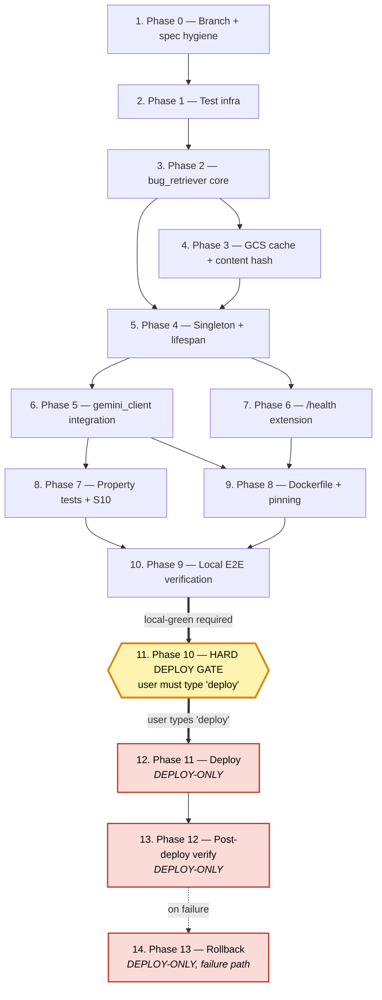

# Implementation Plan: Retrieval-Augmented Few-Shot Selection

## Overview

Convert the design for `rag-few-shot-retrieval` into a series of prompts for a
code-generation LLM that will implement each step with incremental progress.
Each prompt builds on the previous, and the final tasks wire everything
together. There is no orphaned code: every helper, every embedding, every log
line is reachable from a previous step.

The plan is **local-first**: phases 0–9 (top-level tasks 1–10) are fully
executable on a developer laptop with no Cloud Run touches. Phase 10
(top-level task 11) is the **hard sign-off gate** — no `gcloud builds submit`,
no `gcloud run deploy`, no traffic flip, no env-var update against the live
`qa-bugbot` service happens before the user explicitly types the literal token
`deploy`. Phases 11–13 (top-level tasks 12–14) are deploy-only and clearly
marked.

Implementation language: **Python 3.11** (matches `Dockerfile` and current
codebase).

Files touched: new `bug_retriever.py`, new `tests/unit/test_bug_retriever.py`,
new `tests/unit/test_bug_retriever_properties.py`, new
`tests/unit/test_gemini_client_rag.py`, new `tests/unit/test_models_health_rag.py`,
modified `gemini_client.py`, `main.py`, `models.py`, `Dockerfile`,
`requirements.txt`, `.env.example`, `scripts/synthetic_webhook.py`, and
`LLM_HANDOVER.md` (last, post-deploy).

Corpus: `assets/training_examples.json` (606 valid entries) is used as-is.
Expanding to 2K is a **separate follow-up spec** and explicitly out of scope
here.

## Tasks

- [ ] 1. Phase 0 — Branch + spec hygiene

  - [x] 1.1 Create feature branch `feat/rag-few-shot-retrieval` from current `fix/production-reliability` HEAD
    - Run `git checkout fix/production-reliability && git pull` to confirm parity with origin
    - Run `git checkout -b feat/rag-few-shot-retrieval`
    - Verify `git rev-parse HEAD` matches the parent branch HEAD before any new commits
    - _Requirements: 9.1, 9.2_   _Design: Theme 7_

  - [-] 1.2 Verify clean working tree and existing checkpoint tag
    - `git status --porcelain` returns empty output
    - `git tag -l checkpoint-stable-20260530` returns the tag (confirms rollback target is preserved per Req 9.8)
    - `git tag -l qa-bugbot-00042-8zj` style: confirm `git rev-parse checkpoint-stable-20260530` resolves
    - _Requirements: 9.8_   _Design: Theme 7_

  - [~] 1.3 Tag the pre-feature baseline for fast rollback comparison
    - `git tag pre-rag-few-shot-$(date +%Y%m%d)`
    - `git tag -l pre-rag-few-shot-*` confirms the tag landed
    - This tag is additive only and does NOT amend `checkpoint-stable-20260530`
    - _Requirements: 9.8_   _Design: Theme 7_

- [ ] 2. Phase 1 — Test infrastructure

  - [~] 2.1 Create `tests/unit/test_bug_retriever.py` skeleton
    - Add module docstring referencing design §7.1 (33 unit tests U1..U33)
    - Import `BugRetriever`, `RetrievedExample`, `init_retriever`, `get_retriever` from `bug_retriever`
    - Add empty placeholder test functions for U1..U33 with `@pytest.mark.skip(reason="filled in Phase 2/3")`
    - Wire pytest discovery via `tests/unit/__init__.py` (already exists)
    - _Requirements: 8.5_   _Design: Theme 7, §7.1_

  - [~] 2.2 Create `tests/unit/test_bug_retriever_properties.py` skeleton
    - Add module docstring referencing design §7.2 (5 hypothesis tests P1..P5)
    - Import `hypothesis.given`, `hypothesis.strategies as st`, `hypothesis.settings`
    - Add five placeholder `@given` tests P1..P5 mapping to Properties 1, 2, 3, 4, 8
    - Each placeholder asserts `pytest.skip("filled in Phase 7")`
    - _Requirements: 8.5_   _Design: Theme 7, §7.2, Property 1, 2, 3, 4, 8_

  - [~] 2.3 Create `tests/unit/test_gemini_client_rag.py` skeleton
    - Add module docstring referencing design §4.2 (`_render_examples_block`, `_build_fewshot_block`)
    - Import `gemini_client._render_examples_block`, `gemini_client._build_fewshot_block` (lazy import — they don't exist yet)
    - Add placeholder tests U27..U31 with skip markers
    - _Requirements: 8.5_   _Design: §4.2, Property 7_

  - [~] 2.4 Create `tests/unit/test_models_health_rag.py` skeleton
    - Add module docstring referencing design §4.4 (`HealthResponse.rag` field)
    - Add placeholder tests U32 (`/health` includes `rag` sub-object) and U33 (`RAG_ENABLED=false` shape)
    - _Requirements: 6.3, 6.4_   _Design: §4.4_

  - [~] 2.5 Add shared retriever fixtures to `tests/unit/conftest.py`
    - Fixture `mock_sentence_transformer`: returns a stub object whose `.encode(list[str])` returns deterministic L2-normalized random `np.float32` vectors of shape `(N, 384)` seeded by hash of input
    - Fixture `tiny_corpus_rows`: 6 hand-rolled `CorpusEntry` dicts spanning ≥ 3 distinct `project_id` values
    - Fixture `fake_gcs_storage_client`: in-memory dict-backed `storage.Client` substitute supporting `bucket().blob().download_as_bytes()` and `.upload_from_string()`
    - Fixture `caplog_rag`: scoped `caplog` helper that filters records to the `qa_bugbot.bug_retriever` logger
    - _Requirements: 8.5_   _Design: Theme 7, §7.1_

- [ ] 3. Phase 2 — `bug_retriever.py` core

  - [~] 3.1 Implement `BugRetriever.__init__` and `BugRetriever.from_env` constructors
    - `__init__` accepts kwargs: `enabled`, `top_k`, `corpus_path`, `model_name`, `cache_to_gcs`
    - `__init__` clamps `top_k` into `[1, 20]` per Req 2.1; defaults preserved
    - `from_env` reads `RAG_ENABLED`, `RAG_TOPK`, `RAG_CACHE_GCS` and resolves `assets/training_examples.json` from module dir
    - Initialize all per-instance fields per design §4.1 ("Per-instance state" table) to None / [] / `"index_unavailable"`
    - _Requirements: 1.1, 2.1, 8.6_   _Design: Theme 1, §4.1_

  - [~] 3.2 Implement `_load_corpus_rows`
    - Read `assets/training_examples.json` with `encoding="utf-8-sig"`
    - Filter rows missing required fields (id, subject, description_raw) — log a single info line with discard count
    - For each row, resolve `project_id` via the small helper `_resolve_project_id(project_name)` that maps via `config.OP_PROJECTS`; tolerate missing entries by setting `project_id=None`
    - Return `list[CorpusEntry]`; raise `ValueError("no valid entries")` only for empty list, caller catches
    - _Requirements: 1.7_   _Design: Theme 1, §4.1_

  - [~] 3.3 Implement `_load_model`
    - `from sentence_transformers import SentenceTransformer` (lazy import inside the method)
    - Set `os.environ.setdefault("HF_HUB_DISABLE_TELEMETRY", "1")` before construction
    - Construct `SentenceTransformer(self._model_name)` honoring `SENTENCE_TRANSFORMERS_HOME` env var
    - Any exception propagates to caller (`index()`) which wraps it
    - _Requirements: 1.1, 1.6_   _Design: Theme 1, §4.1_

  - [~] 3.4 Implement `_embed_rows_l2_normalized`
    - Build `texts = [f"{r['subject']}\n\n{r['description_raw']}" for r in rows]`
    - Call `self._model.encode(texts, batch_size=32, show_progress_bar=False, normalize_embeddings=True, convert_to_numpy=True)`
    - Assert returned `dtype == np.float32` and `shape == (N, 384)`; cast if necessary
    - Return the matrix; defensive `np.linalg.norm(axis=1)` check that all rows are unit-norm within `1e-5`
    - _Requirements: 1.1_   _Design: Theme 1, §4.1, Property 5_

  - [~] 3.5 Implement `_embed_query_l2_normalized`
    - Single-string `self._model.encode(query, normalize_embeddings=True, convert_to_numpy=True)` → shape `(384,)`
    - Cast to `np.float32` if needed
    - No try/except here — caller (`retrieve`) wraps in defensive try/except
    - _Requirements: 2.1, 4.2_   _Design: Theme 2, §4.1_

  - [~] 3.6 Implement `BugRetriever.retrieve` — cosine + soft boost + top-K
    - Follow the pseudocode in design §3 Theme 2 verbatim
    - Clamp `k = max(1, min(int(k or self._top_k), 20))`
    - Wrap `_embed_query_l2_normalized` in try/except → `embed_error` outcome on any exception
    - Apply `+0.05` boost only when `project_filter is not None` AND row's `project_id == project_filter`
    - Use `np.argpartition(-scores, k)` then `argsort` over the partition slice (avoids full sort)
    - Update `self._last_retrieve_outcome` and emit `RAG_RETRIEVE` log line via `_emit_retrieve_log`
    - _Requirements: 2.1, 2.2, 2.4, 2.6, 3.1, 3.2, 3.3, 3.6, 4.1, 4.2, 4.4_   _Design: Theme 2, Property 1, 2, 3, 8_

  - [~] 3.7 Implement `BugRetriever.index` orchestrator (cache slots stubbed)
    - Follow the pseudocode in design §3 Theme 1 verbatim
    - Wrap the entire body in a top-level try/except so Property 8 holds even against bugs in our own code
    - `_try_load_cache` and `_try_upload_cache` may be NotImplemented stubs at this point — they get filled in Phase 3
    - Emit exactly one `RAG_INDEX` log line on every code path (use `_emit_index_log`)
    - Set `_matrix`, `_entries`, `_project_id_array`, `_content_hash`, `_last_index_outcome`, `_last_index_source`
    - _Requirements: 1.1, 1.2, 1.6, 1.7, 1.8, 7.4_   _Design: Theme 1, §4.1, Property 8_

  - [~] 3.8 Implement `is_ready`, `to_health_dict`, and `last_outcome` accessors
    - `is_ready()` returns `self._matrix is not None and len(self._entries) > 0`
    - `to_health_dict()` returns the full sub-object shape from design §3 Theme 4 (enabled, index_outcome, corpus_size, embedding_dim, model_name, top_k, cache_source) — never raises
    - When `_enabled is False`, force `enabled=false, corpus_size=0, index_outcome="disabled", cache_source="none"` (Req 6.4)
    - `last_outcome()` returns `self._last_retrieve_outcome` defaulting to `"index_unavailable"`
    - _Requirements: 6.3, 6.4_   _Design: §4.1, Theme 4_

  - [~] 3.9 Implement `_emit_index_log` and `_emit_retrieve_log` helpers
    - `_emit_index_log`: format the line per design §3 Theme 4; INFO level normally, WARNING for `model_load_failed` and `corpus_load_failed`
    - `_emit_retrieve_log`: format per Theme 4; INFO level normally, WARNING when `duration_ms > 250` (Req 5.2)
    - Both helpers are pure formatters — no state mutation beyond the `logger.log` call
    - Compute `duration_ms` from `time.monotonic()` deltas
    - _Requirements: 5.2, 6.1, 6.2, 6.5_   _Design: Theme 4, Theme 5_

  - [ ]* 3.10 Unit tests for retrieve happy path and project boost (U10, U11, U12, U17)
    - File: `tests/unit/test_bug_retriever.py`
    - U10: top-K returned in descending score order; `len(R) == K`
    - U11: `+0.05` boost is exact (compute raw cosine, add boost, compare scores byte-for-byte within float32 tol)
    - U12: project filter does NOT exclude — with `k = corpus_size`, every entry appears in result
    - U17: K=0 clamps to 1; K=999 clamps to 20
    - _Requirements: 2.1, 2.4, 3.2, 3.3_   _Design: Property 2, 3_

  - [ ]* 3.11 Unit tests for retrieve fallback outcomes (U13, U14, U15, U16, U18)
    - File: `tests/unit/test_bug_retriever.py`
    - U13: `_matrix=None` → `[]` + outcome `empty_corpus`
    - U14: pre-`index()` retriever → `[]` + outcome `index_unavailable`
    - U15: mocked embedder raises → `[]` + outcome `embed_error`
    - U16: 19-char input runs and returns examples; outcome `short_brief`
    - U18: exactly one `RAG_RETRIEVE` line emitted per call (assert `caplog` length)
    - _Requirements: 2.6, 4.1, 4.2, 4.4, 6.2_   _Design: Theme 3, Property 8_

  - [ ]* 3.12 Unit tests for index outcomes without cache (U5, U6, U7, U8, U9)
    - File: `tests/unit/test_bug_retriever.py`
    - U5: model loader raises → `model_load_failed`, `index()` does not raise
    - U6: missing `training_examples.json` → `corpus_load_failed`, no raise
    - U7: malformed JSON → `corpus_load_failed`, no raise
    - U8: `RAG_ENABLED=false` → `disabled`, model never constructed (assert mock not called)
    - U9: exactly one `RAG_INDEX` line emitted per `index()` call
    - _Requirements: 1.6, 1.7, 1.8, 6.1_   _Design: Theme 1, Property 8_

  - [ ]* 3.13 Unit tests for accessors (U32, U33, plus is_ready)
    - File: `tests/unit/test_models_health_rag.py` (U32, U33) and `tests/unit/test_bug_retriever.py` (is_ready)
    - U32: after successful `index()`, `to_health_dict()` carries `enabled=True, corpus_size > 0, embedding_dim=384`
    - U33: `RAG_ENABLED=false` → `to_health_dict()` returns `enabled=False, corpus_size=0, index_outcome="disabled", cache_source="none"`
    - is_ready: returns False before `index()`, True after successful build, False when `_matrix is None`
    - _Requirements: 6.3, 6.4_   _Design: §4.1, Theme 4_

- [ ] 4. Phase 3 — GCS cache + content hash

  - [~] 4.1 Implement `_compute_corpus_hash` exactly per design §5.4
    - Build minimal dicts `{"id", "subject", "description_raw"}` for each row
    - `minimal.sort(key=lambda r: r["id"])` — string ascending
    - `json.dumps(minimal, sort_keys=True, ensure_ascii=False, separators=(",", ":"))`
    - Encode UTF-8, return `hashlib.sha256(payload).hexdigest()` (lowercase hex)
    - Pure function — no logging, no I/O
    - _Requirements: 7.2, 7.3_   _Design: §5.4, Property 5_

  - [~] 4.2 Implement `_gcs_credentials_available` helper
    - True iff `GOOGLE_APPLICATION_CREDENTIALS` is set AND the file exists, OR `google.auth.default()` succeeds without raising
    - Catch all exceptions and return False
    - Used by `_try_load_cache` and `_try_upload_cache` to short-circuit on dev laptops
    - _Requirements: 7.6_   _Design: Theme 6, §4.1_

  - [~] 4.3 Implement `_try_load_cache(expected_hash)`
    - Returns `Optional[np.ndarray]` — None means "fall through to fresh embed"
    - Skip immediately if `_cache_to_gcs is False` or `_gcs_credentials_available() is False`
    - Download `gs://qa-bugbot-data/embeddings.npz` into a `BytesIO`; `np.load(..., allow_pickle=False)`
    - Validate per design §5.3 cache-load checks (dtype, shape, embedding_dim, model_name, hash equality)
    - On any validation failure set `self._cache_existed_but_mismatched = True` and return None (so caller emits `cache_stale`)
    - On any download exception (auth, not_found, network) return None and let caller emit `cache_miss`
    - Never raises
    - _Requirements: 7.1, 7.2, 7.3, 7.4_   _Design: Theme 6, §5.3, Property 5, 8_

  - [~] 4.4 Implement `_try_upload_cache(matrix, content_hash)`
    - Skip immediately if `_cache_to_gcs is False` or `_gcs_credentials_available() is False`
    - Build the npz via `np.savez_compressed(BytesIO, vectors=..., corpus_content_hash=..., model_name=..., embedding_dim=..., built_at=...)`
    - Upload bytes to `gs://qa-bugbot-data/embeddings.npz`
    - On any failure log a single line `GCS_SYNC op=upload outcome=<err> detail="rag_embeddings"` (Req 7.5)
    - Never raises; never updates `database._last_gcs_sync` (that struct is reserved for the SQLite DB)
    - _Requirements: 7.5, 7.7_   _Design: Theme 6, §5.3, Property 8_

  - [~] 4.5 Wire cache paths into `index()` (cache_hit / cache_stale / cache_miss)
    - Replace stubs from 3.7 with calls to `_try_load_cache` and `_try_upload_cache`
    - On cache hit: `outcome="cache_hit", source="gcs"` — skip fresh embed entirely
    - On `_cache_existed_but_mismatched=True`: `outcome="cache_stale", source="recompute"` — embed fresh + upload
    - On cache absent / download error: `outcome="cache_miss", source="recompute"` — embed fresh + upload (best-effort)
    - Always emit exactly one `RAG_INDEX` line at the end of `index()`
    - _Requirements: 7.1, 7.2, 7.3, 7.4, 7.6_   _Design: Theme 1, Theme 6_

  - [ ]* 4.6 Unit tests for `_compute_corpus_hash` byte-equivalence (U22, U23, U24, U25)
    - File: `tests/unit/test_bug_retriever.py`
    - U22: hand-roll 3 rows; compute the canonical JSON string by hand; assert `_compute_corpus_hash` matches the manual `sha256(payload)` byte-for-byte
    - U23: permute the input rows in 5 random orders; assert hash is identical across all orders
    - U24: edit one row's `subject` → hash MUST change
    - U25: edit one row's `priority` (not embedded) → hash MUST NOT change
    - _Requirements: 7.2, 7.3, 7.7_   _Design: §5.4, Property 5_

  - [ ]* 4.7 Unit test for npz round-trip schema (U26)
    - File: `tests/unit/test_bug_retriever.py`
    - Save matrix via `_try_upload_cache` against an in-memory fake `storage.Client`
    - Load via `_try_load_cache` against the same fake client
    - Assert `np.array_equal(loaded, original)` (byte-equivalent within float32)
    - Assert all required fields present: `vectors`, `corpus_content_hash`, `model_name`, `embedding_dim`, `built_at`
    - Assert dtypes match design §5.3 schema
    - _Requirements: 7.7_   _Design: §5.3, Property 5_

  - [ ]* 4.8 Unit tests for cache load outcomes (U1, U3, U4)
    - File: `tests/unit/test_bug_retriever.py`
    - U1: cache present + hash matches → `cache_hit source=gcs`, fresh embed NOT called (assert mock untouched)
    - U3: GCS download raises (auth, not_found, network) → `cache_miss source=recompute`, fresh embed runs, no exception escapes
    - U4: `_gcs_credentials_available()` returns False → `cache_miss source=recompute`, no GCS call attempted
    - _Requirements: 7.4, 7.6_   _Design: Theme 6, Property 8_

  - [ ]* 4.9 Unit test for cache stale recompute + upload (U2)
    - File: `tests/unit/test_bug_retriever.py`
    - Cache present but `corpus_content_hash` mismatch → `cache_stale source=recompute`
    - Fresh embed runs once, upload attempted exactly once
    - On upload failure, `RAG_INDEX outcome=cache_stale` still emitted; extra `GCS_SYNC op=upload outcome=<err> detail="rag_embeddings"` line present
    - _Requirements: 7.3, 7.5_   _Design: Theme 6, Property 8_

- [ ] 5. Phase 4 — Module-level singleton + lifespan integration

  - [~] 5.1 Implement `init_retriever()` and `get_retriever()` module-level singleton in `bug_retriever.py`
    - `_retriever: Optional[BugRetriever] = None` at module scope
    - `init_retriever()` is idempotent: a second call returns the existing instance without re-running `index()`
    - `init_retriever()` wraps the construction + `index()` call in a try/except that logs and returns the partially-initialized instance (matrix may be None) — never raises
    - `get_retriever()` returns `_retriever` (may be None)
    - _Requirements: 1.1, 1.6, 1.7, 4.3_   _Design: §4.1, Theme 3_

  - [~] 5.2 Wire `init_retriever()` into `main.py:lifespan()` after the smoke-test step
    - Import inside the try block: `from bug_retriever import init_retriever`
    - Call `init_retriever()` AFTER `gemini_client.smoke_test()` and BEFORE the `🚀 Bot is ready!` log line
    - Catch `ImportError` → log warning `"bug_retriever module not importable — RAG disabled"`
    - Catch generic `Exception` → log error with `exc_info=True`; lifespan continues
    - _Requirements: 1.1, 4.3, 8.6_   _Design: §4.3, Theme 3_

  - [~] 5.3 Verify import failure of `bug_retriever` does not take down lifespan
    - Add a try/except around the import itself (not just `init_retriever()`)
    - On `ImportError` set a module-level `_retriever_unavailable = True` so `/health.rag` can report cleanly
    - When `get_retriever()` returns None due to import failure, `gemini_client._build_fewshot_block` falls back to static-50 (verified by 6.8 test)
    - _Requirements: 4.3, 4.7_   _Design: §4.3, Theme 3, Property 7_

  - [~] 5.4 Add `RAG_ENABLED`, `RAG_TOPK`, `RAG_CACHE_GCS` to `.env.example`
    - `RAG_ENABLED=true` — placeholder safe default
    - `RAG_TOPK=5` — default per Req 2.1
    - `RAG_CACHE_GCS=true` — default per Req 7.1
    - Add a comment block above the three vars referencing design §4.6 and Req 8.6 (kill switch)
    - _Requirements: 1.8, 2.1, 7.1, 8.6_   _Design: §4.6_

  - [ ]* 5.5 Unit test for `init_retriever` idempotency
    - File: `tests/unit/test_bug_retriever.py`
    - Call `init_retriever()` twice; assert the second call returns the same instance object (`is` check)
    - Assert `BugRetriever.index()` is called exactly once across both calls (mock the method, count invocations)
    - _Requirements: 1.1_   _Design: §4.1_

  - [ ]* 5.6 Unit test for lifespan resilience to bug_retriever import failure
    - File: `tests/unit/test_bug_retriever.py`
    - Use `monkeypatch.setitem(sys.modules, "bug_retriever", None)` to force `ImportError` on import
    - Run the lifespan startup hook against a minimal FastAPI test app; assert no exception escapes
    - Assert `get_retriever()` returns None and `gemini_client._build_fewshot_block` falls back to static-50
    - _Requirements: 4.3, 4.7_   _Design: §4.3, Theme 3_


- [ ] 6. Phase 5 — `gemini_client.py` integration

  - [~] 6.1 Rename `SYSTEM_PROMPT` to `SYSTEM_PROMPT_BASE` with backwards-compat alias
    - In `gemini_client.py`, change the constant name
    - Add `SYSTEM_PROMPT = SYSTEM_PROMPT_BASE` immediately below the new definition (per design §4.2)
    - All existing call sites that referenced `SYSTEM_PROMPT` keep working
    - Add a `# TODO` comment noting tests should migrate to `SYSTEM_PROMPT_BASE`
    - _Requirements: 6.7_   _Design: §4.2_

  - [~] 6.2 Implement `_render_examples_block(examples)` helper in `gemini_client.py`
    - Reuses the existing `_format_example` helper (do NOT modify `_format_example`)
    - Joins with `"\n\n---\n\n"` separator
    - Prepends the same `"\n\n## REFERENCE EXAMPLES (real tickets — match this style and discipline)\n\n"` header used by `_load_few_shot_block`
    - Returns `""` when `examples` is empty
    - Pure function — no logging, no I/O
    - _Requirements: 2.5, 4.5_   _Design: §4.2, Property 7_

  - [~] 6.3 Implement `_build_fewshot_block(*, query, project_id, phase)` helper
    - Follow the pseudocode in design §3 Theme 3 verbatim
    - Three-stage fallback chain: retrieved → static-50 (`_FEW_SHOT_BLOCK`) → empty
    - Defensive try/except around `retriever.retrieve()` even though `retrieve()` promises not to raise (Property 8 belt-and-braces)
    - Returns `(block_string, meta_dict)` where `meta_dict` has `count`, `outcome`, `source`
    - Never raises
    - _Requirements: 4.1, 4.2, 4.3, 4.4, 4.5, 4.6, 4.7_   _Design: §4.2, Theme 3, Property 7, 8_

  - [~] 6.4 Modify `analyze_text_brief` to accept `project_id` and use `_build_fewshot_block`
    - Add `project_id: Optional[int] = None` parameter (defaulted for backwards compat)
    - Replace the inline `SYSTEM_PROMPT + _FEW_SHOT_BLOCK` composition with `SYSTEM_PROMPT_BASE + _build_fewshot_block(query=text, project_id=project_id, phase="phase1")[0]`
    - Capture the meta dict; pass to `_log_llm_call` via the `extra` parameter
    - Preserve `max_tokens=1000`, `asyncio.wait_for(22)`, `response_format={"type": "json_object"}` exactly
    - _Requirements: 2.1, 2.2, 2.3, 3.1, 3.5_   _Design: §4.2, Theme 2_

  - [~] 6.5 Modify `enrich_with_media` to accept `project_id` and use `_build_fewshot_block`
    - Add `project_id: Optional[int] = None` parameter (defaulted for backwards compat)
    - Substitute the static block with `_build_fewshot_block(query=text, project_id=project_id, phase="phase2")[0]`
    - Preserve `max_tokens=6000`, `client_timeout=45`, outer `asyncio.wait_for(50)` exactly
    - Capture meta dict and forward to `_log_llm_call` via `extra`
    - _Requirements: 2.2, 5.4_   _Design: §4.2, Theme 2_

  - [~] 6.6 Extend `_log_llm_call` extras with `rag_examples`, `rag_outcome`, `rag_source`
    - The existing function already accepts an `extra: Optional[Dict[str, Any]]` — no signature change required
    - Both Phase 1 and Phase 2 call sites now pass `extra={"rag_examples": meta["count"], "rag_outcome": meta["outcome"], "rag_source": meta["source"]}`
    - Verify the existing `extra_str` formatter renders these as `rag_examples=N rag_outcome=ok rag_source=retrieved` after `chars=…`
    - _Requirements: 6.6, 6.7_   _Design: §4.2, Theme 4_

  - [~] 6.7 Wire `target_project_id` through `main.py:_handle_bug_report` to both phases
    - The existing webhook handler already resolves `target_project_id` via `bucket_router.extract_bucket_with_provenance`
    - Pass `project_id=target_project_id` to both `analyze_text_brief` and `enrich_with_media`
    - When provenance is `default`, pass `project_id=None` (per Req 3.5)
    - Verify the original `text_for_llm` (byte-identical) is still the first positional arg — no regression of existing brief preservation
    - _Requirements: 2.3, 3.1, 3.5_   _Design: §4.3, Theme 2_

  - [ ]* 6.8 Unit test: `_render_examples_block` byte-equivalent to `_load_few_shot_block` for same examples (U27)
    - File: `tests/unit/test_gemini_client_rag.py`
    - Hand-roll a 5-element list of example dicts in the schema `_format_example` reads
    - Compute `block_a = _render_examples_block(examples)`
    - Compute `block_b` by manually invoking `_format_example` on each, joining with `"\n\n---\n\n"`, and prepending the same header
    - Assert `block_a == block_b` byte-for-byte (Property 7 backbone)
    - _Requirements: 4.5_   _Design: Property 7_

  - [ ]* 6.9 Unit test: `_build_fewshot_block` fallback chain (U28, U29, U30)
    - File: `tests/unit/test_gemini_client_rag.py`
    - U28: retriever returns `[]` → block is the static `_FEW_SHOT_BLOCK`, meta `source="static"`
    - U29: retriever returns 5 examples → block is rendered from those 5, meta `source="retrieved"`; static block must NOT appear in output
    - U30: retriever returns `[]` AND `_FEW_SHOT_BLOCK == ""` → returned block is `""`, meta `source="empty"`
    - _Requirements: 2.5, 4.1, 4.5, 4.6_   _Design: Property 7_

  - [ ]* 6.10 Unit test: `LLM_CALL` extra fields populated (U31)
    - File: `tests/unit/test_gemini_client_rag.py`
    - Mock `gemini_client.client.chat.completions.create` to return a valid Phase 1 JSON
    - Invoke `analyze_text_brief("[LMS Webview] login broken", project_id=476)`
    - Assert exactly one `LLM_CALL` log line; assert it contains `rag_examples=`, `rag_outcome=`, `rag_source=`
    - _Requirements: 6.6_   _Design: Theme 4_

- [ ] 7. Phase 6 — `/health` extension

  - [~] 7.1 Extend `HealthResponse` in `models.py` with the `rag` field
    - Add `rag: Optional[dict] = Field(default=None, description="Retriever state snapshot — see bug_retriever.to_health_dict.")`
    - Match the shape used by `last_gcs_sync: Optional[dict]` for consistency
    - No new validators
    - _Requirements: 6.3_   _Design: §4.4_

  - [~] 7.2 Populate `rag` in `main.py:health_check()` from `bug_retriever.get_retriever()`
    - Import `from bug_retriever import get_retriever` at top of file (or inside the handler if needed for testability)
    - Call `retriever = get_retriever()`; if non-None, set `rag_dict = retriever.to_health_dict()`; otherwise `None`
    - Pass `rag=rag_dict` into the `HealthResponse(...)` constructor
    - `/health.status` is NOT affected by RAG state (per design Theme 4 — RAG degradation is best-effort, not a degraded health state)
    - _Requirements: 6.3, 6.4_   _Design: §4.3, §4.4, Theme 4_

  - [ ]* 7.3 Integration test: `/health` includes `rag` sub-object after `init_retriever()` succeeds
    - File: `tests/unit/test_models_health_rag.py`
    - Use `httpx.AsyncClient` against `httpx.ASGITransport(app=main.app)`
    - Run lifespan, GET `/health`, assert response body has `rag.enabled=True`, `rag.corpus_size > 0`, `rag.embedding_dim=384`, `rag.model_name="sentence-transformers/all-MiniLM-L6-v2"`
    - _Requirements: 6.3_   _Design: §4.4_

  - [ ]* 7.4 Integration test: `/health.rag.enabled=false` when `RAG_ENABLED=false`
    - File: `tests/unit/test_models_health_rag.py`
    - Set `RAG_ENABLED=false` via environment fixture
    - Run lifespan, GET `/health`, assert `rag.enabled=False`, `rag.corpus_size=0`, `rag.index_outcome="disabled"`, `rag.cache_source="none"`
    - _Requirements: 6.4, 8.6_   _Design: §4.4_

- [ ] 8. Phase 7 — Property tests + S10 synthetic webhook scenario

  - [ ]* 8.1 Property test P1 — retrieval determinism (Property 1)
    - File: `tests/unit/test_bug_retriever_properties.py`
    - **Property 1: Retrieval purity / determinism**
    - **Validates: Requirements 5.6, 8.3**
    - Strategy: `query = st.text(min_size=0, max_size=8000)`, `k = st.integers(1, 20)`, `project_filter = st.one_of(st.none(), st.integers(1, 1000))`
    - Build a tiny deterministic corpus once at module scope; for each draw assert two `retrieve()` calls return byte-identical `[(id, score), ...]` sequences
    - `@settings(max_examples=200, deadline=None)`
    - _Requirements: 5.6, 8.3_   _Design: Property 1_

  - [ ]* 8.2 Property test P2 — cosine + soft-boost bounds (Property 2)
    - File: `tests/unit/test_bug_retriever_properties.py`
    - **Property 2: Cosine and soft-boost bounds**
    - **Validates: Requirements 3.2, 3.3, 3.6**
    - Strategy: random L2-normalized query and corpus; for each result with `matched_project=True` assert score is exactly `raw_cosine + 0.05` ± float32 tol; for `matched_project=False`, score equals raw cosine
    - All scores ∈ `[-1.0, 1.05]`
    - _Requirements: 3.2, 3.3, 3.6_   _Design: Property 2_

  - [ ]* 8.3 Property test P3 — K boundedness and ordering (Property 3)
    - File: `tests/unit/test_bug_retriever_properties.py`
    - **Property 3: K boundedness and descending order**
    - **Validates: Requirements 2.1, 2.4, 3.3**
    - For random `(corpus_size, k)`, assert `len(R) <= min(k, N)` and `R[i].score >= R[i+1].score` for all consecutive pairs
    - When `k >= N`, assert `R` is a permutation of corpus by id
    - _Requirements: 2.1, 2.4, 3.3_   _Design: Property 3_

  - [ ]* 8.4 Property test P4 — query non-mutation (Property 4)
    - File: `tests/unit/test_bug_retriever_properties.py`
    - **Property 4: Brief preservation (caller variable non-mutation)**
    - **Validates: Requirements 2.3, 8.3**
    - Strategy: `query = st.text(min_size=0, max_size=8000, alphabet=st.characters(blacklist_categories=("Cs",)))`
    - Snapshot query before call; after call assert `query == snapshot` and `id(query) == id(snapshot)` (Python str interning makes this trivially true; explicit check guards against future mutability)
    - _Requirements: 2.3, 8.3_   _Design: Property 4_

  - [ ]* 8.5 Property test P5 — never-raise (Property 8)
    - File: `tests/unit/test_bug_retriever_properties.py`
    - **Property 8: Never-raise contract**
    - **Validates: Requirements 1.6, 1.7, 4.1, 4.2, 4.3, 4.4, 4.7, 7.4, 7.5**
    - Strategy: `query = st.text()`, occasionally `st.none()`-then-coerce; corpus may be empty; project_filter random int including negatives
    - Assert `retrieve()` never raises; result is always a list
    - Assert `index()` never raises even when injected with embedder exceptions
    - _Requirements: 1.6, 1.7, 4.1, 4.2, 4.3, 4.4, 4.7_   _Design: Property 8_

  - [ ]* 8.6 Unit test U20 — no socket / open / httpx calls inside `retrieve()` (Property 6)
    - File: `tests/unit/test_bug_retriever.py`
    - Monkey-patch `socket.socket.__init__` to raise `RuntimeError("forbidden in retrieve")`
    - Monkey-patch `builtins.open` to raise `RuntimeError("forbidden in retrieve")`
    - Monkey-patch `httpx.Client` and `httpx.AsyncClient` to raise on construction
    - Call `retriever.retrieve("any query", k=5)`; assert it returns successfully
    - _Requirements: 5.6, 2.7_   _Design: Property 6_

  - [ ]* 8.7 Unit test U19 — slow-call WARNING level
    - File: `tests/unit/test_bug_retriever.py`
    - Mock `time.monotonic` (or sleep) to make `_emit_retrieve_log` see `duration_ms > 250`
    - Assert the emitted record has `levelno == logging.WARNING`
    - Assert outcome is still `ok` (not a failure)
    - _Requirements: 5.2_   _Design: Theme 5_

  - [ ]* 8.8 Unit test U21 — query non-mutation (example-based companion to P4)
    - File: `tests/unit/test_bug_retriever.py`
    - Pass a list to `retrieve()` (defensive; current sig is `str`, but verify caller-side dicts/lists in scope are untouched)
    - Verify `==` and `is` for an immutable `query` string and for any caller dict the test might pass
    - _Requirements: 2.3_   _Design: Property 4_

  - [~] 8.9 Add scenario S10 to `scripts/synthetic_webhook.py`
    - Brief: `"[LMS Webview] Lead detail page hangs after tapping Reply on iPhone 14 (iOS 17.4)."`
    - Mock `bug_retriever.get_retriever().retrieve` to return 5 LMS Webview tickets
    - Assert the Phase 1 LLM mock was called with a prompt containing `## REFERENCE EXAMPLES` exactly once
    - Assert the prompt's example block contains the substring `LMS Webview` at least once
    - Assert ticket is filed under project_id 476 (LMS Webview)
    - Assert `LLM_CALL` log line contains `rag_source=retrieved`, `rag_examples=5`, `rag_outcome=ok`
    - _Requirements: 2.5, 3.2, 6.6, 8.5_   _Design: §7.4_

  - [~] 8.10 Wire S10 into `--scenario all` runner; assert all 10 scenarios still pass
    - Update the `_SCENARIOS` registry in `scripts/synthetic_webhook.py`
    - Update the `--scenario` choices CLI arg to include `S10`
    - Run `python scripts/synthetic_webhook.py --scenario all`; expect 10/10 pass and exit 0
    - _Requirements: 8.5_   _Design: §7.4_

- [ ] 9. Phase 8 — Dockerfile + dependency pinning

  - [~] 9.1 Add `sentence-transformers==2.7.0` and `numpy==1.26.4` to `requirements.txt`
    - Pin both versions exactly per design §4.6
    - Place after `google-cloud-storage==2.14.0` (consistent ordering)
    - Add a single comment line above the new pins: `# RAG few-shot retrieval (rag-few-shot-retrieval spec)`
    - _Requirements: 8.7_   _Design: §4.6_

  - [~] 9.2 Run `pip install --dry-run -r requirements.txt` to resolve open question §9 numpy compatibility
    - From a clean venv (or `--ignore-installed`) run `pip install --dry-run -r requirements.txt`
    - Capture the resolution result into a temporary file `pip-resolution-check.txt`
    - If the resolver fails: try `numpy==1.26.0`, then the latest `numpy<2`; document the working pin in the same file
    - If the resolver succeeds: confirm the resolved `torch` is the CPU wheel (not CUDA) by inspecting the dry-run output
    - Delete `pip-resolution-check.txt` after recording outcome in CHECKLIST or commit message
    - _Requirements: 8.7_   _Design: §4.6, Open Question 1_

  - [~] 9.3 Add model pre-fetch step to `Dockerfile`
    - Insert between `RUN pip install --no-cache-dir -r requirements.txt` and `COPY . .` per design §4.5
    - Block:
      ```
      ARG ST_MODEL=sentence-transformers/all-MiniLM-L6-v2
      ENV HF_HUB_DISABLE_TELEMETRY=1 \
          SENTENCE_TRANSFORMERS_HOME=/app/.cache/sentence-transformers
      RUN python -c "from sentence_transformers import SentenceTransformer; SentenceTransformer('${ST_MODEL}')"
      ```
    - Verify the docker build cache invalidation behavior matches design (a `requirements.txt` change retriggers the model fetch — acceptable)
    - _Requirements: 1.4, 8.7_   _Design: §4.5_

  - [~] 9.4 Verify image-size delta budget after rebuild
    - Run `docker build -t qa-bugbot:rag-pre-test --no-cache .`
    - Compare with the current production image: `docker image ls --format '{{.Repository}}:{{.Tag}} {{.Size}}'`
    - Assert delta ≤ 80 MB per Req 8.7
    - If delta > 80 MB, revisit the model choice or the layer ordering before continuing
    - _Requirements: 8.7_   _Design: §4.5, Theme 7_

- [ ] 10. Phase 9 — Local end-to-end verification

  - [~] 10.1 Run full unit test suite green: `python -m pytest tests/unit -q`
    - All existing tests (the 190 from production-reliability) still pass
    - All new tests from Phases 2-7 pass
    - All hypothesis property tests P1..P5 pass with `--hypothesis-show-statistics`
    - Capture the final test count for the readiness summary in 11.1
    - _Requirements: 8.5_   _Design: §7.1, §7.2_

  - [~] 10.2 Run synthetic webhook scenarios green: `python scripts/synthetic_webhook.py --scenario all`
    - All of S1-S9 (existing) + S10 (new) pass; exit code 0
    - Capture the 10/10 pass result for the readiness summary
    - _Requirements: 8.5_   _Design: §7.4_

  - [~] 10.3 Build local Docker image clean
    - `docker build -t qa-bugbot:rag-local --no-cache --build-arg BUILD_MARKER=local-$(git rev-parse --short HEAD) .`
    - Capture the final image size for the readiness summary
    - Verify the model weights are inside the image: `docker run --rm qa-bugbot:rag-local ls /app/.cache/sentence-transformers/`
    - _Requirements: 8.7_   _Design: §4.5_

  - [~] 10.4 Run container locally and verify `/health` shape
    - `docker run -p 8080:8080 --env-file .env qa-bugbot:rag-local`
    - `curl localhost:8080/health` returns `status=healthy`, `rag.enabled=true`, `rag.corpus_size=606`, `rag.embedding_dim=384`, `rag.model_name="sentence-transformers/all-MiniLM-L6-v2"`
    - `curl localhost:8080/health` second call (after ≥ 1 webhook) confirms shape unchanged
    - _Requirements: 6.3_   _Design: §4.4, §10 Phase B_

  - [~] 10.5 Grep startup logs for `RAG_INDEX outcome=ok|cache_hit`
    - `docker logs <container> | grep RAG_INDEX` returns exactly one line
    - First-run outcome is `cache_miss` or `ok` (cold cache); second-run outcome is `cache_hit` (validates Property 5 round-trip)
    - Capture sample log line for the readiness summary
    - _Requirements: 1.2, 7.1, 7.2_   _Design: Theme 4, Theme 6_

  - [~] 10.6 A/B latency measurement: RAG_ENABLED=true vs false on the same brief
    - Run the same canary brief 50 times each against `RAG_ENABLED=true` and `RAG_ENABLED=false` containers
    - Measure Phase 1 LLM-call median latency for both via `LLM_CALL phase=phase1` log lines (parse `duration_ms` field)
    - Compute median delta; assert `RAG_ENABLED=true` is at least 1500 ms faster (per Req 5.5)
    - Measure retrieval-only p99 over the 50 RAG-true calls via `RAG_RETRIEVE` lines; assert < 100 ms
    - Capture both numbers for the readiness summary
    - _Requirements: 5.1, 5.5, 8.1_   _Design: Theme 5, §10 Phase B_

  - [~] 10.7 Demonstrate each fallback path locally for the readiness summary
    - `embed_error`: monkey-patch the model to raise during a single retrieve; capture `RAG_RETRIEVE outcome=embed_error` and the `LLM_CALL rag_source=static` line
    - `empty_corpus`: temporarily rename `assets/training_examples.json`; capture `RAG_INDEX outcome=corpus_load_failed` and a subsequent `RAG_RETRIEVE outcome=empty_corpus`
    - `index_unavailable`: hit `/health` before lifespan fully completes (race) OR mock `get_retriever()` to return None; capture `LLM_CALL rag_outcome=index_unavailable rag_source=static`
    - `RAG_ENABLED=false`: restart with the env flag; capture `RAG_INDEX outcome=disabled source=none`
    - Save the four sample log lines for the readiness summary in 11.1
    - _Requirements: 4.1, 4.2, 4.3, 8.6, 9.5_   _Design: Theme 3, §10 Phase C_

- [ ] 11. Phase 10 — **HARD DEPLOY GATE** (Requirement 9)

  > **STOP HERE.** No task numbered ≥ 12 may run automatically. Phases 11+
  > are gated behind explicit user sign-off.

  - [~] 11.1 Produce the deploy-readiness summary per Req 9.5 and post in chat — STOP
    - Compose a single message with subsections (a)..(i) per Req 9.5:
      - (a) Full unit-test pass count from 10.1
      - (b) Synthetic webhook scenario pass count (10/10) from 10.2
      - (c) Phase 1 LLM-call latency: static-50 baseline vs. retrieval-backed (median over ≥ 50 calls each), from 10.6
      - (d) Retrieval-only p99 latency over ≥ 50 calls, from 10.6
      - (e) `embeddings.npz` size in bytes (from a local cache-upload run)
      - (f) Image-size delta vs. current production image, from 10.4
      - (g) Sample `RAG_INDEX` and `RAG_RETRIEVE` log lines, from 10.5
      - (h) One sample log line for each of the four fallback paths from 10.7
      - (i) Rollback command: `gcloud run services update-traffic qa-bugbot --region asia-south1 --to-revisions=qa-bugbot-00042-8zj=100`
    - **STOP** — wait for the user to type the literal token `deploy`. Anything else is treated as "not approved" per Req 9.6
    - _Requirements: 9.4, 9.5, 9.6, 9.7, 9.8_   _Design: Theme 7, §10 Phase C_

- [ ] 12. Phase 11 — Deploy (DEPLOY-ONLY, gated on 11.1)

  > **DEPLOY-ONLY:** Do NOT execute any task in this phase until the user has
  > typed `deploy` in response to 11.1. Per Req 9.1, no `gcloud run` command
  > runs while any task above is unchecked.

  - [~] 12.1 Commit and tag the feature branch
    - `git add -A && git commit -m "feat(rag): retrieval-augmented few-shot selection"`
    - Pre-commit hook (from production-reliability spec) runs and must pass
    - `git tag rag-few-shot-deploy-$(date +%Y%m%d-%H%M)` — additive only, must NOT amend `checkpoint-stable-20260530`
    - Push branch: `git push -u origin feat/rag-few-shot-retrieval`
    - _Requirements: 9.2, 9.8_   _Design: §10 Phase D_

  - [~] 12.2 Build + deploy via `gcloud run deploy --source .` with the new env vars
    - `gcloud run deploy qa-bugbot --source . --region asia-south1 --no-cpu-throttling --memory 1Gi --cpu 1 --timeout 300 --min-instances 1 --max-instances 100 --service-account qaautomation@artful-affinity-634.iam.gserviceaccount.com --update-env-vars "BUILD_MARKER=<sha>,RAG_ENABLED=true,RAG_TOPK=5,RAG_CACHE_GCS=true"`
    - Cloud Build runs implicitly (matches the existing deploy convention from production-reliability §15.3)
    - Capture the new revision name from the gcloud output
    - _Requirements: 9.4_   _Design: §10 Phase D_

  - [~] 12.3 Force traffic flip to the new revision
    - `gcloud run services update-traffic qa-bugbot --region asia-south1 --to-revisions=<new-revision-name>=100`
    - Cloud Run does NOT auto-flip when traffic was previously pinned (per design §10 Phase D)
    - Verify with `gcloud run services describe qa-bugbot --region asia-south1 --format='value(status.traffic)'`
    - _Requirements: 9.4_   _Design: §10 Phase D_

- [ ] 13. Phase 12 — Post-deploy verification (DEPLOY-ONLY)

  - [~] 13.1 `/health.rag` populated against the live URL
    - `curl https://qa-bugbot-542857204182.asia-south1.run.app/health` returns `rag.enabled=true`, `rag.corpus_size=606`, `rag.index_outcome ∈ {ok, cache_hit}`
    - `/health.status == "healthy"` (RAG state does NOT flip status — verify per Theme 4)
    - _Requirements: 6.3_   _Design: §10 Phase E_

  - [~] 13.2 `RAG_INDEX outcome=ok|cache_hit` present in `/logs`
    - `curl https://qa-bugbot-542857204182.asia-south1.run.app/logs | grep RAG_INDEX` returns exactly one line
    - Outcome is `ok` (first deploy / cache miss) or `cache_hit` (subsequent deploys)
    - _Requirements: 1.2, 6.1, 7.1_   _Design: Theme 4_

  - [~] 13.3 Canary bug routes correctly with `rag_source=retrieved`
    - Send a canary brief: `[Photo Search] Lens upload fails on iQOO 11 (Android 14)`
    - Verify ticket lands under project_id 461 (Photo Search) — bucket_router is still authoritative (Req 8.3)
    - `curl /logs | grep LLM_CALL` for the canary timestamp shows `rag_source=retrieved`, `rag_examples=5`, `rag_outcome=ok`
    - _Requirements: 8.3, 6.6_   _Design: §10 Phase E_

  - [~] 13.4 Tag the new stable revision and update LLM_HANDOVER.md
    - `git tag checkpoint-stable-rag-$(date +%Y%m%d)` — captures the live state per Req 9.8 (additive only)
    - Update top-level `LLM_HANDOVER.md` with: new RAG architecture summary, the three new env vars (`RAG_ENABLED`, `RAG_TOPK`, `RAG_CACHE_GCS`), the new log markers (`RAG_INDEX`, `RAG_RETRIEVE`), the new `/health.rag` shape, and the rollback command targeting `qa-bugbot-00042-8zj`
    - Commit the docs update separately from code: `git commit -m "docs(rag): update LLM_HANDOVER for live RAG state"`
    - _Requirements: 9.8_   _Design: §10 Phase E, Theme 7_

- [-] 14. Phase 13 — Rollback (DEPLOY-ONLY, failure path)

  > **DEPLOY-ONLY, FAILURE PATH:** Mark optional/skip if Phase 12 (task 13)
  > was clean. Reserved for use only if 13.1, 13.2, or 13.3 fail.

  - [-] 14.1 Roll back traffic to `qa-bugbot-00042-8zj`
    - `gcloud run services update-traffic qa-bugbot --region asia-south1 --to-revisions=qa-bugbot-00042-8zj=100`
    - Per design §10 Phase F, no GCS cleanup required — the rolled-back revision does not read `embeddings.npz`
    - Verify with `gcloud run services describe qa-bugbot --region asia-south1 --format='value(status.traffic)'`
    - _Requirements: 8.8, 9.8_   _Design: §10 Phase F_

  - [-] 14.2 Author `postmortem.md` documenting the regression
    - Capture the failing canary signal (which of 13.1/13.2/13.3 failed and why)
    - Capture the live-revision logs leading up to the rollback
    - Outline a remediation plan and what verification step is needed before the next deploy attempt
    - _Requirements: 8.8, 9.8_   _Design: §10 Phase F_

## Notes

- Tasks marked with `*` (e.g. `- [ ]* 3.10`) are **optional** test sub-tasks —
  they can be skipped for a faster MVP, but the property tests (8.1, 8.2, 8.3,
  8.4, 8.5) and the byte-equivalence test (6.8) are highly recommended because
  they encode the most fragile invariants (purity, cosine bounds, Property 7
  fallback equivalence, never-raise contract).
- Tasks 11.1, 12.x, 13.x, 14.x are **deploy-only** and are explicitly gated on
  user sign-off in task 11.1. The agent MUST NOT execute any task numbered
  ≥ 12 until the user types the literal token `deploy` in response to the
  Phase 10 readiness summary, per Requirement 9.6.
- Each leaf task references the granular acceptance criteria from
  `requirements.md` AND the design Theme/Property it implements, for
  bidirectional traceability.
- Property tests live in `tests/unit/test_bug_retriever_properties.py` to keep
  them visually distinct from example-based unit tests, mirroring the
  production-reliability convention (`tests/unit/test_*_property.py`).
- The single rollback target is `qa-bugbot-00042-8zj` (alias
  `checkpoint-stable-20260530`). All deploy phase tasks treat this tag as
  read-only per Req 9.8 — no force-push, no amend, no delete.
- Corpus expansion to 2K is **not** in this spec. The 600-entry corpus
  (606 valid rows in `assets/training_examples.json`) ships as-is.
- Per Req 5.6, `retrieve()` performs no socket / open / httpx / GCS calls.
  This is enforced by code review AND by the unit test 8.6 which monkey-patches
  those primitives to raise.

## Task Dependency Graph



The Phase 10 sign-off gate (node `P10`) is a hard bottleneck: every node
downstream of it (`P11`, `P12`, `P13`) is deploy-only and requires explicit
user approval. No `gcloud` command runs until the user types `deploy`.

### Execution Waves

Same-file tasks are placed in different waves to prevent edit conflicts.
Waves through 11.1 are sequential through Phase 9 (task 10) and the
hard gate (task 11). Wave 16 onwards is gated on the Phase 10 user
sign-off — schedulers MUST stop at wave 15 and wait for explicit user
approval before advancing to wave 16+.

```json
{
  "waves": [
    { "id": 0, "tasks": ["1.1", "1.2", "1.3"] },
    { "id": 1, "tasks": ["2.1", "2.2", "2.3", "2.4", "2.5"] },
    { "id": 2, "tasks": ["3.1"] },
    { "id": 3, "tasks": ["3.2", "3.3", "3.5", "3.9"] },
    { "id": 4, "tasks": ["3.4", "3.6"] },
    { "id": 5, "tasks": ["3.7", "3.8"] },
    { "id": 6, "tasks": ["3.10", "3.11", "3.12", "3.13"] },
    { "id": 7, "tasks": ["4.1", "4.2"] },
    { "id": 8, "tasks": ["4.3", "4.4"] },
    { "id": 9, "tasks": ["4.5"] },
    { "id": 10, "tasks": ["4.6", "4.7", "4.8", "4.9"] },
    { "id": 11, "tasks": ["5.1", "5.4"] },
    { "id": 12, "tasks": ["5.2", "5.3"] },
    { "id": 13, "tasks": ["5.5", "5.6", "6.1"] },
    { "id": 14, "tasks": ["6.2"] },
    { "id": 15, "tasks": ["6.3"] },
    { "id": 16, "tasks": ["6.4", "6.5"] },
    { "id": 17, "tasks": ["6.6", "6.7"] },
    { "id": 18, "tasks": ["6.8", "6.9", "6.10", "7.1"] },
    { "id": 19, "tasks": ["7.2"] },
    { "id": 20, "tasks": ["7.3", "7.4"] },
    { "id": 21, "tasks": ["8.1", "8.2", "8.3", "8.4", "8.5", "8.6", "8.7", "8.8"] },
    { "id": 22, "tasks": ["8.9", "8.10"] },
    { "id": 23, "tasks": ["9.1"] },
    { "id": 24, "tasks": ["9.2"] },
    { "id": 25, "tasks": ["9.3"] },
    { "id": 26, "tasks": ["9.4"] },
    { "id": 27, "tasks": ["10.1", "10.2"] },
    { "id": 28, "tasks": ["10.3"] },
    { "id": 29, "tasks": ["10.4", "10.5"] },
    { "id": 30, "tasks": ["10.6", "10.7"] },
    { "id": 31, "tasks": ["11.1"] },
    { "id": 32, "tasks": ["12.1"] },
    { "id": 33, "tasks": ["12.2"] },
    { "id": 34, "tasks": ["12.3"] },
    { "id": 35, "tasks": ["13.1", "13.2", "13.3"] },
    { "id": 36, "tasks": ["13.4"] },
    { "id": 37, "tasks": ["14.1", "14.2"] }
  ]
}
```
