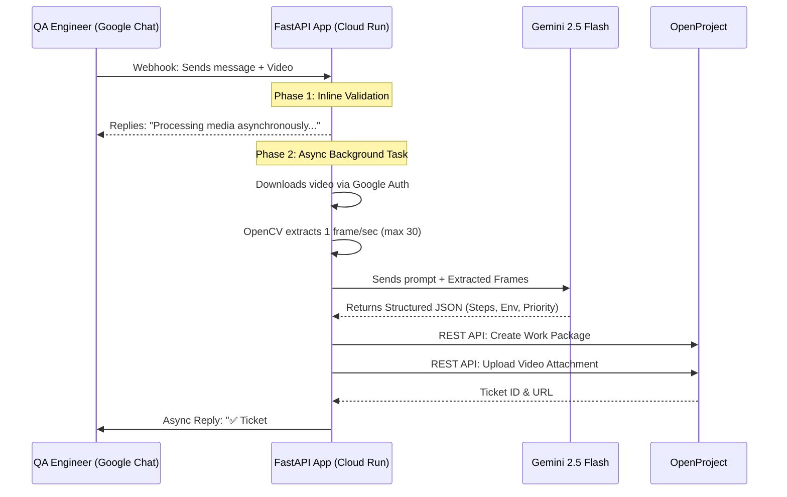

# 🚀 AI-Powered QA Bug Logger (Hackathon Pitch & Stakeholder Deck)

*A comprehensive guide and presentation flow for the IndiaMART Hackathon.*

---

## 1. 🎯 The Hook & Executive Summary
**Elevator Pitch:** "We built an AI-powered Google Chat bot that eliminates the tedious, manual process of bug reporting. QA engineers simply drop a quick message and a screen recording into chat, and our bot's AI automatically analyzes the video, extracts the steps to reproduce, and creates a perfectly formatted bug ticket in under 60 seconds."

**The Impact (In One Sentence):** 
Reclaiming **1,800 hours per year** for the organization, essentially adding a full-time engineer to the team for just **$16.80 a year** in operational costs.

---

## 2. 🚨 The Problem
* **Time Consuming:** Manually filling out bug tickets (formatting descriptions, specifying steps to reproduce, uploading media, assigning environments) takes an average of **10 minutes per bug**.
* **Context Loss:** Testers often lose their "testing flow" when context switching from the app to the project management tool.
* **Inconsistent Quality:** Bug report quality varies wildly between engineers.

---

## 3. 💡 The Solution
A seamless Google Chat Integration. 
1. The tester sends a message (e.g., *"Cart crashes when adding 5 items on iOS"*) and attaches a video.
2. The AI uses **Gemini 2.5 Flash** to visually analyze the video and text.
3. A perfectly structured bug ticket is instantly created in **OpenProject**.
4. The bot replies in chat with the ticket link.

---

## 4. 📊 ROI & Business Impact (The "Stakeholder Wow" Factor)
Stakeholders care about time and money. Use these exact metrics:

### ⏱️ Time Efficiency
* **Current Manual Time:** 10 minutes/bug
* **AI Automated Time:** ~1 minute (including QA review)
* **Savings:** 9 minutes saved per bug (**90% efficiency increase**)
* **Annual Impact:** With the organization logging 3,000 bugs/quarter, this saves **1,800 hours per year** (essentially adding a full-time engineer for free).

### 💰 Cost Efficiency
By aggressively optimizing the architecture to leverage Google Cloud "Free Tiers":
* **Compute Cost:** **$0.00 / month** (Runs entirely on Google Cloud Run's free tier of 180k vCPU-seconds).
* **AI Cost:** Processing 1,000 bugs a month costs **~$1.40 / month** using Gemini 2.5 Flash.
* **Total Cost of Ownership:** **$16.80 per year**. Unprecedented ROI.

---

## 5. 🏗️ System Architecture

*Use this diagram in your presentation slides.*

---

## 6. 🛠️ Technology Stack Used
* **Compute / Hosting:** Google Cloud Run (Serverless, scales to 0, highly cost-effective).
* **Backend Framework:** FastAPI (Python) with `asyncio` for high concurrency.
* **AI / LLM:** Google `gemini-2.5-flash` (Optimized for fast multimodal video/image reasoning).
* **Video Processing:** OpenCV (`cv2`) for intelligent frame sampling.
* **Integrations:** Google Workspace Chat API & OpenProject v3 REST API.
* **Database:** SQLite (`aiosqlite`) for fast, local user mapping.

---

## 7. 🚀 Key Innovations (Why this project wins the hackathon)

When the judges ask *"What was the hardest technical challenge?"*, highlight these architectural choices:

1. **Beating Serverless Timeouts (The Two-Phase Async Pipeline):** 
   Google Chat webhooks strictly timeout in 30 seconds, but video analysis takes longer. We engineered a custom architecture bypassing Cloud Run's CPU throttling (`--no-cpu-throttling`) to run an isolated `asyncio.Task` protected from Python's garbage collection. This allows instant user feedback while doing the heavy lifting in the background.

2. **Intelligent Video Pruning:** 
   Raw video payloads fail LLM limits. We integrated an OpenCV pipeline that intelligently extracts exactly 1 frame per second (capped at 30 frames), resizes them to 480px, and compresses them before hitting the LLM. It guarantees perfect AI reasoning while keeping payload sizes tiny and cheap.

3. **100% Platform Agnostic Formatting:**
   Our AI doesn't just copy-paste text. It classifies the operating system, deduces the priority level, formats the Markdown perfectly for OpenProject's specific parser, and maps everything to internal corporate integer IDs.

---

## 8. 📝 Presentation Strategy & Demo Flow

1. **Start with the Pain:** Show a screen recording of a QA engineer spending 10 minutes filling out a tedious bug report manually.
2. **Show the Magic:** Open Google Chat live. Type a 1-sentence message: *"Login button is grayed out on iOS when offline"*, attach a quick video, and hit send.
3. **The "Ta-Da" Moment:** Wait 15 seconds. The bot replies with a Jira/OpenProject link. Click the link. Show the stakeholders the perfectly formatted steps to reproduce, the mapped fields (Priority: High, OS: iOS), and the attached video.
4. **Drop the ROI:** Reveal the slide showing the 1,800 hours saved for just $16.80 a year.
5. **Mic Drop.**
